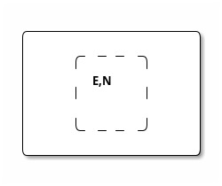

# Lecture: Advanced Statistical Physics
## General Information
* Yesterday: Nobel Price for Application of Statistical Physics, related to Ising type models.
* Lectures
    * Wed, 08:00 & Thu 10:00
    * recorded, see ILIAS
    * Hand-written lecture notes uploaded
    * textbooks
        * different ones are used
        * sometimes references are made
* Tutorials:
    * Assistant: Roman Daviet: rdaviet@uni-koeln.de
    * 1x @10:00 - full, 2x @12:00 & 2x @16:00
    * starting Monday, the 14th
    * problem sheets on Thursday
        * meaningful answer is required, not necessarily correct

## Outline of Content

1. Microscopic and Macroscopic Degrees of Freedom *(about 3 weeks)*
    1. Thermodynamics and [[20230829190239|Entropy]]
    2. Diffusion, [[20221026123304|Random Walks]], Stochastic Processes & Nonequilibrium Statistical Physics
2. [[20231111163639|Phase Transitions]] & Critical Phenomena *(rest of course)*

# $I$ Microscopic and Macroscopic Degrees of Freedom

## $1^\circ$ [[20241011111231|Thermodynamics and Entropy]]
Assume a box with $N$ particles.


A [[20230228174954|microstate]] is the description of a state in all its details. In [[20241010090350|classical mechanics]], it's described by position vectors ${\vec r_i}$ and [[20230828155847|impulses]] ${\vec p_i}$ with $6N$ components. In [[20230408112055|quantum mechanics]], it's described by a [[20241010091103|wave function]] $\Psi(\vec r_i)$.

If we let this system alone, i.e. without applying external forces, for a long time $t\rightarrow\infty$, it gets into a [[20230228175311|macrostate]] in [[20230301091751|thermal equilibrium]]. In this case, a small number of macroscopic variables can describe the system. In mechanical systems, the [[20241010090855|particle number]] $N$, the [[20241010092336|volume]] $V$ and the total energy $E$ are used. $E$ is known from [[20230825125242|mechanics]]. From [[20241010092719|Noether's theorem]], we know that energy conservation is related to [[20241010094112|time invariance]]. Since the box is limited, neither [[20241010094135|translation invariance]] nor [[20241010094158|rotational invariance]] are given, such [[20230828155847|momentum]] and [[20230814141041|angular momentum]] are not conserved.

A thermodynamic description exists for $N\rightarrow\infty$ in terms of deterministic relations between a small number of macroscopic variables characterising the equilibrium state.

The [[20221020201709|statistical physics]] wants to explain how the macroscopic description emerges from the microscopic information, what properties (information) survive on the macroscopic level and how fluctuations in macroscopic quantities disappear on large systems with $N\rightarrow\infty$. If a small system can interact with a lager system, these fluctuations can be described by [[20241010122324|Stochastic Thermodynamics]]. Further, thermodynamic description of Nonequilibrium Systems are researched in [[20241010121732|Non-Equilibrium Statistical Mechanics]] (NESM).

### $1.1$ Entropy
The [[20230829190239|Entropy]] $S(E,V,N)$ is an extensive function of [[20230901205542|extensive state variables]]. [[20230301091751|Equilibrium states]] are states of maximal entropy $S$, where [[20230901205708|intensive variables]] are equal.

An example of maximizing entropy is the [[20241010123656|equilibration of systems in contact]].

#### Conditions for Stability of the Equilibrium State
If the [[20230829190239|entropy]] $S$ is maximal at [[20230301091751|equilibrium]], it must be a [[20241010130229|convex function]].

Thus, the [[20241010131312|heat capacity]] for constant volume $C_V$ is positive: Radiating energy decreases temperature. Similarly, the [[20241011110411|compressibility]] $\kappa_T$ is positive: Compression increases pressure.

This is necessary for stable cases. E.g. stars contradict this, but are not stable.

If these conditions seem to be not true in a theory, it may hint towards phase transitions.

$$
\begin{align}
    C_x &= T\left(\frac{\partial S^2}{\partial T^2}\right)_{x,N}
        & > 0 \\
    \kappa_T
        &= -\frac{1}{V} \left(\frac{\partial S^2}{\partial P^2}\right)_{T,N}
        &> 0 \\
    \left(\frac{\partial S^2}{\partial V^2}\right)_{T,N}
        &= - \frac{1}{TV\kappa_T}
        &< 0
\end{align}
$$

#### [[20230403100902|Boltzmann's entropy]]
Entropy is a measure for degeneracy (loss of information) of the microscopic description. $S$ is proportional to the [[20230402162515|microcanonical partition function]] $\Omega(E,V,N)$, describing the number of microstates compatible with $E,V,N$.

$$
\begin{eqnarray}
    S &=& S(E,V,N) \\
        &=& k_B \ln(\Omega(E,V,N))
\end{eqnarray}
$$


#### [[20241016102356|Volume Dependence: The Ideal Gas Law]]
In [[20230408112055|quantum mechanics]], counting the [[20230402162515|number of states]] $\Omega$ is easy, compared to [[20241010090350|classical mechanics]]. As an example, an [[20221104144059|ideal gas]][^1] in a box is considered. The [[20241010092336|volume]] $V$ is divided into small boxes of size $v_0$. Then, the [[20230228174954|microstate]] of particles describes the label of the box a particle is in, with $\frac{V}{v_0}$ microstates per particle. From this, $\Omega$ can be calculated.

[^1]: i.e. particles don't interact with each other

$$
\begin{eqnarray}
    \Omega &=& \left(\frac{V}{v_0}\right)^N \cdot f(E,N) \\
    \Rightarrow S &=& k_B \left( N \ln\frac{V}{v_0} + \ln f(E,N) \right) \\
    P &=& T\frac{\partial S}{\partial V} \\
        &=& \frac{k_BTN}{V}
\end{eqnarray}
$$

This proves the [[20230829120012|ideal gas law]].

#### Energy Dependence
With $3N$ variables, the [[20241016102556|energy shell]] can be calculated. The area of the energy shell is roughly the volume of the sphere, which is proportional to $(2mE)^{\frac{3N}{2}}$. From this, we can calculate the relation between $\Omega$ and $E$.

$$
\begin{eqnarray}
    E &=& \sum_{i=1}^N \frac{1}{2m} |p_i|^2 \\
    \Leftrightarrow \frac{1}{2m} |p_i|^2 &=& 2mE \\
    \Rightarrow \Omega &\approxeq& V^N E^{\frac{3N}{2}} \cdot \tilde f(N)
\end{eqnarray}
$$

#### Homogeneity Relation
Since $S$ is an extensive function of extensive state variables, following must be true.

$$
\begin{eqnarray}
    \forall \lambda: S(\lambda E, \lambda V, \lambda N) &=& \lambda S(E,V,N)
\end{eqnarray}
$$

#### [[20230403101223|Sackur-Tetrode Formula]]
From the Homogeneity Relation, we can calculate the dependence of $N$, using the Energy Dependence and the Homogeneity Relation.

$$
\begin{eqnarray}
    S &=& k_B N \left(
            \ln\frac{V}{N} + \frac{3}{2} \ln \frac{E}{N} + \mathrm{const}
        \right)
\end{eqnarray}
$$

#### [[20230902132830|equipartition theorem]]
$$
\begin{eqnarray}
    \frac{\partial S}{\partial E} &=& \frac{3}{2}\frac{k_BN}{E} = \frac{1}{T} \\
    \Rightarrow E &=& \frac{3}{2} k_BTN
\end{eqnarray}
$$

#### [[20241017091536|Gibbs Paradox]]
If particles are treated as distinguishable, $\Omega$ is larger by $N!$. Thus, entropy gets an additional term $\ln N!\approx N\ln N$, which is not extensive. This is known as *Gibbs Paradox*.[^2]

[^2]: cf: Daan Frenkel (2014) Why colloidal systems can be described by statistical mechanics: some not very original comments on the Gibbs paradox, Molecular Physics, 112:17, 2325-2329, DOI [10.1080/00268976.2014.904051](https://doi.org/10.1080/00268976.2014.904051)

### $1.2$ [[20241017093320|Ensembles and Fluctuations]]
[[20230403100902|Boltzmann's entropy]] applies to closed systems with fixed values of $E,V,N$.

Now, we consider a macroscopic system as part of a larger system, referred to as [[20241017092452|reservoir]]. The system can exchange energy and particles with the reservoir.



This leads from the *micro-canonical ensemble* to the *canonical ensemble* and the *grand-canonical ensemble*.

#### Ensembles
For large systems, following postulate can be made. However, it's not entirely true.

> All accessible microstates of a closed system occur with equal probability.

Thus, the probability $P(r)$ for the system to be in any particular microstate $r$ is as follows:

$$
\begin{eqnarray}
    P(r) &=& \frac{1}{\Omega}
\end{eqnarray}
$$

The probability $P_s$ to find the (sub)system in a certain, specified microstate $(\Omega_s=1)$ with energy $E_s$ and particle number $N_s$ can be computed. The total energy $E=E_s+E_\mathrm{res}$ and total particle number $N=N_s+N_\mathrm{res}$ must be conserved.

$$
\begin{eqnarray}
    P_s &=& \frac{\Omega(E_\mathrm{res}-E_s, N-N_s)}{\Omega(E,N)}
\end{eqnarray}
$$

Since the reservoir is very large, a Taylor expansion with $E_s\ll E_\mathrm{res}$ and $N_s\ll N_\mathrm{res}$ leads to the canonical and the grand canonical ensemble.

##### Canonical Ensemble
The canonical ensemble describes a system able to exchange energy, but unable to exchange particles.

$$
\begin{eqnarray}
    P_s &=& \frac{1}{Z} \exp(-\beta E_s) \\
    Z &=& \sum_s \exp(-\beta E_s) \qq{partition function} \\
    \beta &=& \frac{1}{k_BT}
\end{eqnarray}
$$

##### Grand Canonical Ensemble
The grand canonical ensemble describes a system able to exchange energy and particles.

$$
\begin{eqnarray}
    P_s &=& \frac{1}{Y} \exp(-\beta (E_s-\mu N_s)) \\
    Y &=& \sum_s \exp(-\beta (E_s-\mu N_s)) \qq{grand partition function}
\end{eqnarray}
$$

#### Moments of extensive qualities
Moments of $E_s, N_s$ are obtained by taking the derivation of $\ln Z$ or $\ln Y$, respectively. The expectation value $\braket{E_s}$ is the thermodynamic energy for large systems. Similarly, the variance $(\Delta E_s)^2$ can be computed. Such, $Z$ is a *cumulant* generating function.

$$
\begin{eqnarray}
    \braket{E_s} &=& \frac{1}{Z} \sum_s E_s \exp(-\beta E_s) \\
        &=& - \frac{\partial}{\partial \beta} \ln Z \\
        &=& -\frac{1}{Z} \frac{\partial}{\partial \beta} \sum_s \exp(-\beta E_s) \\
    (\Delta E_s)^2 &=& \braket{(E_s-\braket{E_s})^2} \\
        &=& \frac{\partial^2}{\partial \beta^2} \ln Z \\
        &=& k_B T^2 \left(\frac{\partial E}{\partial T}\right)_{V,N} \\
        &=& k_B T^2 C_V
\end{eqnarray}
$$

The *heat capacity* $C_V$ is related to the variance of the energy, i.e. to the relative fluctuations of energy. Similarly, the *compressibility* $\kappa_T$ is related to the fluctuations of particle numbers $N$. This, too, enforces positive values for $C_V,\kappa_T$.

$$
\begin{eqnarray}
    (\Delta N)^2 &=& \frac{N^2}{V} k_BT \kappa_T
\end{eqnarray}
$$

In order of magnitude, the fluctuations are proportional to the number of particles.


$$
\begin{eqnarray}
    \Delta E &\propto& N \\
    \Delta N &\propto& N \\
    \Rightarrow \frac{\Delta E}{E} &\approx& \frac{1}{\sqrt{N}} \\
    \Rightarrow \lim_{N\rightarrow\infty} \frac{\Delta E}{E} &=& 0
\end{eqnarray}
$$

## $1.3$ Entropy and Information
Assume a system composed of $M\gg1$ identical subsystems. Each subsystem is in a microstate $s$ with a probability $P^{(s)}$.

With $M\rightarrow \infty$, the number of subsystems $m_s$ in microstate $s$ is $m_s\approx M\cdot P^{(s)}$.[^3]
[^3]: [[20230228181259|Ensemblebild]]

The total number of microstates of the whole system is with the multinational coefficient.[^4]
[^4]: cf. [[20240521172857|Binomialkoeffizient]] for $s\in\{A,B\}$

$$
\begin{eqnarray}
    \Omega_\mathrm{tot} &=& \frac{M!}{\Pi_s (m_s!)} \\
    \sum_s m_s &=& M
\end{eqnarray}
$$

### Gibbs Entropy
The Boltzmann entropy $S_\mathrm{tot}$ leads to *Gibbs entropy* $S[P_s]$:

$$
\begin{eqnarray}
    S_\mathrm{tot} &=& k_B \ln \Omega_\mathrm{tot} \\
    M\rightarrow\infty:\qquad &\approx& -M k_B \sum_s P_s \ln P_s \\
    S[P_s] &=& -k_B \sum_s P_s \ln P_s
\end{eqnarray}
$$

In the *microcanonical ensemble*:
$$
\begin{eqnarray}
    P_s &=& \frac{1}{\Omega} \\
    S &=& k_B \ln \Omega
\end{eqnarray}
$$

### Shannon Entropy
Shannon developed his entropy regarding information, unrelated to physics or thermodynamics in particular.

Shannon entropy quantifies the information contained in a probability distribution ${P_s}$. He found, $S[P_s]$ is the unique information measure that satisfies certain plausible postulates. In particular, the gained information shall be largest in an uniform distribution.

#### Jaynes' Principle: Maximum Entropy method
A priori distributions should be selected such that Shannon entropy is maximized under the constraints.


### $2.1$ [[20241016101000|Simple Random Walk]]
The [[20221028194709|expected value]] of a random walk with step size $\ell$ in $d$ dimensions is $\braket{\vec R(n)}=0$, the [[20221028194035|variance]] is $\braket{\vec R^2(n)} = d\ell^2 n$. Thus, the [[20221028194012|standard deviation]] scales with $\Delta\vec  R\approx \sqrt{n}$, regardless of $d$.

The probability $P(R(n))$ to find the walker in the $d$-dimensional sphere of radius $\Delta R$, for $n\rightarrow\infty$.

$$
\begin{eqnarray}
    P(\vec R(n))
        &=& \left(
            \frac{1}{\sqrt{2\pi\ell^2n}}
          \right)^{d/2}
          \exp\left[
              - \frac{\vec R^2(n)}{2\ell^2n}
          \right]
\end{eqnarray}
$$

#### universality
$P(\vec R(n))$ is not dependent on the distribution of random steps.

#### scaling with $n$
E.g. the radius of the probability sphere scales with $\sqrt{n}$, i.e. independent of the number of dimensions.

#### isotropic
$P$ is isotropic for large $n$, but the individual realisation is anisotropic.[^1]

[^1]: cf. Sethna J.P. [[@Sethna2021|Statistical Mechanics]]

#### Recurrence
The probability $P$ to return to the origin $\vec R_n=\vec 0$ scales by $n^{-\frac{d}{2}}$,[^2] which is part of the factor in the [[20241016101000|Probability of simple Random Walks]].

The [[20221028194709|expected number]] $\braket{N(n)}$ of returns to the origin in $n$ steps can be computed using a counting function $\delta_0(\vec x_i)$. It is described by the *Zeta function*.

[^2]: cf. Norris: *Markov Processes*

$$
\begin{eqnarray}
    P(\vec R_n=\vec 0) &\propto& n^{-\frac{d}{2}} \\
    \delta_0(\vec x_i)
        &=& \begin{cases}
                1 & \vec x_i=\vec 0 \\
                0 & \vec x_i\neq\vec 0
            \end{cases} \\
    N(n) &=& \sum_{i=0}^n \delta_0(\vec x_i) \\
    \braket{N(n)} &=& \sum_{i=1}^n \braket{\delta_0(\vec x_i)} \\
        &=& \sum_{i=1}^n P(\vec x_i=\vec 0) \\
        &\propto& \sum_{i=1}^n i^\frac{d}{2} \\
    \braket{\delta_0(\vec x_i)}
            &=& 1\cdot P(\vec x_i=\vec 0)
                + 0 \cdot P(\vec x_i\neq\vec 0)
\end{eqnarray}
$$

For $n\rightarrow\infty$ and $d\le 2$, the origin is visited *infinitly often*; the random walk is *recurrent*. This means, returning is guaranteed. For $n\rightarrow\infty$ and $d\ge 3$, the origin is visited finitely often, in this case the random walk is *transient*.

Let $\rho$ be the probability to return to the origin, then $\Pi$ is the probability to return again after the last visit.

$$
\begin{eqnarray}
    \Pi &=& 1 - \rho =
            \begin{cases}
                = 0 & d\le 2 \\
                > 0 & d > 2
            \end{cases}
\end{eqnarray}
$$

$d=2$ is an example of a *critical dimension*. This is not a [[20231111163639|phase transition]], but it is related, especially mathematically.


#### hydrodynamic limit
A first continuum can be reached in the hydrodynamic limit. This supposes the steps are taken at a rate $\Gamma$ and the step size is microscopic $(\ell\rightarrow 0)$, with $n=\Gamma t$ and a finite $\Gamma \ell^2\equiv 2D$.

#### diffusion constant
This leads to the *diffusion constant* $D$, in the unit $\frac{\mathrm{length}^2}{\mathrm{time}}$. This leads to a [[20241016101000|Probability of simple Random Walks]] $P$ as follows.

$$
\begin{eqnarray}
    P(\vec R(t))
        &=& \left(\frac{1}{\sqrt{2\pi Dt}}\right)^d
            \exp\left[-\frac{R^2}{4Dt}\right]
\end{eqnarray}
$$

This solves the 2nd Diffusion Equation, with the initial condition of the particle starting in a certain position $\vec R$, described by the [[20230303204120|Deltafunktion]] $\delta(\vec R)$.

$$
\begin{eqnarray}
    \frac{\partial P}{\partial t} &=& D\nabla^2P \\
    \left.P(\vec R)\right|_{t=0} &=& \delta(\vec R)
\end{eqnarray}
$$

#### Wiener process / Brownian motion
Brownian motion describes a [[20221026123304|random walk]] with $n\rightarrow \infty$ in a continuous limit.

The idea is to "squish together" a random walk into a unit time, rendering it continuous. However, it is nowhere smooth or differentiable, but it is *scale invariant*.

The process is called *Brownian scaling*.

##### Brownian scaling
The positions $X_i$ of a [[20221026123304|random walk]] are connected with a continuous line, rendering it $\{\tilde X_s\}_{0\le s\le n}$, for a constant $n$. This is converted to $\{B^{(n)}_t\}_{0\le t\le1}$.

While $s$ denotes the distance between the points, $t$ denotes the time required for $n$ steps. In the limit $n\rightarrow\infty$, it becomes the *Brownian motion* $B_t$.

$$
\begin{eqnarray}
    B^{(n)}_t &=& \frac{1}{\sqrt{n}} \tilde X_{t\cdot n} \\
    t &=& \frac{s}{n} \\
    \braket{B^{(n)}_t} &=& 0 \\
    \Rightarrow \braket{(\Delta B^{(n)}_t)^2} &=& t \\
    B_t &=& \lim_{n\rightarrow\infty} B^{(n)}_t
\end{eqnarray}
$$

##### scale invariance
Scale invariance describes an object that looks the same regardless of scale. E.g. the *Mandelbrot-Menge* looks the same, regardless on how far is zoomed in.


### 2.2 other universality classes
Under which continuous does the [[20230223130500|CLT]] fail?

#### 2.2.1 Levy Flights
Consider a [[20221026123304|random walk]] with steps $\vec \ell_i$ and $\braket{\vec \ell_i}=0$ and diverging [[20221028194035|variance]] $\braket{(\Delta \ell)^2}=\infty$. One example is the *Cauchy distribution* $p(\ell)$.

#### Cauchy distribution
The [[20221028194709|expected value]] is $\braket{\ell}=0$, but the [[20221028194035|variance]] $\braket{(\Delta \ell)^2}=\infty$ diverges. Thus, single $\ell$ are very much larger than most other and dominate the sum of many steps. In this case, the [[20230223130500|central limit theorem]] fails.

$$
\begin{eqnarray}
    P(\ell) &=& \frac{1}{\pi} \frac{1}{1+\ell^2} \\
\end{eqnarray}
$$

For large $\ell$, the tail of the probability $P(\ell\gg 1)$ can be approximated by an exponential function, with a  parameter $\mu$.

$$
\begin{eqnarray}
    P(\ell\gg 1) &=& \ell^{-(\mu+1)} \\
    P(\ell>x) &=& \int_x^\infty \ell^{-(\mu+1)} \dd{\ell} \\
        &\propto& x^{-\mu}
\end{eqnarray}
$$

#### extreme value statistics
Extreme value statistics considers the most extreme values, e.g. asks for the largest value.

For example, given the following relation for $N$, the largest value $\hat x$ shall be estimated. This is done by setting $N=1$.

$$
\begin{eqnarray}
    N &\propto& n x^{-\mu} \\
    N &\overset{!}{=}& 1 \\
    \Rightarrow 1 &\propto& n \hat x^{-\mu} \\
    \Leftrightarrow \hat x &\propto& \sqrt[\mu]{n} \\
\end{eqnarray}
$$

### 2.2.2 Self-avoiding Random Walk
A self-avoiding random walk is a [[20221026123304|random walk]] that does not allow returns to an already used position. If the random walk would visit a formerly visited position, it stops instead. Thus, it can trap itself.

It can be compared to a game of snake (possibly in higher dimensions), but while hitting random keys.

For up to $3$ dimensions, such a walker will be stuck on the long term. For at least $5$ dimensions, such a random walk will not re-visit positions.

#### Fleury's Argument
Fleury[^1] analyzed the *self-avoiding random walk* for less than $3$ dimension.

The argument uses [[20230825125343|thermodynamics]]: re-visiting is allowed, but it costs energy. Then, the *free energy* $F$ of a polymer with $n$ links, given the end-to-end distance $R(n)$ at [[20230301091751|thermal equilibrium]].

Assume $N_\mathrm{int}$ intersections are used and each requires an energy $U$. The [[20230829190239|entropy]] $S$ is described by the number $\Omega$ of random walks with $n$ steps and distance $R$.

Here, $\Omega_0$ describes the number of random walks in $d$ dimensions with $n$ steps. $c$ is a constant. 

$$
\begin{eqnarray}
    F &=& E - TS \\
    E &=& N_\mathrm{int} \cdot U \\
        &\propto& \frac{n^2}{R^d} U \\
    S &=& k \ln \Omega \\
    \Omega &\propto& \Omega_0\exp[-\frac{R^2}{2n\ell^2}] \\
    \Rightarrow S &=& k\ln \Omega_0 - \frac{kR^2}{2n\ell^2} \\
    \Rightarrow F
        &\approx& \frac{n^2}{R^d} U
            - T S_0
            + c \frac{TR^2}{n} \\
        &=& F_0
            + \frac{n^2}{R^d} U
            + c \frac{TR^2}{n}
\end{eqnarray}
$$

For small $R$, $F(R)$ gets very large. Now, the optimal distance $R^*$ can be calculated. This yields to the *Fleury exponent* $\nu_f$.

$$
\begin{eqnarray}
    \frac{\partial F}{\partial R} &=& 0 \\
    \Rightarrow R^* &=& \left(\frac{n^3U}{2cT}\right)^{1/(d+2)} \\
        &\approx& n^{\nu_f} \\
    \nu_f &=& \frac{3}{d+2}
\end{eqnarray}
$$


[^1]: Chemist, worked on polymers and got a Nobel price


## 2.3 Collective Diffusing
From now on, many interacting [[20221026123304|random walkers]] are considered to be on the lattice. One example is Langmuir gas.


#### Langmuir gas
In the following example, two dimensions with $\vec x=(i,j)\in\mathbb Z$ are used. The state of each site is denoted as $\eta_{\vec{x}}$.

$$
\begin{eqnarray}
    \eta &=&
        \begin{cases}
            0 & \text{vacant} \\
            1 & \text{occupied}
        \end{cases}
\end{eqnarray}
$$

The particles attempt jumps to a nearest neighbor site with the rate $\Gamma$, i.e. the probability to jump in a time interval $\dd{t}$ is $\Gamma\cdot\dd{t}$. There exists an *exclusion interaction*. Mathematically, is a *continuous time Markov process*.

In $d$ dimensions, each site has $2d$ neighbors.

##### exclusion interaction
An exclusion interaction forbids jumps to occupied sites.

##### periodic boundary condition
A periodic boundary condition can handle boundaries for finite systems. This renders each

E.g. in one dimension, the first and the last position are equal.

### 2.3.1 equilibrium measure
What is the *equilibrium measure* for $t\rightarrow\infty$?

* finite system with *periodic boundary conditions*: All [[20230228174954|microstates]] $\{\eta_{\vec{x}}\}$ with $N$ particles are equally likely
* In an infinite lattice, the [[20241030083454|Bernoulli measure]] is applied.

#### equilibrium measure
The equilibrium measure is the *probability distribution* of configuration in *equilibrium*.

#### [[20241030083454|Bernoulli measure]]
Each site on a lattice is occupied independently with a probability $p=\rho$, described by the density $\rho$.

### 2.3.2 Time evolution of density profile
* initial condition: Site $\vec x$ is occupied with probability $\rho(\vec x, t=0)$.
* How does the average density profile $\rho(\vec x, t)=\braket{\eta_{\vec{x}}(t)}$ (over many runs) evolve? $\braket{\eta_{\vec{x}}(t)}$ is the average over initial conditions with $\rho(\vec x, t=0)$ and runs of the stochastic dynamics.

#### continuum evolution equation / hydrodynamic equation
$$
\begin{eqnarray}
    \dv{\rho{\vec x, t}}{t}
        &=& \frac{\Gamma}{2d}
            \sum_{\vec{x}^\prime: \text{ neighbours of } \vec x}
            \braket{\eta_{\vec{x}^\prime}(1-\eta_{\vec{x}})}
            -\braket{\eta_{\vec{x}}(1-\eta_{\vec{x}^\prime})} \\
        &=& \frac{\Gamma}{2d}
            \sum_{\vec{x}^\prime}(
                \braket{\eta_{\vec x^\prime}}
                 - \braket{\eta_{\vec x}}
            ) \\
        &=& \frac{\Gamma}{2d}
            \sum_{\vec{x}^\prime}(
                \rho(\vec x^\prime, t)
                 - \rho(\vec x, t)
            ) \\
    \eta_{\vec{x}^\prime}(1-\eta_{\vec{x}}) &=&
        \begin{cases}
            1 & \text{jump } \vec x^\prime\rightarrow \vec x \text{ is possible} \\
            1 & \text{else}
        \end{cases}
\end{eqnarray}
$$

The gain term describes the probability of a particle jumping to position $\vec x$, the loss term describes a particle jumping away from the same position. This is a linear, closed set of equations. These are identical to those of non-interacting random walks.

For one dimension, the differential equations look as follows. Thus, the sum $\sum_{\vec{x}^\prime}(\rho(\vec x^\prime, t) - \rho(\vec x, t))$ is called the *lattice Laplacian*.

$$
\begin{eqnarray}
    \dv{\rho_i}{t} &=& \rho_{i+1} - 2\rho_i + \rho_{i-1}
\end{eqnarray}
$$

In *continuum limit*, the limits $L,N\rightarrow\infty$, $a\rightarrow0$ are applied such that the box size $B=La$ and density $\rho=\frac{N}{V}$ are fixed, with [[20241010092336|volume]] $V=L^d$ sites, lattice spacing $a$, [[20241010090855|particle number]] $N=\bar \rho V$.

In this limit, the lattice Laplacian becomes a real *Laplacian*. The sum goes over a discrete function of discrete space, whereas the Laplacian is of a continuous function of continuous space

$$
\begin{eqnarray}
    \sum_{\vec{x}^\prime}(\rho(\vec x^\prime, t) - \rho(\vec x, t))
        &\rightarrow& a^2\nabla^2 \rho(\vec x, t)
\end{eqnarray}
$$

The *continuum evolution equation* or *hydrodynamic equation* can be computed, with the *collective diffusion constant* $D$. $D$ becomes finite with a large rate $\Gamma\rightarrow\infty$.


$$
\begin{eqnarray}
    \pdv{\rho}{t} &=& \frac{\Gamma a^2}{2d} \nabla^2\rho \\
    D &=& \frac{\Gamma a^2}{2d}
\end{eqnarray}
$$

#### continuum limit
In continuum limit, the lattice length $L$ and [[20241010090855|particle number]] $N$ are very large compared to the distance $a$ between lattice points. This is applicable in e.g. *solid states physics*.

Thus, $L,N\rightarrow\infty$, $a\rightarrow0$ are applied such that the box size $B=La$ and density $\rho=\frac{N}{V}$ are fixed, with [[20241010092336|volume]] $V=L^d$ sites, lattice spacing $a$, [[20241010090855|particle number]] $N=\bar \rho V$.

#### hydrodynamic limit
In the hydrodynamic limit, the density $\rho(\vec x, t)$ shall be a smooth, differentiable function. Thus, it needs to vary slowly on the microscopic scale.

This has to be true for the initial density profile, too. For a small $a$, the number of particles has a small fluctuation. Then, the local density is almost constant.

### 2.3.3 Tracer diffusion / tagged particle diffusion
Now, the dynamics of a single particle is considered. The *tracer diffusion coefficient* $D_1$ is relevant. Interactions imply $D_1<D$.

$$
\begin{eqnarray}
    D_1|t-t^\prime| &\approx&
        \braket{(\vec x_\mathrm{tracer} - \braket{\vec x_\mathrm{tracer}})^2}
\end{eqnarray}
$$

#### Darken equation
The Darken equation is an approximation using the average density $\bar\rho$.

$$
\begin{eqnarray}
    D_1 &\approx& (1-\bar\rho) D \\
\end{eqnarray}
$$

#### subdiffusive dynamics
In one dimension $(d=1)$, the particle has subdiffusive dynamics.
$$
\begin{eqnarray}
    d=1:\qquad D_1 &=& 0 \\
    \braket{(x_\mathrm{tracer} - \braket{x_\mathrm{tracer}})^2} &\approx& \sqrt{|t-t^\prime|}
\end{eqnarray}
$$

### 2.4 driven diffusion
Driven diffusion assumes existence of forces $F$ causing asymmetrical movement.

E.g. in one dimension, a particle at position $i$ may prefer forward movement with the rate $\Gamma_{i,i+1}>\Gamma_{i,i-1}$, where the rate $\Gamma_{i,j}$ describes the movement from position $i$ to the neighbor $j$.

### 2.4.1 closed system
Assume a closed system with a force $F$, generated by a linear potential $V$, where $a$ is the *lattice constant(?)*.

At *temperature* $T$, the *canonical distribution* $P_i\propto\exp[-\beta V_i]$ can be applied. This leads to the current $J$.

$$
\begin{eqnarray}
    \Gamma_{i,i+1} &>& \Gamma_{i,i-1} \\
    F &=& \frac{V_{i+1}-V_i}{a} \\
    V_i &=& V_0 - aF\cdot i \\
    \frac{P_{i+1}}{P_i} &=& \exp[-\beta (V_{i+1}-V_i)] \\
        &=& \exp[\beta a F] \\
    J_{i, i+1} &=& P_iP_{i,i+1} - P_{i,i+1},P_{i+1,i} \\
        &\overset{!}{=}& 0 \qq{in equilibrium}
\end{eqnarray}
$$

This leads to the *condition of detailed balance*, assuming the current vanishes in equilibrium.

$$
\begin{eqnarray}
    J_{i, i+1} &\overset{!}{=}& 0 \qq{in equilibrium} \\
    \Rightarrow \frac{\Gamma_{i+1,i}}{\Gamma_{i,i+1}} &=& \frac{P_i}{P_{i+1}} \\
        &=& \exp[-\beta aF]
\end{eqnarray}
$$

In the following set, $\Gamma$ describes the probability to take a jump, where $p$ describes the probability to jump to the right.

$$
\begin{eqnarray}
    \Gamma_{i,i+1} &=& p\Gamma \\
    \Gamma_{i,i+1} &=& (1-p)\Gamma \\
    \frac{p}{1-p} &=& \exp[\beta aF] \\
    \Rightarrow p &=& \frac{\exp[\beta aF]}{1+\exp[\beta aF]} \\
    &\rightarrow&
        \begin{cases}
            1 & \beta aF \gg 1 \\
            \frac{1}{2} & \beta aF \ll 1
        \end{cases}
\end{eqnarray}
$$

### 2.4.2 ring of particles


### 2.4.2 non-equilibrium particles on a ring
Particles can jump clockwise with a probability $p\Gamma$ and anti-clockwise with a probability $(1-p)\Gamma$, where $\Gamma$ denotes the jump rate.

#### single particle
Due to translation invariance, the probability $p_i$ to find the particle at the position $i$, is uniform for the ring with $L$ sites. Thus, the current $J$ is nonzero. Further, the average speed $\braket{v}$ of the particle can be computed from the distance of lattice points $a$. The *mobility* $\sigma$ is defined as the proportional factor for small forces.

$$
\begin{eqnarray}
    p_i &=& \frac{1}{L} \\
    J_{i, i+1} &=& P_i\Gamma_{i,i+1} - P_{i+1}\Gamma_{i+1,i} \\
        &=& \frac{1}{L} (\Gamma_{i,i+1} - \Gamma_{i+1,i}) \\
        &=& \frac{1}{L} (2p-1)\Gamma \\
    \braket{v} &=& (\Gamma_{i,i+1} - \Gamma_{i+1,i})a \\
    \qq{small force}:
    \braket{v} &\approx& \frac{1}{2} \Gamma a^2\beta F \\
        &\equiv& \sigma F
\end{eqnarray}
$$

This is similar to Newton's law with friction. In the overdamped case ($m\rightarrow0$), $v$ is inverse proportional to the friction $\gamma$.

$$
\begin{eqnarray}
    m\dot v &=& F - \gamma v\\
    m\rightarrow0 \Rightarrow v &=& \frac{1}{\gamma} F
\end{eqnarray}
$$

The diffusion constant $D$ follows. This leads to the *Einstein relation* for $\sigma$. The macroscopic fluctuation - described by $D$ - leads to macroscopic friction $\gamma^{-1}$, aka *Stokes friction*.[^1]
$$
\begin{eqnarray}
    D &=& \frac{1}{2} \Gamma a^2 \\
    \sigma &=& \frac{1}{2} \Gamma a^2 \\
        &=& \frac{D}{k_BT} \\
        &=& \frac{1}{\gamma} \\
    \Rightarrow D &=& \frac{k_BT}{\gamma}
\end{eqnarray}
$$

##### Example of a nonequilibrium stationary state: Energy production
Let a nonequilibrium stationary state be characterized by a positive entropy production.

If the particle jumps to the right, work $\Delta W=Fa$ is applied, or $\Delta W=-Fa$ if it jumps left. Because the particle prefers jumping to the right, energy is dissipated to the head bath. This produces entropy $S$.

$$
\begin{eqnarray}
    \dv{S}{t} &\approx& \frac{1}{2}k_B\Gamma
        \left(\frac{Fa}{k_BT}\right)
\end{eqnarray}
$$

#### many particles on the ring
Now, $N$ particles will be on the ring with $L$ sites. The time will be counted in units of $\Gamma\overset{!}{=}1$ and the distance in units of $a\overset{!}{=}1$. An *exclusion interaction* enforces a maximum of a single particle per site. The density is $\rho=\frac{N}{L}$.

This is called [[20231012095625|ASEP]], where *simple* refers to a jump range of $1$.[^2] This was first applied in Biophysics of mRNA translation[^3] in the form of [[20231012095456|TASEP]].

[^2]: Spitzer F. (1970)
[^3]: MacDonald et al. (1968)

#### continuum limit
With $p=0.5$, the system is a *SSEP* (symmetric simple exclusion process).

Consider the average occupation variables $\eta_i$, describing the density $\rho_i$ at position $i$.

$$
\begin{eqnarray}
    \eta_i &=&
        \begin{cases}
            0 & i\text{ vacant} \\
            1 & i\text{ occupied}
        \end{cases} \\
    \rho_i &=& \braket{\eta_i} \\
    \dv{}{t}\braket{\eta_i}
        &=&
            p\braket{\eta_{i-1}(1-\eta_{i})}
            +(1-p)\braket{\eta_{i+1}(1-\eta_{i})} \\
        &&  -(1-p)\braket{\eta_{i}(1-\eta_{i-1})}
            -p\braket{\eta_{i}(1-\eta_{i+1})} \\
    \braket{\eta_{i}(1-\eta_{i+1})} &=& \braket{\eta_i} - \braket{\eta_i\eta_{i+1}}
\end{eqnarray}
$$

For $p\neq0.5$, the quadratic terms do not cancel out. Thus, equations for $\braket{\eta_i\eta_{i\pm1}}$  depend on terms of at least 3rd order. This infinite hierarchy of equation cannot be solved in general.

One possible approach is the so-called *mean field approximation*. Instead, the *master equation* is used. The number of configurations is described by the [[20240521172857|binomial coefficient]] ${L \choose N}$.

An educated guess assumes that the stationary distribution $P^*$ is uniform, thus $P^*={L \choose N}^{-1}$.

##### proof
The guess can be proven by proving the following equality.

$$
\begin{eqnarray}
    \forall \mathcal C:\qquad
    \underbrace{
    \sum_{\mathcal C^\prime}
        \Gamma(\mathcal C^\prime\rightarrow\mathcal C)
        }_\text{total influx}
        &=&
        \underbrace{
            \sum_{\mathcal C^\prime}
            \Gamma(\mathcal C\rightarrow\mathcal C^\prime)
        }_\text{total outflux}
\end{eqnarray}
$$

The flux can be described by the number of states with exactly $1$ particle moving in or out of $\mathcal C$. This depends on the probability $p$ (or $1-p$ for jumps back) and the number of $01$ pairs (or the number of $10$ pairs).

To prove this, the number of $01$ pairs must be equal to the number of the $10$ pairs. Considering *clusters* of at least one particle, each cluster has exactly one vacant space before and after it. Therefore, the ring geometry enforces the equality.

For large systems with $L,N\rightarrow\infty$ with $\rho=\frac{N}{L}$, the states $\braket{\eta_i},\braket{\eta_{i+1}}$ become independent. This is the [[20241030083454|Bernoulli measure]].

Conversely, the stationary state of an open [[20231012095625|ASEP]] is rather complex.

#### mean field approximation
One possible approach is the so-called *mean field approximation* (MFA), i.e. assume that averages factorize. In other words, the variables are assumed to be independent. With this approach, a nonlinear, closed set of equations for $\braket{\eta_i}$ emerge.

$$
\begin{eqnarray}
    \braket{\eta_i\eta_{i+1}} &\approx& \braket{\eta_i}\braket{\eta_{i+1}}
\end{eqnarray}
$$

This is not correct in the general case, because it neglects fluctuations or correlations, described by the [[20221028194035|variance]] $\mathrm{Var}(x)\overset{!}{=}0$.

$$
\begin{eqnarray}
    \forall i\neq j:\braket{x_ix_j} &=& \braket{x_i}\braket{x_j} \\
    \braket{x_i^2} &=& \braket{x_i}^2 \\
    \Rightarrow \mathrm{Var}(x_i) &=& 0
\end{eqnarray}
$$

For example, in the [[20231012095625|ASEP]] the occupation numbers are given as $\eta_i\in\{0,1\}$, the square matches the value itself: $\eta_i^2=\eta_i$. In this case, the MFA does not make sense.

#### Master Equation
The master equation is the general description of a continuous time Markov process. It is the balance equation for the probability $P_t(\mathcal C)$ to find a system in configuration $\mathcal C$ at time $t$.

With this, the full probability distribution of configurations $\mathcal C$  is considered. It is the difference between the *gain term*, where states change to $\mathcal C$, and a *loss term*, where the state moves away from $\mathcal C$. $\Gamma(\mathcal C^\prime\rightarrow\mathcal C)$ is the transition rate from state $\mathcal C^\prime$ to state $\mathcal C$.

$$
\begin{eqnarray}
    \dv{P_t(\mathcal C)}{t}
        &=&
            \underbrace{
                \sum_{\mathcal C^\prime}
                \Gamma(\mathcal C^\prime\rightarrow\mathcal C)
                P_t(\mathcal C^\prime)
            }_\text{gain term}
            -
            \underbrace{
                \sum_{\mathcal C^\prime}
                \Gamma(\mathcal C\rightarrow\mathcal C^\prime)
                P_t(\mathcal C^\prime)
            }_\text{loss term} \\
        &=& \sum_{\mathcal C^\prime} A_{\mathcal C\mathcal C^\prime} P_t(\mathcal C^\prime)
\end{eqnarray}
$$

This can be described as a matrix $A=(A_{\mathcal C\mathcal C^\prime})$. To solve the problem, $A$ needs to be diagonalized.

With long times $t\rightarrow\infty$, the system approaches a *stationary distribution* $P^*(\mathcal C)$ which satisfies following equation. Thus, $P^*$ is an eigenvector with eigenvalue $0$. All other eigenvalues are negative.

$$
\begin{eqnarray}
    \sum_{\mathcal C^\prime} A_{\mathcal C\mathcal C^\prime} P_t(\mathcal C^\prime) &=& 0 \\
    \sum_{\mathcal C^\prime}
        \Gamma(\mathcal C^\prime\rightarrow\mathcal C)
        &=&
            \sum_{\mathcal C^\prime}
            \Gamma(\mathcal C\rightarrow\mathcal C^\prime)
\end{eqnarray}
$$


Beware of typos / errors, also in every textbook! *Constant vigilance!*[^1]

[^1]: Harry Potter and the Goblet of Fire

### 2.4.2 non-equilibrium particles on a ring
#### many particles on the ring
##### Stationary Current
The *stationary current* $J_{i,i+1}$ describes the average flow of particles from position $i$ to $i+1$.

For the [[20231012095625|ASEP]] on a closed ring, it can be computed as follows from the probability $\braket{\eta_i(1-\eta_{i+1})}$, describing the state for an occupied position $i$ and a vacant position $i+1$. The latter is calculated from the number of matching configurations divided by the number of possible calculations, similar as the *micro-canonical partition function*. It can be described by the density $\rho$.

$$
\begin{eqnarray}
    J_{i,i+1} &=& p\braket{\eta_i(1-\eta_{i+1})}
            - (1-p)\braket{\eta_{i+1}(1-\eta_i)} \\
    \braket{\eta_i(1-\eta_{i+1})}
        &=& \frac{\text{\# configurations with }\eta_i=1,\eta_{i+1}=0}
            {\text{\# configurations}} \\
        &=& \frac{{L-2 \choose N-1} }{{L \choose N}} \\
        &=& \frac{(L-N)N}{L(L-1)} \\
        &=& \frac{(1-\rho)\rho}{1-L^{-1}} \\
    \lim_{\overset{L\rightarrow\infty}{N\rightarrow\infty}}
    \braket{\eta_i(1-\eta_{i+1})} &=& \rho(1-\rho) \\
    \Rightarrow J(\rho) &=& p(\rho(1-\rho)) - (1-p)\rho(1-\rho) \\
        &=& (2p-1)\rho(1-\rho)
\end{eqnarray}
$$

In the *hydrodynamic limit* with fixed density $\rho=\frac{N}{L}$, a simple statement follows, describing a [[20241030083454|Bernoulli measure]]. In a finite system, the probability is larger.

The current-density relation $J(\rho)$ describes a parabola with a maximum at $\rho=0.5$. For higher densities $\rho>0.5$, the current $J$ decreases because of the exclusion.

In Traffic research this is called a *fundamental diagram*, which can be described by the *Nagel-Schreckenberg model*.

### Hydrodynamic equation for the TASEP
The Hydrodynamic equation is an analogue to the *diffusion equation*, applied to the symmetric model.

In [[20231012095456|TASEP]], the probability to move to the right is set to $p=1$. Consider the time evolution of a slowly varying density profile $\rho(x)$. The *lattice spacing* shall be small $(a\rightarrow0)$, especially compared to the length $\ell\gg a$ of density variation.

The density has to satisfy a [[20230812130544|continuity equation]], since the number of particles is conserved:
$$
\begin{eqnarray}
    \pdv{t} \rho(x,t) + \pdv{x}j(x,t) &=& 0
\end{eqnarray}
$$

For a small region $\xi$ on the lattice, where $a\ll \xi \ll \ell$, the density $\rho(x)$ is almost constant. Therefore, the local current $j$ must correspond to the current in the hydrodynamic limit.
It leads to a [[20230903110117|PDE]] of first order in $x$, which is non-linear.

$$
\begin{eqnarray}
    \lim_{\overset{a\rightarrow0}{\ell\rightarrow\infty}} j(x,t) &=& J(\rho(x,t)) \\
    \Rightarrow \pdv{\rho}{t} + \pdv{J}{x} &=& 0 \\
    \Rightarrow \pdv{\rho}{t} &=& - \pdv{x} \rho(1-\rho) \\
        &=& \underbrace{- \pdv{\rho}{x}}_{\text{convection term}}
            + \underbrace{2\rho\pdv{\rho}{x}}_{\text{Burgers nonlinearity}}
\end{eqnarray}
$$

The convection term can be removed by a *Galilei transformation* to a moving frame:

Define the field $\phi$ trough $\rho(x,t)=\phi(x-t,t)$. $\phi$ satisfies the *inviscid* *Burgers equation*, i.e. with viscosity $\nu=0$.

$$
\begin{eqnarray}
    \pdv{\rho}{x} &=& \pdv{\phi}{x} \\
    \pdv{\rho}{t} &=& -\pdv{\phi}{x} + \pdv{\phi}{t} \\
        &=& - \pdv{\rho}{t} + \pdv{\phi}{t} \\
    \Rightarrow \pdv{\phi}{t} &=& \pdv{\rho}{t} + \pdv{\rho}{x} \\
        &=& 2\rho\pdv{\rho}{x} \\
        &=& 2\rho\pdv{\phi}{x}
\end{eqnarray}
$$

#### small fluctuations
For **small fluctuations** $\Phi(x,t)$ around the constant density with $|\Phi|\ll1$. In this case, the initial profile $\Phi_0$ translates the lattice. Thus, $c$ is the *kinematic wave speed*. This again is the derivative of the *stationary current* $J$.

$$
\begin{eqnarray}
    \rho(x, t) &=& \bar \rho + \Phi(x,t) \\
    \Rightarrow \pdv{\rho}{t} = \pdv{\Phi}{t}
        &=& - J^\prime(\bar \rho + \Phi) \\
    J^\prime(\rho) &=& 1-2\rho \\
    \Rightarrow \pdv{\Phi}{t} + c\pdv{\Phi}{x} &=& 0 \\
    \Rightarrow \Phi(x, t) &=& \Phi(x-ct, 0) \equiv \Phi_0(x-ct) \\
    c(\bar\rho) &=& 1-2\bar\rho
\end{eqnarray}
$$

The average movement can be positive or negative. If $\bar\rho<0.5$, a positive movement (forward), but for $\bar\rho>0.5$, it is negative. This also explains why traffic jams move backwards in space.

##### kinematic wave speed
The kinematic wave speed is the derivative of the *stationary current* $J$.

#### shock formation
Next **shock formation** is researched. A formal solution can be developed by the *method of characteristics*. This can be interpreted as a propagating density initial density $\rho(x,0)$ at the kinematic wave speed $c(\rho)$.

$$
\begin{eqnarray}
    \pdv{\rho}{t} &=& -\pdv{x} J(\rho) \\
        &=& - c(\rho) \pdv{\rho}{x} \\
\end{eqnarray}
$$

The *characteristics* are space-time lines of constant density, i.e. tracking the time-development of a selected density. These characteristic can collide, when some densities move forwards and others move backwards. Collisions of characteristics cause shocks.

##### Shock formation
The densities become discontinuous from a smooth profile

#### Burgers equation
The burgers equation describes the viscosity $\nu$ of a fluid and is related to the *Navier-Stokes eqation*. It looks similar to the *hydrodynamic equation for the TASEP*.

$$
\begin{eqnarray}
    \pdv{u}{t} &=& - u\pdv{u}{x} + \nu\pdv[2]{u}{x}
\end{eqnarray}
$$

The viscosity smoothens the non-linearity. This is oppoesed to the Navier-Stokes equation, where the velocity increases non-linearity.

#### Navier-Stokes equation
The Navier-Stokes equation from fluid dynamics, describing the fluid velocity $\nu$ dependent on pressure $P$ and density $\rho$.

$$
\begin{eqnarray}
    \dv{u}{t} &=& \pdv{\vec u}{t} + \vec u \cdot \nabla \vec u \\
        &=& \nu\nabla \vec - \frac{1}{\rho} \nabla P
\end{eqnarray}
$$

The *scalar product* $u \cdot \nabla \vec u$ describes non-linearity caused by convection.


> Next **shock formation** is researched. A formal solution can be developed by the *method of characteristics*. This can be interpreted as a propagating density initial density $\rho(x,0)$ at the kinematic wave speed $c(\rho)$.

$$
\begin{eqnarray}
    \pdv{\rho}{t} &=& -\pdv{x} J(\rho) \\
        &=& - J^\prime(\rho) \pdv{\rho}{x} \\
        &=& c(\rho) \pdv{\rho}{x}
\end{eqnarray}
$$

If the density has a range such that the kinematic wave speed $c(\rho)$ is positive for some and negative for other densities, shocks will form.

In [[20231012095456|TASEP]], shocks are sharp even on a microscopic scale. With viscosity, no shocks will form, but they can be derived as a limit for steep curves.

Shocks can be measured with a so-called *second-class particle*, which works as a movable bar for measurement.

##### Method of characteristics
The *characteristics* are space-time lines of constant density, i.e. tracking the time-development of a selected density. These characteristic can collide, when some densities move forwards and others move backwards. Collisions of characteristics cause *shocks*.

Let $\xi(x_0, t)$ describe the position of a density segment, that was initially at $x_0$. This function can be inverted to $x_0(\xi, t)$, assuming inversion is possible. Then $\rho(x,t)=\rho(x_0(x,t), 0)$ solves the [[20230903110117|PDE]].

$$
\begin{eqnarray}
    \xi(x_0, t) &=& x_0 + c(\rho(x_0, t))\cdot t
\end{eqnarray}
$$

At $t=0$, $\xi$ describes the identity. Over time, the curve goes flatter, since $c(\rho<0.5)$ is positive and $c(\rho>0.5)$ is negative. Finally, $\xi$ develops a minimum and a maximum. This curve is multi-valued. For a certain area, $x_0$ will be a multi-valued curve. This is an nonphysical solution. The physical solution can be found with the *Maxwell construction*, causing a shock.

##### Time of the appearance of shocks
The time $t_s$, at which a *shock* appears, can be described by the slope at the steepest point.

$$
\begin{eqnarray}
    t_s &=& \frac{1}{2a_\mathrm{max}} \\
    a_\mathrm{max} &=& \max_x\left\{\dv{x}\rho(x, 0)\right\}
\end{eqnarray}
$$

##### Position and Motion of the shock
The position and the motion of the shock can be computed from mass conservation. The integral over the density profile has to stay constant. This is similar to the *Maxwell construction*.

If the currents left and right of the shock are not equal, the shock moves with a speed $v$.

$$
\begin{eqnarray}
    J(\rho_\mathrm{R}) - J(\rho_\mathrm{L})
        &=& v(\rho_\mathrm{R} - \rho_\mathrm{L}) \\
    \Rightarrow v
        &=& \frac{J(\rho_\mathrm{R}) - J(\rho_\mathrm{L})}
            {\rho_\mathrm{R} - \rho_\mathrm{L}}
\end{eqnarray}
$$

This explains backwards movement of *traffic jams*: As long as the influx is larger than the outflux, the jam moves backwards.

####  shock dynamics
Multiple shocks can collide and merge, if they have different speeds. After long times, these states still reach [[20230301091751|equilibrium]].

# $II$ Phase transitions and critical phenomena
A phase transition is a singular[^1] behavior of macroscopic degrees of freedom upon variation of macroscopic control parameters at fixed microscopic interaction.

[^1]: i.e. non-smooth and non-analytic

## $1^\circ$ Thermodynamics of Phase Transition
## 1.1 Simple fluids
### Phases & phase diagram
A typical phase diagram looks like the following. However, water is anormal[^2].

[^2]: The curve for water has a negative slope between solid and liquid.

```ditaa
^ P
|    |
|    |
|    +--------
|   /
|  /
| /
|/
+------------|------> T
```

The *critical point* $(T_C,P_C$) is at critical [[20230403104255|temperature]] $T_C$ and critical [[20230829113605|pressure]] $P_C$, where the difference between liquid and gas vanishes. Further, the *triple point* $(T_T,P_T)$ is the point where all three phases coexist.

Phase coexistence implies [[20230301091751|equilibrium]] under particle exchange, governed by the [[20230729145443|chemical potential]] $\mu(T,P)$.

For two phases $A$ and $B$, the equality $\mu_A=\mu_B$ defines a line in the $(T,P)$ plane. For three phases $A,B,C$, the equality of all three potentials defines a point in the same plane.

With more species of components, more phases may coexist, according to *Gibbs phase rule*.

Changing between solid and liquid state breaks symmetries, while changing between liquid and gas doesn't. Thus, not all substances require a liquid-gas-transition, because particles are ordered randomly anyways. This also explains the *superfluid phase*, where there is no difference between liquid and gas, after the coexistence line terminated at $(T_C,P_C)$.

#### Gibbs phase rule
Gibbs phase rule describes the number of free *degrees of freedom* $\varphi$. This is described by the number of components $n$ and the number of phases $r$.

$$
\begin{eqnarray}
    \phi &=& (n+2) - r
\end{eqnarray}
$$

The shape of lines of coexisting phases is described by the *Clausius-Clapeyron relation*.

#### Clausius-Clapeyron relation
The Clausius-Clapeyron relation describes the shape of the line of coexisting phases $A$ and $B$.

$$
\begin{eqnarray}
    \dv{P_{AB}}{T} &=& \frac{s_B-s_A}{v_B-v_A} \\
        &=& \frac{q_{AB}}{T(v_B-v_A)} \\
    q_{AB} &=& T(s_A-s_B)
\end{eqnarray}
$$

$s_i$ describe the [[20230829190239|entropy]] per particle, while $v_i$ describe the [[20241010092336|volume]] per particle in each phase. Alternately, $q_{AB}$ describes the [[20231111163808|latent heat]], while $T$ describes the [[20230403104255|temperature]].


Thus, phases $A$ and $B$ can coexist when the [[20230729145443|chemical potentials]] $\mu_A=\mu_B$ are equal.

### [[20231111163639|phase transition]]
A phase transition of first order is described by a singularity / discontinuity in the first derivative of the [[20230403093920|thermodynamic potential]].

## 1.2 Van der Waals gas
### Van der Waals gas
Typically, particles interact with a potential between atoms or molecules. This distinguishes this model from the [[20221104144059|ideal gas]].

The interaction consists of a short-ranged repulsion and a long-ranged attraction.[^1] Both interactions are required to explain [[20231111163639|phase transitions]].

[^1]: This can be modeled with e.g. the [[20230531125913|Lennard-Jones-Potential]].

In a classical model, $N$ particles interact with a potential $\omega(r)$, depending on the distance $r$. In principle, the thermodynamic properties can be derived from the *partition function*. However, this is a very difficult practice.

A possible approach is to start with an [[20221104144059|ideal gas]] and use perturbation theory to extend the model.

The repulsion (described by $b$) increases the pressure, while the attraction (described by $a$) decreases pressure. $b$ is the excluded volume per particle, i.e. their size, while $a$ describes the attraction. At the critical point, $\partial_V P$ vanishes. This happens at a critical pressure $P_c$ with a critical volume per particle $v_c$.

$$
\begin{eqnarray}
    P &=& \frac{Nk_BT}{V-bN} - \frac{aN^2}{V^2} \\
    v_c &=& 3b \\
    k_BT &=& \frac{8}{27} \frac{a}{b} \\
    P_c &=& \frac{a}{27b^2}
\end{eqnarray}
$$

At $\partial_V P=0$, the [[20241011110411|compressibility]] $\kappa_t=\partial_P V$ becomes infinite and for $\partial_VP>$, it is negative. The latter is not a stable state. Thus, the system is not homogeneous but contains a gas and a liquid phase. In this case, the curve $P(V)$ does not make sense physically.

### 1.2.a Virial expansion
The Virial expansion extends the model of the [[20221104144059|ideal gas]] for the *Van der Waals gas*.

It expands the *grand-canonical partition function* $Y$ with the *fugacity* $z$. It uses the *canonical partition function* $Z(N)=Z(T,V,N)$.

$$
\begin{eqnarray}
    Y(T,V,\mu) &=& \sum_{N=0}^\infty Z(N)\exp[\beta\mu N] \\
    \ln Y &=& Z(1) + \left(Z(2) - \frac{Z(1)^2}{2}\right)z^2 \\
    z &=& \exp[\beta\mu]
\end{eqnarray}
$$

In the ideal gas, the particles are independent. In this case, the fugacity expansion terminates after the first order. For the ideal gas, the fugacity $z$ consists of the density $\rho$ and the *thermal de Broglie wavelength* $\lambda_\mathrm{th}$.

$$
\begin{eqnarray}
    Z(N) &=& \frac{1}{N!}Z(1)^N \\
    \Rightarrow Y &=& \exp[Z(1) z] \\
    \Rightarrow \ln Y &=& Z(1) z \\
    z &=& \rho \lambda_\mathrm{th}^3 \\
    \lambda_\mathrm{th} &=& \sqrt{\frac{2\pi}{mk_BT}}\hbar
\end{eqnarray}
$$

From this, the physical meaning of the expansion can be explained. They are caused by $Z(2)$, which depends on the interaction potential $\omega$. From this, the *equation of state* follows. The leading order of correction is described by the *first virial coefficient* $B_2(T)$.

$$
\begin{eqnarray}
    PV &=& k_BT\ln Y \\
        &=& k_BTN(1 + B_2(T)\rho + \mathcal O(\rho^2)) \\
    B_2(T) &=& - 2\pi \int_0^\infty r^2 (\exp[-\beta \omega(r)] - 1) \dd{r}
\end{eqnarray}
$$

Higher orders of expansion are required to explain [[20231111163639|phase transitions]].

### 1.2.b mean-field approximation
Assume independent particles subjected to an effective potential, which is generated by the other particles, like gravitation or the electromagnetic interaction.

$$
\begin{eqnarray}
    Z(N) &=& \frac{Z(1)^N}{N!} \\
    Z_1(1) &=& \lambda_\mathrm{th}^{-3} \int_V \exp[-\beta w_\mathrm{eff}(\vec r)] \dd[3]{r}
\end{eqnarray}
$$

The inverse *thermal de Broglie wavelength* $\lambda_\mathrm{th}^{-3}$ describes the *kinetic energy*. The effective potential $w_\mathrm{eff}(\vec r)$ shall be attractive with $\bar\omega<0$, if the particles don't touch. This is described by the *excluded radius* $r_\mathrm{ex}$, which denotes the volume of a particle. From this, the *free energy* $F$ can be derived.

$$
\begin{eqnarray}
    \omega(r) &=& \bar\omega \theta(r_\mathrm{ex}) \\
    Z_1(1) &=& \lambda_\mathrm{th}^{-3} (V - V_\mathrm{ex}) \exp[-\beta\bar\omega] \\
    F &=& k_BT\ln Z \\
        &\approx& -k_BTN\left(\ln \frac{Z(1)}{N} + 1\right)
\end{eqnarray}
$$

Assuming the excluded volume $V_\mathrm{ex}$ from the excluded volume per particle $b$ and the attraction by other particles as $\bar\omega$, the *equation of state* for the *Van der Waals gas* follows. The repulsion (described by $b$) increases the pressure, while the attraction (described by $a$) decreases pressure.

$$
\begin{eqnarray}
    V_\mathrm{ex} &=& bN \\
    \bar\omega &=& -a \frac{N}{V} \\
        &=& -a\rho \\
    \Rightarrow P &=& -\pdv{F}{V} \\
        &=& \frac{Nk_BT}{V-bN} - \frac{aN^2}{V^2}
\end{eqnarray}
$$


> *Missing*


### Ising model
The Ising model is a classical model to describe [[20231030093100|magnetism]]. It uses a lattice with classical spins on all positions.

The energy[^1] $H$ of a [[20230228174954|microstate]] can be described with the *(exchange) coupling* $J$ and the external *magnetic field* $h$. The coupling is only relevant for nearest neighbours $\braket{i,j}$. For $J>0$, [[20230828121438|ferromagnetism]] occurs, for $J<0$ [[20231111130423|antiferromagnism]].

$$
\begin{eqnarray}
    H &=& -J \sum_{\braket{i,j}} \sigma_i\sigma_j - h\sum_i \sigma_i
\end{eqnarray}
$$

Without external field $h=0$, the energy $H$ is invariant of flipping a spin $\sigma_i\mapsto-\sigma_i$. This *symmetry* is spontaneously broken at low [[20230403104255|temperatures]] $T$ in ferromagnetism.

The [[20230901205708|intensive thermodynamic variable]] is the [[20231030091047|magnetization]] $m=\braket{\sigma_i}_{h,T}$ dependent on the [[20230901205542|extensive variables]] $h, T$. Below the [[20231030093402|Curie temperature]] $T_C$, first order [[20231111163639|phase transitions]] between $m>0$ and $m<0$ occur constantly. Both phases of $m(T)$ coexist. Above $T_C$, this discontinuity vanishes and [[20230828095949|paramagnetism]] occurs.

[^1]: written as [[20230809131455|Hamiltonian]] $H$

#### mapping to a lattice gas
This is analogous to the liquid-gas transition, apart from the symmetry. In this case, the external field $h$ is analogue to the [[20230829113605|pressure]] $P$, the magnetisation $m$ to the velocity $v$. In both cases, the density $\rho=v^{-1}$ is described the same.

The occupation numbers can be denoted as $\eta_i=\frac{1}{2}(1+\sigma_i)=\pm 1$. For [[20230828121438|ferromagnetism]], the interaction between particles is attractive $(J>0)$. Thus, the density is $\rho=\braket{\eta_i}=\frac{1}{2}(1+m)$. For $m>0$, the state is similar to a liquid, for $m<0$ it is similar to a gas.

Then, the energy $H$ can be written with the *coupling* $J$, external *magnetic field* $h$ and the [[20241010090855|particle number]] $N$. Further, the *number of broken bonds* $A$ describes the bonds on the lattice, that connect sites with different [[20230814144242|spins]] $\sigma_i$ or $\eta_i$.

$$
\begin{eqnarray}
    H &=& 2JA - 2hN + \mathrm{const}
\end{eqnarray}
$$

$N$ describes the volume of a "droplet", a [[20231111130821|domain]], and $A$ the surface of the same droplet.[^2] $2J$ is analogue to the *interface energy*, $2h$ to the [[20230729145443|chemical potential]].

[^2]: In 2 dimensions, $N$ is the area and $A$ the length of the contour.

#### mapping to binary alloys
An *alloy* (Legierung) is a *metal* consisting of two species of atoms $A$ and $B$. These can be mapped to the spin, e.g. $A\mapsto\sigma_i=1$ and $B\mapsto\sigma_i=-1$.

With positive *coupling* $J>0$, both species are *segregated*, with big [[20231111130821|domain]]-like "drops" of the same metal. This is comparable to the [[20230828121438|ferromagnetic]] phase. With negative coupling $J<0$, it is analogue to [[20231111130423|antiferromagnism]], where next neighbours want to be different species of atoms.

On e.g. a triangular lattice, some positions have *frustration*, because these particles are both next to a spin up and down. In this case, the [[20230812104044|ground state]] is exponentially degenerate.

#### related models
##### Schelling model for social segregation
A similar model is used to describe social *segregation*, done by Schelling in 1971.

##### neural systems
Also, neural systems can be described similarly.

##### Patts model
Extends the *Ising model* for $q$ states $\sigma_i=0,\dots,(q-1)$, instead of $2$ spins. With positive *coupling* $J>0$, there are $q$ degenerate [[20230812104044|ground states]].

$$
\begin{eqnarray}
    H &=& -J \sum_{\braket{i,j}} \sigma_i\sigma_j
\end{eqnarray}
$$

##### Heisenberg model
The Heisenberg model extends the *Ising model* using a 3-dimensional vector with continuous components, [[20241014140623|normalized]] as $|\vec\sigma_i|=1$. It describes a continuous rotational system.

$$
\begin{eqnarray}
    H &=& -J \sum_{\braket{i,j}} \vec\sigma_i\vec\sigma_j
\end{eqnarray}
$$

##### n-vector model
The $n$-vector model generlizes the *Ising model*.

$$
\begin{eqnarray}
    H &=& -J \sum_{\braket{i,j}} \sum_{\alpha=1}^n \sigma_i^\alpha\sigma_j^\alpha \\
    \sum_\alpha (\sigma_i^\alpha)^2 &=& 1
\end{eqnarray}
$$

With $n=3$, it is the Ising model, with $n=2$ the *Heisenberg model*. With $n=2$ it is a $XY$-model.

##### Spin glass
Spin glasses are disordered or diluted magnets. Opposed to e.g. a [[20230828121438|Ferromagnet]], only some sites on a [[20230730120424|lattice]] have a magnetic [[20230829114215|degree of freedom]].

##### Edwards-Anderson model
The Edwards-Anderson model can describe *Spin glasses*. It is similar to the *Ising model*, but the *coupling* $J_{ij}$ depends on the positions. I.e., the coupling is a [[20221028195435|random variable]] with vanishing [[20221028194709|expected value]] $\braket{J_{ij}}=0$.

$$
\begin{eqnarray}
    H &=& - \sum_{\braket{i,j}} J_{ij} \sigma_i\sigma_j \\
    \braket{J_{ij}} &=& 0
\end{eqnarray}
$$

With $\braket{J_{ij}^2}>0$, particles can suffer *frustration*. Calculating thermodynamic properties as averages with respect to $J_{ij}$ is difficult. The *replica trick* can be useful.

$$
\begin{eqnarray}
    \braket{F}_{J_{ij}}
        &=& -k_BT\braket{\ln Z}_{ij} \\
        &\neq& -k_BT\ln\braket{Z}_{ij} \qquad\text{at low }T
\end{eqnarray}
$$

##### replica trick
The replica trick describes the logarithm the *partition function* $Z$ as a limit of the partition function with $n$ replicas.

$$
\begin{eqnarray}
    \ln Z &=& \lim_{n\rightarrow 0} \frac{Z^n-1}{n}
\end{eqnarray}
$$


> *Missing*


> *Missing*


> *Missing*


The transfer matrix needs to be diagonalized. This leads to eigenvalues $\Lambda_\mathrm{even}$ and $\Lambda_\mathrm{odd}$, that can be degenerate. The *coupling* $K=K^*$ (with $K=\beta J$) leads to the *critical point* with $\sinh(2K_C)=1$.

Below the critical [[20230403104255|temperature]], at $K<K_C$ and $\Lambda_e>\Lambda_o$, the *free energy* $F=-k_BT \ln Z$ is extensive (?). Here, $L$ refers to the [[20241010092336|volume]] of the system, which describes the number of [[20230814144242|spins]].

$$
\begin{eqnarray}
    \Lambda_\mathrm{even} &=&
        \sqrt{2\sinh 2K}
        \exp\left[\frac{1}{2}\sum_q \epsilon(q) \right] \\
    F &=& -k_BT \ln Z \\
        &=& -\frac{1}{\beta} L \ln(\Lambda_e) \\
        &\propto& L^2
\end{eqnarray}
$$

The free energy per spin $f$ can be derived. It has a singularity at $Q(K_C)>1)$. cf. Trishka & Bergersen (?), also cf their notation.

$$
\begin{eqnarray}
    f &=& \frac{F}{L^2} \\
    \beta f &=& -\ln(2\cosh 2K)
        - \frac{1}{\pi} \int_0^{\pi/2}
            \ln\left(\frac{1 + \sqrt{1-Q^2\sin^2\theta}}{2}\right) \dd{\theta} \\
    Q(K) &=& \frac{2\sinh 2K}{\cosh^2 2K}
\end{eqnarray}
$$

The *specific heat* c(T) has a weak logarithmic divergence. The [[20231030091047|magnetization]] $m(T<T_C)$, the susceptibility $\chi$ and the *critical isotherm* $m|_{T=T_C}$ can be derived.

$$
\begin{eqnarray}
    c(T) &\approx& -\frac{2k_B}{\pi} (2K_C)^2 \ln\left|\frac{1-T}{T_C}\right| \\
    m(T) &=& \pm \left(1-\frac{(1-\tanh^2 K)^4}{16\tanh^4 K}\right)^{1/8} \\
    T\approx T_C\Rightarrow m(T) &\approx& (T-T_C)^{\beta} \\
    \qq*{with} \beta &=& \frac{1}{8} \\
    \chi &\approx& |T-T_C|^{-\gamma} \\
    \gamma &=& \frac{7}{4} \\
    m|_{T=T_C} &\approx& h^{1/\delta} \\
    \delta &=& \frac{1}{15}
\end{eqnarray}
$$

Further, the *correlation function* $\braket{\sigma_i\sigma_j} - \braket{\sigma_i}{\sigma_j}$ can be described by the correlation length $\xi(T)$, only for $T\neq T_C$. Otherwise, the power-law decay of correlation is to be applied.

$$
\begin{eqnarray}
    T\neq T_C:\qquad
        \braket{\sigma_i\sigma_j} - \braket{\sigma_i}{\sigma_j}
        &\approx& \exp\left[-\frac{|i-j|}{\xi}\right] \\
    \xi(T) &\approx& |T-T_C|^{-\nu} \\
    \nu &=& 1 \\
    T= T_C:\qquad
        \braket{\sigma_i\sigma_j} - \braket{\sigma_i}{\sigma_j}
        &\approx& |i-j|^{-(d-2+\eta)} \\
        &\approx& \sqrt[4]{|i-j|} \\
    \eta &=& \frac{1}{4}
\end{eqnarray}
$$

# $3^\circ$ Landau theory and Gaussian fluctuations
### [[20240104140318|Landau theory]]
The Landau theory is a general, model-independent formulation of the *mean field theory*.

### Gaussian fluctuations
Gaussian fluctuations are often an appropriate treatment of *fluctuations*.

## 3.1 The Landau free energy
### [[20231111164000|order parameter]]
An [[20231111164000|order parameter]]  $\Phi$is a thermodynamic quality that allows distinction between *phases*.

For example, the density of a liquid or gas differs below the critical point, but is identical above the critical point with $\Delta \rho=0$. Also, the [[20231030091047|magnetization]] is the order parameter of [[20231030093100|magnetism]].

In phase transitions of second [[20231111164227|order]], the order parameter varies continuously.

#### Idea to derive free energy
1. Write the free energy as a function $f$ of the [[20231111164000|order parameter]] $\Phi$.
2. $|\Phi|$ is small, thus a [[20230303210116|Taylor expansion]] of $f(\Phi)$ can be applied.
3. keep the lowest order terms that are allowed by symmetry.
4. The equilibrium value of $\Phi$ is obtained by minimising $f(\Phi)$.

##### without magnetic field
Without an external [[20230827163117|magnetic field]] $h=0$, symmetry enforces $f(\Phi)=f(-\Phi)$. A [[20230303210116|Taylor expansion]] can be applied for small [[20231111164000|order parameters]] $\Phi$.

$$
\begin{eqnarray}
    f(\Phi) &=& \underbrace{f(0)}_0 + \frac{1}{2} a \phi^2 + \frac{1}{4} b \Phi^4 + \mathcal O(\Phi^6)
\end{eqnarray}
$$

With $a,b>0, $\Phi=0$ minimises $f(\Phi)$ at [[20230301091751|equilibrium]], since $f(\Phi)$ is a parabola. However, for $a<0,b>0$, $f$ describes a [[20230809130413|double-well]] with two minima at $\Phi=\pm\Phi_0$.

For $a,b<0$, the function diverges at $f(|\Phi|\rightarrow\infty)=-\infty$. In this case, the 6th order of the Taylor expansion is required, since this does not describe a thermodynamically sensible state.

To describe an *Ising*-like transition, $b>0$ has to be applied. Also, $a\approx T-T_C$ describes the dependence of [[20230403104255|temperature]] $T$ and *critical temperature* $T_C$.

##### with magnetic field
Applying an external [[20230827163117|magnetic field]] $h\neq0$, symmetry is broken. A [[20230303210116|Taylor expansion]] can be applied for small [[20231111164000|order parameters]] $\Phi$.

$$
\begin{eqnarray}
    f(\Phi,T,h) &=& \underbrace{f(0)}_0 + \frac{1}{2} a \phi^2 + \frac{1}{4} b \Phi^4 + \mathcal O(\Phi^6) - h\Phi
\end{eqnarray}
$$

This shifts the function $f(\Phi)$ compared to the case without field $h=0$. Unless the field is strong, the minima for $a<0,b>0$ are at different heights. Thus, one of the minima as a local minimum, but the other is a global minimum.

The [[20221028194709|expected value]] $\braket{\Phi}$ changes discontinuously under continuous variation of parameter $a$ or the external field $h$. Thus, the [[20231111163639|phase transition]] is of first [[20231111164227|order]] below the *critical temperature* $T_C$, but discontinuous above.

##### critical exponents
Minimising the free energy describes the external field $h$ by the parameters $a$ and $b$.

$$
\begin{eqnarray}
    \pdv{f}{\Phi} &=& 0 \\
    \Rightarrow h &=& a\Phi + b\Phi^3 \\
    a &\approx& T-T_C
\end{eqnarray}
$$

With $h=0$, the minimal free energy can be derived for the 

$$
\begin{eqnarray}
    h=0:\qquad -a\Phi &=& b\Phi^3 \\
    a>0: \Phi_0 &=& 0 \\
    a<0: \Phi^2 &=& \frac{a}{b} \\
        &\propto& T-T_C \\
    \Rightarrow \Phi_0 &=& \sqrt{-\frac{a}{b}} \\
        &\propto& \sqrt{T-T_C} \\
    \Rightarrow \beta &=& \frac{1}{2}
\end{eqnarray}
$$


> *Missing*


> *Missing*

Conclusion: The *mean-field theory* is self-consistent in dimensions $d>4$. Such, $d_>=4$ is the *upper critical dimension* for *Ising-like* *critical points*. The *lower critical dimension* is $d_<=1$.

```ditaa
          1     2     3     4     5     6
----------|-----|-----|-----|-----|-----|-----> d
//////////                   \\\\\\\\\\\\\\\\
no phase transition              MF-theory is correct
  at T>0
```

With $d_<<d<d_>$, a *hyperscaling relation* can be derived. This behaviour is generally the case. Here, the hyperscaling relation $d_v=2\beta+\gamma$ is derived by *Onsager's work*, as seen *before*.

> *Missing*

### 3.5 Order parameters with continuous symmetry
The *lower critical dimension* for order parameters with continuous symmetry is $d_<=2$.

In the *XY-model*, spins are two-dimensional vectors with magnitude $1$. These spins can be described by an vector on a unit circle in an x-y-plane. Then, the vectors are defined by an angle $\phi_i\in[0,2\pi)$. The energy $H$ is defined by the sum over the nearest neighbours $\sum_{\braket{ij}}$.

$$
\begin{eqnarray}
    H &=& -J \sum_{\braket{ij}}
        \vec\sigma_i \vec\sigma_j \\
    \vec\sigma_i &=& (\sigma_i^x, \sigma_i^y) \\
    (\sigma_i^x)^2 + (\sigma_i^y)^2 &=& 1 \\
    \Rightarrow
        H &=& -J \sum_{\braket{ij}}
            \cos(\phi_i-\phi_j)
\end{eqnarray}
$$

In the *spin-wave approach*, an ordered state with $\phi_i=\Phi=0$ and small fluctuations $|\phi_i-\phi_j|\ll 1$ are assumed. At [[20230403104255|temperature]] $T=0$, no fluctuations appear. Otherwise, the stability of such a state is of interest.

$$
\begin{eqnarray}
    \cos(\phi_i-\phi_j) &\approx& 1 - \frac{1}{2}(\phi_i-\phi_j)^2 \\
    \Rightarrow H &=&
        \mathrm{const}
        + \frac{1}{2} J \sum_{\braket{ij}}(\phi_i-\phi_j)^2
\end{eqnarray}
$$

Considering long wavelength fluctuations, the angles $\phi_i$ are replaced with a function $\phi(\vec r)$ in the continuum limit. In the *Ginzburg-Landau* description, the free energy $\mathcal F$ is described as follows. It matches the *Gaussian theory* at the *critical temperature*, thus $\mathcal F_G$ is with $a=0$.

$$
\begin{eqnarray}
    \mathcal F[\phi(\dots)] &=& \frac{1}{2} g \int (\nabla\phi)^2 \dd[d]r \\
    \mathcal F_G[\phi(\dots)] &=&
             \int\left(
                \frac{1}{2} g(\nabla\phi)^2
                + \frac{1}{2} a(\nabla\phi)^2
            \right)
            \dd[d]r
\end{eqnarray}
$$

The fluctuations can be calculated from the [[20230303205208|Fourier-transformed]] [[20230818103221|correlation]] of $\phi$ is as follows. In the limit with large $q$ and small lattice spacing $a\propto\Lambda^{-1}$ *(?)*, this becomes a simple integral with $a\approx\Lambda^{-1}<|\vec r|<L$.

$$
\begin{eqnarray}
    \braket{\hat\phi(\vec q)\hat\phi(\vec q^\prime)}
        &=& \delta_{\vec q+\vec q^\prime} \frac{k_BT}{g|\vec q|^2} \\
    \braket{\hat\phi^2(\vec q)}
        &=& \frac{1}{V^2} \sum_{\vec{q}} \braket{|\hat\phi(\vec q)|^2} \\
        &=& \frac{1}{V^2} \sum_{\vec q} \frac{k_BT}{g|\vec q|^2}
            \qquad \rightarrow \frac{1}{(2\pi)^d}
            \int \frac{k_BT}{g|\vec q|^2} \dd[d]{\vec q} \\
        &\approx& \frac{k_BT}{g} \int_{L^{-1}}^\Lambda q^{d-3} \dd{q}
\end{eqnarray}
$$

In one dimension $d=1$, the phase fluctuation $\braket{\phi^2}\approx\frac{k_BT}{g}L$ diverge for sufficiently large $L\rightarrow 0$. Thus, no long-ranged order is possible.

In two dimensions $d=2$, the phase fluctuation $\braket{\phi^2}=\frac{k_BT}{g}\ln(L\Lambda)$ diverges both for large $L\rightarrow\infty$ or large $\lambda\rightarrow\infty$. Even though the divergence is slower than in one dimension, no long-range order is possible for large $L$. This is different from the *Ising-model*, where ordered states are possible in two dimension.

In larger dimensions $d>2$, the integral remains finite for $L\rightarrow\infty$, if $\Lambda$ is kept finite. Thus, the fluctuations $\braket{\phi^2}\propto \frac{k_BT}{g}$ vanish for sufficiently low temperatures $T$.

#### Domain wall argument
The orientation of the spins changes continuously in space. With a lattice spacing $a$, the domain wall has a width $w$. Thus, $\frac{w}{a}$ spins are misaligned, with $\Delta \phi=\phi_{i+1}-\phi_i=\frac{a\pi}{w}$.

```ditaa
+---------------------------------------+
| ^        >                \        |  |
| |       /      ->           >      v  |
|                                       |
| ^                                  |  |
| |                                  v  |
|                                       |
| ^                                  |  |
| |    <         <-        /         v  |
|        \               <              |
+---------------------------------------+

     |-----------------------------|
                  w
```

The cost per misaligned pair is $J(\Delta\phi^2)=J\pi^2\left(\frac{a}{w}\right)^2$, such the total cost is $\frac{w}{a}J(\Delta\phi^2)\propto\frac{a}{w}$. The lowest cost for $w\approx L$ requires a domain wall energy of $\frac{a}{L}L^{d-1}\propto L^{d-2}$. This is a higher cost than the *domain wall energy of the Ising model*.


#### Mermin-Wagner theorem
Continuous symmetries cannot be spontaneously broken in two dimensions.

This is applicable for e.g. the *Landau theory* and the *Heisenberg model* in two dimensions.

#### correlation function in the spin-wave approximation
In the *XY-model*, the [[20230814144242|spin]] can be described as a complex number $\Psi$, or by a phase $\varphi$.

$$
\begin{eqnarray}
    \Psi(\vec r) &=& \sigma^x(\vec r) + i \sigma^x(\vec r) \\
        &=& \exp[i\varphi(\vec r)]
\end{eqnarray}
$$

Then, the *correlation function* $\braket{\sigma_i,\sigma_j}$ can be computed as follows. The function $G(|\Delta\vec r|)$ is arbitrary. Because the free energy $\mathcal F[\varphi]$ depends quadratic on $\varphi$, $X$ must be [[20230223132329|Gaussian distributed]].

$$
\begin{eqnarray}
    \braket{\sigma_i,\sigma_j}
        &=& \braket{\exp[iX]} \\
        &\equiv& G(|\vec r-\vec r^\prime|) \\
    X &=& \varphi(\vec r) - \varphi(\vec r^\prime) \\
    \Rightarrow
    \braket{\exp[iX]}
        &=& \exp\left[-\frac{1}{2}\braket{X^2}\right] \\
    \Rightarrow
    G(|\vec r-\vec r^\prime|)
        &=& \exp\left[
                -\frac{1}{2}\braket{
                    (\varphi(\vec r)-\varphi(\vec r^\prime)
                )^2}
            \right]
\end{eqnarray}
$$

In [[20230303205208|Fourier space]], this yields following result $\braket{|\hat\varphi(\vec q)|^2}$. In the *continuum limit*

$$
\begin{eqnarray}
    \braket{|\hat\varphi(\vec q)|^2} &=& \frac{k_BTV}{g|\vec q|^2} \\
        &\approx& \frac{2k_BT}{g} \frac{1}{(2\pi)^d}
            \int 
            \frac{1}{|\vec q|^2}
            \underbrace{[1 - \cos(\vec q \cdot [\vec r - \vec r^\prime])]}
            _{\approx 1 - \frac{1}{2}\vec q\cdot[\vec r - \vec r^\prime]}
            \dd[d]q
\end{eqnarray}
$$

The $\cos$ term removes the singularity at $|q|\rightarrow0$. Thus, the fluctuations are well-behaved for $L\rightarrow\infty$. Still, divergence occurs for $|\vec q|\rightarrow\infty$, due to the $1/|\vec q|$ term. In that case, the $\cos$ term is effectively irrelevant. Thus, the $\cos$ changes the boundaries of the integral.

$$
\begin{eqnarray}
    \braket{|\hat\varphi(\vec q)|^2}
        &\approx&
            \frac{2k_BT}{g} \frac{1}{(2\pi)^d}
            \int_{1/r}^\Lambda |\vec q|^{-2} \dd[d]{q} \\
        &=&
            \frac{2k_BT}{g} \frac{1}{(2\pi)^d}
            \int_{1/r}^\Lambda q^{d-3} \dd{q}
\end{eqnarray}
$$

For more than two dimensions $d>2$, this integral converges for $r=|\vec r-\vec r^\prime|\rightarrow \infty$ and sufficiently low temperatures $T$.

For two dimensions $d=2$, the integral can be solved in *radial coordinates*. This leads to a power-law decay with temperature-dependent exponent $\eta(T)$.

$$
\begin{eqnarray}
    \braket{|\hat\varphi(\vec q)|^2} &=& \frac{k_BT}{\pi g} \ln(\Lambda r) \\
    \Rightarrow G(r)
        &=& (\Lambda r)^{-\eta(T)} \\
        &\approx& |\vec r-\vec r^\prime|^-{\eta(T)} \\
    \eta(T) &=& \frac{k_BT}{2\pi g}
\end{eqnarray}
$$

This is different than [[20231111163639|phase transitions]] in *Ising-like models*, where $G(r)\propto\exp[-\frac{r}{\xi}]$ for non-critical temperatures $T\neq T_C$, and $G(r)\propto r^{-(d-2+\eta)}$ at the *critical temperature* $T_C$.

#### quasi-long-ranged order
For the *XY-model*, the *correlation function* shows a slow (power-law) decay at all (low) temperatures $T$. This is called quasi-long-ranged order.

#### Spin-wave approximation at high temperature
The *spin-wave approximation* assumes small fluctuations in the [[20230814144242|spins]], which is true for small [[20230403104255|temperatures]] $T$.

However, it neglects that $\phi\in[0,2\pi]$ is limited and assumes that $\varphi(\vec r)$ is globally well-defined. It cannot form [[20231102164210|vortices]], where the spins form a circle. This makes $\varphi(\vec r)$ multi-valued. These vortices can be neglected, because they have a high cost.

#### Kosterlitz–Thouless transition
Let $\varphi(r,\theta)=\theta$ be dependent on the angle $\theta$ only, i.e. independent on the radius $r$. This is described in *polar coordinates*. With this, the free energy $F_\mathrm{vortex}$ can be calculated for the *XY-model*.

$$
\begin{eqnarray}
    \nabla \varphi &=& \frac{1}{r} \vec e_\theta \\
    |\nabla \varphi|^2 &=& \frac{1}{r} \\
    \mathcal F_\mathrm{vortex}
        &=& \frac{1}{2} g \int (\nabla\varphi)^2 \dd[d]r \\
        &=& \pi g \int_{\Lambda^{-1}}^R r^{-1} \dd{r} \\
        &=& \pi g \ln(R\Lambda)
\end{eqnarray}
$$

The vortex energy diverges for $R\rightarrow\infty$. However, the vortex also has an [[20230829190239|entropy]]. Because the vortex can be at any position, the positional entropy can be calculated from [[20230403100902|Boltzmann's entropy]] $S$ with the number of possible positions $\Omega$.

Since the vortex has an expanded size, $\Lambda^{-1}$ can be used to describe the size of the vortex core. Thus, $\Omega$ can be calculated from the area of the domain space $\pi R^2$ and the area of the vortex $\pi \Lambda^{-2}$.

$$
\begin{eqnarray}
    S &=& k_B \ln \Omega \\
    \Omega &\approx& \frac{\pi R^2}{\pi\Lambda^{-2}} = (R\Lambda)^2 \\
    \Rightarrow
    S &\approx& 2k_B\ln(R\Lambda)
\end{eqnarray}
$$
Thus, the *free energy* $F$ changes the sign at the *critical temperature* $T_C$. At lower temperature $T<T_C$, no vortices appear, thus quasi-long-ranged order exists.

$$
\begin{eqnarray}
    F &=& E - TS \\
        &=& \mathcal F_\mathrm{vortex} - TS \\
        &=& (\pi g-2k_BT)\ln(R\Lambda) \\
    T_C &=& \frac{\pi g}{2k_B} \\
    G(r) &=&
        \begin{cases}
            r^{-\eta(T)} &: T<T_C \\
            \exp[-\frac{r}{\xi}] &: T>T_C
        \end{cases}
\end{eqnarray}
$$

This is an example for *topological phase transitions*. It is a [[20231111163639|phase transition]] of infinite [[20231111164227|order]]. It's *correlation length* $\xi$ is infinite.

$$
\begin{eqnarray}
    \xi &\approx&
        \begin{cases}
            \exp \frac{c}{\sqrt{|T-T_C|}}: T>T_C \\
            \infty : T<T_C
        \end{cases}
\end{eqnarray}
$$

One application is in superfluid helium. Here, the superfluid velocity $\vec v_s=\frac{\hbar}{m}\nabla\varphi$ is an interesting factor.

#### topological phase transitions
Topological phase transitions are [[20231111163639|phase transitions]] caused by topological defects.

One example is the *Kosterlitz–Thouless transition*, which is very gradual.


### 3.6 Thermal Roughening
Thermal roughening is a weak effect influencing the surface separating different phases of matter are. It's transitions are closely related to *Kosterlitz–Thouless transitions*.

These surfaces are [[20241010094135|invariant under transition]]. In the following graphic, the surface would be invariant in $z\rightarrow z+c$ with $c\in\mathbb R$.

For the separation between solid and a fluid, a one-dimensional discrete [[20241010094135|translational symmetry]] is $z\rightarrow z+an$, where $a$ is the *lattice space* and $n\in\mathbb Z$. The solid itself has a $3d$ discrete translational symmetry.

```ditaa
z ^
  |       gas
  |
  |~~~~~~~~~~~~~~~~~~~~~~~~~
  |
  |     liquid
  +------------------------> x
```

#### Roughening
A continuous $1d$ [[20241010094135|translational symmetry]] may be restored at a [[20230403104255|temperature]] $T_R<T_m$, which is smaller as the melting temperature $T_m$. This means that the surface melts, before the full body melts.

The rough configuration has a higher energy, but also a higher [[20230829190239|entropy]]. Thus, it can be thermodynamically stable at temperature $T_R$. This is described by the *solid-on-solid model*.

Roughness can be defined by the height difference *correlation function*.
$$
\begin{eqnarray}
    \braket{(h(\vec x) - h(\vec x^\prime))^2} &=& C(|\vec x - \vec x^\prime|) \\
    \lim_{|\vec x - \vec x^\prime|\rightarrow 0}
        C(|\vec x - \vec x^\prime|) &=&
            \begin{cases}
                <\infty &: \text{smooth} \\
                \infty &: \text{rough}
            \end{cases}
\end{eqnarray}
$$

##### smoothness
Thus, smoothness is a long-ranged order in the height $h$. It describes a discrete [[20241010094135|translational symmetry]] in the height.

#### Landau theory for liquid-gas transition
The [[20240104140318|Landau theory]] for the roughening transition shall be derived. Similar to the *solid-on-solid model*, the surface is described by a height function $z\equiv h(x,y)\equiv h(\vec x)$

$$
\begin{eqnarray}
    h(\vec x) &=& z \\
    \vec x &=& (x,y) \in \mathbb R
\end{eqnarray}
$$

We consider the liquid-gas interface. The surface with area $A$ has *free energy* $\mathcal F$ per unit area $\gamma$. This is related to *tension*, but uses energy instead of *forces*.

In one dimension, the surface area is the length of the curve. The surface length in one dimension $d=1$ can be described by the *theorem of Pythagoras*, which needs to be integrated.

$$
\begin{eqnarray}
    \mathcal F &=& \gamma\cdot A \\
    \qq*{1d:} L &=& \int \sqrt{1+\left(\pdv{h}{x}\right)^2} \dd{x} \\
    \Rightarrow\qq*{2d:} A &=& \int \sqrt{1+(\nabla h)^2} \dd[2]x
\end{eqnarray}
$$

For small fluctuations, a [[20230303210116|Taylor expansion]] can be applied. Here, $(x,y)\in[0,L]^2$ are applied. From this, the free energy $\mathcal F$ follows. Again, the *Gaussian model* applies with $a=0$, or the *spin-wave approximation* to the *XY-field* follows. Thus, the previous results can be applied.

$$
\begin{eqnarray}
    \sqrt{1+(\nabla h)^2} &\approx& 1 + \frac{1}{2}(\nabla h)^2 \\
    \mathcal F &=& \gamma A \\
        &\approx& \gamma \int 1 + \frac{1}{2}(\nabla h)^2 \dd[2]x \\
        &=& \gamma L^2
            + \underbrace{\frac{1}{2}\int \gamma(\nabla h)^2 \dd[2]x}
            _{\text{Gaussian model at }a=0}
\end{eqnarray}
$$


The liquid-gas interface is roughened by *capillary waves*; for large distance the surface will be *rough*.

$$
\begin{eqnarray}
    C(|\vec x - \vec x^\prime|)
        &=& \frac{k_BT}{\pi\gamma}
            \ln(\Lambda|\vec x - \vec x^\prime|) \\
    \lim_{|\vec x - \vec x^\prime|\rightarrow\infty}
        C(|\vec x - \vec x^\prime|) &=& \infty
\end{eqnarray}
$$

#### Theory for solid-fluid transition: pinning potential
A solid introduces preferred positions of $h$ at $h=na$ with $n\in\mathbb Z$. These boundary conditions need to be implemented in the model for the *fluid-gas transition*.

Due to the periodic dependency, a so-called *pinning potential* $V_p(h)$ is introduced. The *free energy* $\mathcal F$ looks similar to the *Ginzburg-Landau functional* for *Ising-like* [[20231111163639|phase transitions]].

$$
\begin{eqnarray}
    V_p(h) &=& -V_0 \cos\left(2\pi\frac{h}{a}\right) \\
    \Rightarrow \mathcal F &=&
        \gamma \int \frac{1}{2}(\nabla h)^2 + V_p(h(x)) \dd[2]x \\
\end{eqnarray}
$$

If the pinning potential $V_p(h)$ is strong enough, it is able to *localize* the surface, i.e. to smoothen it. For small potentials $V_p$, the *perturbation argument* can be applied. Here, the average $\braket{V_p(h)}|_{V_0=0}$ with respect to the height distribution $P_0(h)$ in the absence of $V_p$ is calculated.

In this model, $P_0(h)$ is a [[20230223132329|Gaussian distribution]] with [[20221028194035|variance]] $W^2$. This $W^2$ can be computed using (the ??) $C(|\vec x - \vec x^\prime|)$. In especially long distances $|\vec x - \vec x^\prime|$ are interesting. This describes the *pinning energy* $E_p$.

$$
\begin{eqnarray}
    E_p &=& \braket{\int V_p(h(x)) \dd[2]x} \\
        &=& L^2\braket{V_p(h)}|_{V_0=0} \\
    C(|\vec x - \vec x^\prime|) &=& \braket{(h(\vec x)-h(\vec x^\prime))^2} \\
        &=& \underbrace{\braket{h(\vec x)^2}+\braket{h(\vec x^\prime)^2}}_{2W^2}
            - \underbrace{2\braket{h(\vec x)h(\vec x^\prime)}}_{
                \rightarrow 0 \text{ for } |\vec x - \vec x^\prime|\rightarrow \infty} \\
    P_0(h) &=& \frac{1}{\sqrt{2\pi W^2}} \exp\left[\frac{h^2}{2W^2}\right] \\
    \Rightarrow W^2 &=& \frac{k_BT}{2\pi\gamma} \ln(\Lambda L)
\end{eqnarray}
$$

Next, the average pinning potential is required to calculate the *pinning energy* $E_p$. A [[20231111163639|phase transition]] occurs when $\eta=2$. From this, the *roughening temperature* $T_R$ can be derived.

$$
\begin{eqnarray}
    \braket{V_p(h)} &=& -\frac{V_0}{2}
        = (L\Lambda)^{-\eta} \\
    \eta &=& \frac{\pi k_BT}{a^2} \\
    \Rightarrow
    E_p &\propto& L^{2-\eta} \\
    \Rightarrow
    T_R &=& \frac{2}{\pi} \frac{a^2\gamma}{k_B}
\end{eqnarray}
$$

For higher [[20230403104255|temperatures]] $T>T_R$, the pinning energy vanishes  $E_p\rightarrow0$. This renders the pinning irrelevant ant the surface is *rough*.

For smaller temperatures $T<T_R$, the surface is pinned to one height. This causes a flat, *smooth* surface.

#### comparison to Kosterlitz–Thouless transition

|              |                                          Kosterlitz–Thouless                                           |                                              Roughening                                               |
| :----------: | :----------------------------------------------------------------------------------------------------: | :---------------------------------------------------------------------------------------------------: |
|              |                                    $\frac{k_BT_c}{g}=\frac{\pi}{2}$                                    |                               $\frac{k_BT_R}{\gamma a^2}=\frac{2}{\pi}$                               |
| fluctuations | $\braket{(\phi(\vec x)-\phi(\vec x^\prime))^2}=\frac{k_BT}{\pi g}\ln(\Lambda\|\vec x-\vec x^\prime\|)$ | $\braket{(h(\vec x)-h(\vec x^\prime))^2}=\frac{k_BT}{\pi \gamma}\ln(\Lambda\|\vec x-\vec x^\prime\|)$ |
|   for $T$:   |                                                $T<T_C$                                                 |                                                $T>T_C$                                                |

##### duality
Different problems can be mapped onto each other, but e.g. high- and low-[[20230403104255|temperature]] phases may be comparable.

The low-temperature phase of the *XY-model* maps to the high-temperature phase of the *roughening problem*.


## $4^\circ$ Scaling and Renormalization

> Missing


#### Decimation of the Ising chain
```ditaa

   ^       ^   ^           ^
---|---|---|---|---|---|---|---|-->
       v           v   v       v

   1   2   3
```

$$
\begin{eqnarray}
    Z_L(K, h)
        &=& \sum_{\sigma_1}\dots\sum_{\sigma_L}
            \exp\left[
                \underbrace{K\sum_i \sigma_i\sigma_{i+1}}_{\beta J}
                + \underbrace{h\cdot \sum_i \sigma_i}_{\beta h}
            \right] \\
        &=& \sum_{\sigma_1}\dots\sum_{\sigma_L}
            \left(
                \sum_{\sigma_1}\dots\sum_{\sigma_{L-1}}
                \exp[-\beta H(\sigma_1, \dots, \sigma_L)]
            \right)
\end{eqnarray}
$$

The sum over component $i$ is described by a hyperbolic cosine $\cosh$. This can be written as an effective interaction between the spins $\sigma_{i\pm1}$, including the field acting on both.

$$
\begin{eqnarray}
    \sum_{\sigma_i=-1}^1
            \exp[K\sigma_i(\sigma_{i-1}+\sigma_{i+1}) + h\sigma_i]
        &=& 2 \cosh(K(\sigma_{i-1}+\sigma_{i+1}) + h) \\
    2 \cosh(K(\sigma_{i-1}+\sigma_{i+1}) + h)\qquad \\
        \cdot
            \exp\left[\frac{1}{2}h(\sigma_{i-1}+\sigma_{i+1})\right]
        &\overset{!}{=}&
            \exp\left[
                K^\prime\sigma_{i-1}\sigma_{i+1}
                + \frac{1}{2} h^\prime(\sigma_{i-1}+\sigma_{i+1})
                + 2 K_0^\prime
            \right]
\end{eqnarray}
$$

From this, the demoted chain has an Ising energy of $H^\prime$.

$$
\begin{eqnarray}
    K^\prime
        &=& \frac{1}{Y} \ln\left(
                \frac{\cosh(2K+h)\cosh(2K-h)}{\cosh^2 (h)}
            \right) \\
    h^\prime
        &=& \frac{1}{2} \ln\left(
                \frac{\cosh(2K+h)}{\cosh(2K-h)}
            \right) \\
    K_0^\prime
        &=& \frac{1}{8} \ln\left[
                16\,\cosh(2K+h)\cosh(2K-h)\cosh^2(h)
            \right] \\
    -\beta H^\prime(\sigma_2,\dots,\sigma_L)
        &=& LK_0^\prime
            + K^\prime\sum_i \sigma_{2i}\sigma{2_i+1}
            + h^\prime\sigma_{2i} \\
    \Rightarrow
    Z_L(K, h) &=& Z_{L/2}(K^\prime, h^\prime)\exp[LK_0^\prime]
\end{eqnarray}
$$

##### without external field
Without an external field, $h=0$ leads to $h^\prime=0$. In this case, $K^\prime=f(K)\equiv\frac{1}{2}\ln[\cosh2K]$ follows. For small $K\rightarrow0$, it is proportional to the square $K^\prime\propto K^2$. For large $K\rightarrow\infty$, it is proportional $K^\prime\propto K$.

In multiple iterations, e.g. $K_3=K^{\prime\prime}=f(f(K_1))$, a so-called *cobweb-plot* can be used to describe the development of $K_i$, which becomes small. Thus, $K=0$ is a *stable fixed point*.[^1]

[^1]: See the digression regarding iterative maps (below) for explanation.

However, it needs to be computed if another fixed point is exists. To do this, the variable $x\in[0,1]$ is defined.

$$
\begin{eqnarray}
    x &\equiv& \mathrm e^{-K} \\
    \Rightarrow
    x^\prime &\equiv& \mathrm e^{-K^\prime} \\
        &=& \exp\left[
                -\frac{1}{2}\ln\left(\frac{1}{2}(x^{-2}+x^2)\right)
            \right] \\
        &=& \left(
                \sqrt{\frac{1}{2}(x^-2+x^2)}
            \right) \\
        &\equiv& f(x)
\end{eqnarray}
$$

For $x=0$, the fixed point $x=0$ follows from $f(x)=0$ for $K\rightarrow\infty$. For $x=1$, a stable fixed point $x=1$ follows for $K=0$. Thus, the state flows from $K=\infty$ to $K=0$, as depicted in the following flow diagram.

Since $K=\beta J$, the destination drives the system to higher temperatures, unless the initial [[20230403104255|temperature]] is $T=0$.

```ditaa
 |---->---->---->---->---->---->---->----|---> x
 0                                       1

 |---->---->---->---->---->---->---->----|---> K
inf                                      0

```

##### with external field
For high [[20230403104255|temperatures]] with $K\rightarrow 0$, the magnetic field does not change due to $h^\prime=h$. For low temperatures, the magnetic field increases due to $h^\prime=2h$.

In the following flow diagram, the curves for $h\neq0$ are smooth curves, which could not be depicted in this ASCII graphic. The line with $K=0$ is a line of fixed points.
```ditaa
h ^                           | 
  |                           ^
  |--<---                     ^
  |      ----<----            ^
  |               -----<------^
  |                           ^
  |                           ^
  +---<---<---<---<---<---<---|---> K
  |                           v
  |                           v
  |               -----<------v
  |      ----<----            v
  |--<---                     v
  |                           |

  0                          inf
```

The unstable fixed point at $T=0$ reflects the "*critical point*" of the Ising chain, where the *correlation length* $\xi\propto \exp[2\beta J]$ diverges.

The expected flow diagram for a system with finite temperature with a critical point, e.g. the $2d$ Ising model, depicts the flow away from the critical point. There is a *critical fixed point* at $(K_c,h=0)$, which is repulsive in both directions of $K$ and $h$.

```ditaa
h ^                           | 
  |           ^               |
  |           ^               |
  |           ^               |
  |           ^               |
  |           ^               |
  |           ^               |
  +---<---<---o--->--->--->---|---> K
  |           v               |
  |           v               |
  |           v               |
  |           v               |
  |           v               |
  |                           |

  0                          inf
```

The critical exponents $y_t, y_h$ are associated with the linearization of the RG-Flow near the critical point.

#### Digression: Iterated Maps
##### iterated map
An *iterated map* is chain of mappings $X\rightarrow X^\prime=f(X)$. The iteration can be interpreted as a discrete time dynamical system $X_{t+1}=f(X_t)$.

##### fixed point
A *fixed point* is the point $X^*=f(X^*)$, where the value doesn't change anymore. These points can be either stable or unstable.

One example is the *logistic map* $f(x)=rx(1-x)$ with $x\in[0,1]$, which describes a parabola with a fixed point at $x_0=0$. Depending on $r$, a second fixed point $x_1>0$ can exist. This is a case of *deterministic chaos*.

##### stability
Consider a small perturbation around a fixed point $X^*$ with a small $|\varepsilon_t|\ll 1$.

$$
\begin{eqnarray}
    X_t &=& X^*+\varepsilon_t \\
    X_{t+1} &=& X^* + \varepsilon_t \\
        &=& f(X^*) + \varepsilon_t f^\prime(X^*) \\
        &=& X^* + \varepsilon_t f^\prime(X^*) \\
    \varepsilon_{t+1} &=& f^\prime(X^*) \varepsilon_t \\
    \Rightarrow
    \varepsilon_{t+n} &=& (f^\prime(X^*))^n \varepsilon_t \\
\end{eqnarray}
$$

For $|f^\prime(X^*)|<1$, the fixed point is stable for $\varepsilon\rightarrow0$ and unstable for  $\varepsilon\rightarrow\infty$.

#### Decimating the $2d$ Ising model
In decimation, each second spin shall be excluded. I.e., the nearest neighbours are removed from the sublattices. Thus, the number of spins $N\mapsto \frac{N}{2}$, the *lattice spacing* $a\mapsto \sqrt{2}a$ and $2a\equiv b\mapsto \sqrt{2}$, because two sublattices of equal size exist.

Each spin $\sigma_0$ has $4$ next neighbours $\sigma_i$. To evaluate the sum, all $2^4=16$ configurations need to be evaluated. This needs to be matched to the Ising energy $H^\prime$ on the second sublattice.

$$
\begin{eqnarray}
    H^\prime &=&
        \sum_{\sigma_0=-1}^1
            \exp[K\sigma_0(\sigma_1+\sigma_2+\sigma_3+\sigma_4)] \\
        &=& 2\cosh[K(\sigma_1+\sigma_2+\sigma_3+\sigma_4)]
\end{eqnarray}
$$

To archive this, non-Ising terms need to be included into $H^\prime$. This proliferation of new interactions causes the RG-flow to be not constrained to the $(K,h)$-plane anymore.

On the other side, the additional interactions will turn out to be irrelevant.

$$
\begin{eqnarray}
    H^\prime
        &=& 2\cosh[K(\sigma_1+\sigma_2+\sigma_3+\sigma_4)] \\
        &=& \exp\left[
                K_0^\prime
                + K_1^\prime
                \cdot
                    \underbrace{(
                        \sigma_1\sigma_2
                        + \sigma_2\sigma_3
                        + \sigma_3\sigma_4
                        + \sigma_4\sigma_1
                    )}_\text{Ising}
            \right.\\
        &=& \left.
            \underbrace{
                + K_2^\prime(\sigma_1\sigma_3+ \sigma_2\sigma_4)
                + K_3^\prime\sigma_1\sigma_2\sigma_3\sigma_4
            }_\text{non-Ising}
            \right]
\end{eqnarray}
$$


> *missing*


> *missing*


> *missing*


The *power counting* is the change of parameters under rescaling steps $\vec r \mapsto \vec r/\ell$ and $\vec q \mapsto b\vec q$. The dimensional analysis using $[\phi]=\ell\frac{2-d}{d}$ leads to $r^\prime$ and $u^\prime$.


$$
\begin{eqnarray}
    \beta\mathcal F
        &=&
            \int \dd[d]{r}
                \frac{1}{2}(\nabla \phi)^2
                + \frac{1}{2} \vec r \phi^2
                + \frac{1}{4} \vec u \phi^4
            \\
    r^\prime &=& b^2 r \\
    u^\prime &=& b^{4-d} u
\end{eqnarray}
$$

In the *Gaussian model* with $u=0$, the rescaling step is the full $Rb$. Thus, the *Gaussian fixed point* is at $r=0$ and $u=0$ with the temperature eigenvalue at $b^2=b^{4t}$, with $y_t=2$ and $\nu=1/y_t=0.5$. The dimension of the [[20230827163117|magnetic field]] is $[h]=[\phi]^{-1}\ell^{-d}=\ell^{-(1+\frac{d}{2})}$. The eigenvalue is $h=b^{y_h}h>0$, thus the relevant variable is $y_h=1+\frac{d}{2}$. $y_t$ and $y_h$ are critical exponents of the Gaussian fixed point. This $d$-dependent exponent coincides with the *mean-field exponents* in four dimensions $d=4$.

It follows that $u$ is the relevant perturbation of the Gaussian fixed point for $d<d_>=4$ dimensions. The RG-flow for $d<4$ can also be described.

The *power counting* only describes the effect of rescaling. When $u\neq 0$, there are additional contributors from $\exp[-\beta\mathcal F[\phi_s]]$.

$$
\begin{eqnarray}
    \exp[-\beta\mathcal F[\phi_s]]
        &=&
            \int \mathcal D \phi_s
                \exp[-\beta\mathcal F[\phi_>],\phi_<]]
\end{eqnarray}
$$

Assuming $u\ll1$, these contributions can be calculated perturbatively.[^1] For the following, consider infinitesimal rescaling with very small $s\ll 1$ and $b=\exp[s]\approx 1+s$. This treats $s$ as a continuous variable, leading to $u^\prime=\exp[\varepsilon s]u$ and the expansion parameter $\varepsilon=4-d$.

[^1]: cf. Kardar M.: Statistical Physics of Fields (2007), Cambridge University Press, DOI [10.1017/CBO9780511815881](https://doi.org/10.1017/CBO9780511815881) , Chapter 5

Then, the continuous flow equation is the [[20230903105431|differential equation]] $\dv{u}{s}=\varepsilon u$. The contribution from integrating over $\phi_<$ will produce a quadratic term from $\dv{u}{s}=\varepsilon u-\vec A u^2$.

Thus, a new stable fixed point emerges for $A,\varepsilon>0$ at $u^*=\frac{\varepsilon}{A}$, while the Gaussian fixed point at $u=0$ is unstable. For nearly $4$ dimensions, $\varepsilon\ll 1$ leads to $u^*\ll 1$. Thus, $u^*$ or $\varepsilon$ can be used as an expansion parameter.

For $A,\varepsilon<0$, the Gaussian fixed point is locally stable, and a new unstable fixed point emerges.

For $A<0,\varepsilon>0$ no stable fixed point exists, while for $A>0,\varepsilon<0$ the Gaussian fixed point is only one.

The explicit flow for $(r,u)$ can be calculated by the dimensionless rescaled parameters $\tilde r=r/\Lambda^2$ and $\tilde u=u/\Lambda^{4-d}$. This yields to the following flow equations, with the aria of a $d$-dimensional unit sphere $K_d$. The second term in the equation for $\tilde u$ is caused by the elimination of small-scale fluctuations $\phi_<$.

$$
\begin{eqnarray}
    \dv{\tilde r}{s} &=&
        2\tilde r
        + \frac{1}{2} K_d
            \frac{\tilde u}{1+\tilde r} \\
    \dv{\tilde u}{s} &=&
        \underbrace{\varepsilon \tilde u}_\text{power counting}
        - \underbrace{\frac{3}{2} K_d
            \frac{\tilde u}{(1+\tilde r)^2}
        }_{\text{elimination of } \phi_<}
\end{eqnarray}
$$

For $\varepsilon>0$, a *Wilson-Fisher fixed point* emerges, which is stable in one direction, but unstable for in temperature direction. For $\varepsilon<0$, the WP fixed point is in the unphysical region.[^2]

[^2]: cf. Kardar M. , Chapter 5

The linerization around $r^*,u^*$ leads to the following results.

$$
\begin{eqnarray}
    \tilde r &=& r^* + \delta r \\
    \tilde u &=& u^* + \delta u \\
    \Rightarrow
    \dv{s} \begin{pmatrix} \delta r \\ \delta u \end{pmatrix}
        &=&
            \begin{pmatrix}
                \overbrace{2 - \frac{\varepsilon}{3}}^\text{thermal EV}
                    & \frac{K_d}{2}(1+\frac{\varepsilon}{6}) \\
                0
                    & \underbrace{-\varepsilon}_\text{irrelevant}
            \end{pmatrix}
\end{eqnarray}
$$

## $5^\circ$ Kinetics of first order phase transitions
It is of interest, how a system evolves in time towards [[20230301091751|thermal equilibrium]], when it is prepared in either in an *unstable* or a *meta-stable* state.

This will lead to *spatial homogeneity* / *spacial patterns* with a time-dependent length scale.

For example, an *Ising model* above the *critical temperature* $T_C$ is "quenched"[^3], i.e. brought to a [[20230403104255|temperature]] $T<T_C$ abruptly. This causes complex [[20231111130821|domain]] structures. Since this is energetically expensive, over long time $t\rightarrow\infty$, the elimination of interfaces will create a stable state with simple domain structure, e.g. two domains. The length scale $L(t)\propto t^n$ will increase over time.

[^3]: deutsch: abgeschreckt

### 5.1 basic phenomenology
Assume a *Van-der-Waals gas* as an example. The *isotherm* at $T<T_C$ is complex *(see plot)*.

The stability criterion is defined by positive [[20241011110411|compressibility]] $\kappa_T=-V^{-1}\pdv{V}{P}>0$. In the coexistence region, the *Maxwell construction* is applied. The section with $\kappa_T<0$ are unphysical, such unstable. However, also sections with $\kappa_T>0$ are defined as *meta-stable*, when they are also part of the Maxwell construction.

In the $T-\rho$-Diagram, the phase boundary is a curve separating the stable phase from the unstable or meta-stable phase. Similarly, a curve called *spinodal* separates the meta-stable phase from the unstable phase. Inside the spinodal, the system is unstable. Between the spinodal and the phase boundary, the system is meta-stable.

Thus, two qualitatively different scenarios emerge. In scenario $I$, the quenched state is in the unstable state, which is also called *spinodal decomposition*. In this case, each state is locally unstable and each domain will change locally, before a large-scale order will establish

Scenario $II$ describes quenching into a meta-stable state, causing so-called *nucleation*. For example, an external field may be applied, making the positive phase stable and the negative phase meta-stable. The meta-stable global state could be a completely negative state. If a small droplet switches orientation to positive, it will not grow but switch back. If the droplet is large enough, it will grow until the complete area is positive, and thus in the stable state.


### 5.2 Conserved and non-conserved dynamics
Examples for phase separation in an alloy shows droplets of different elements forming after quenching.[^1] In this case, the states are *conserved*, since the elements cannot be converted into each other.

[^1]: Livi R., Politi P. (2017) *Nonequilibrium Statistical Physics: A Modern Perspective* (2017), Cambridge University Press, DOI [10.1017/9781107278974](https://doi.org/10.1017/9781107278974), cf. figure 6.3

A magnetic system is *non-conserved*. Multiple simulations *self-similarity*, where the shape of domains look similar at different times, except for the scaling.[^2]

[^2]: Livi R., Politi P. (2017) *Nonequilibrium Statistical Physics: A Modern Perspective* (2017), Cambridge University Press, DOI [10.1017/9781107278974](https://doi.org/10.1017/9781107278974), cf. figures 6.2, 6.4 and 6.12

#### 5.2 a) Kinetic Ising models
The framework for these model are *continuous time Markov processes*, which were already discussed in part $I$ regarding *diffusion* and the [[20231012095456|TASEP]].

The *configuration* $\mathcal C=\{\sigma_i\}$ describes the [[20230228174954|microstate]] of all [[20230814144242|spins]] $\sigma_i$. The [[20221021130053|probability]] for transition to occur in a time interval $\dd{t}$ is described by $\Gamma\dd{t}$, using the *transition rate* $\Gamma(\mathcal C\rightarrow\mathcal C^\prime)$.

The [[20230228180810|probability distribution]] $P_t(\mathcal C)$ satisfies the *master equation* below. We want to study the *equilibration* $P_t(\mathcal C)\rightarrow P_\mathrm{eq}(\mathcal C)$ of the system with the *Ising Hamiltonian* $H$.

$$
\begin{eqnarray}
    \pdv{P_t(\mathcal C)}{t}
        &=&
            \sum_{\mathcal C^\prime}
                \Gamma(\mathcal C^\prime\rightarrow \mathcal C)
                P_T(\mathcal C^\prime)
                - \Gamma(\mathcal C\rightarrow \mathcal C^\prime)
                P_T(\mathcal C)
            \\
    P_\mathrm{eq}(\mathcal C)
        &=&
            \frac{1}{Z} \exp[-\beta H] 
\end{eqnarray}
$$

The condition for *detailed balance* requires that each term of the right-hand side of the master equation vanishes.

$$
\begin{eqnarray}
    \Gamma(\mathcal C^\prime\rightarrow\mathcal C)
        P_\mathrm{eq}(\mathcal C^\prime)
        &=&
            \Gamma(\mathcal C\rightarrow\mathcal C^\prime)
                P_\mathrm{eq}(\mathcal C)
            \\
    \Rightarrow
    \frac{\Gamma(\mathcal C^\prime\rightarrow\mathcal C)}{\Gamma(\mathcal C\rightarrow\mathcal C^\prime)}
        &=&
            \frac{P_\mathrm{eq}(\mathcal C)}{P_\mathrm{eq}(\mathcal C^\prime)}
            \\
        &=& \exp[-\beta(H(\mathcal C)-H(\mathcal C^\prime))]
\end{eqnarray}
$$

This describes a [[20230403104255|temperature]] dependent bias towards lower energy. This is also applicable in *machine learning*, since it should be possible to increase the cost at a low probability, too.

The following approach allows for solutions. The *Metropolis* rule $\Phi_M(x)$ describes transitioning to lower-energy states to be allowed, and transitions to higher-energy states to be allowed, but rare. Another option is shown as $\Phi_2(x)$.

$$
\begin{eqnarray}
    \Gamma(\mathcal C\rightarrow\mathcal C^\prime)
        &=&
            \Phi(\beta(H(\mathcal C)-H(\mathcal C^\prime)))
            \\
    \frac{\Phi(x)}{\Phi(-x)} &=& \exp[-x] \\
    \Phi_M(x)
        &=&
            \begin{cases}
                1 & x <0 \\
                \exp[-x] & x\ge 0
            \end{cases}
            \\
    \Phi_2(x) &=& \exp\left[-\frac{x}{2}\right]
\end{eqnarray}
$$

Physically, we expect a local dynamics with a single spin flipping at a time. This means that $\mathcal C$ and $\mathcal C^\prime$ differ by a single spin. Thus, the energy change $\Delta H$ can be computed by switching spin $i$ and summing over the nearest neighbours of spin $i$.

$$
\begin{eqnarray}
    \Delta H
        &=& H(\mathcal C^\prime) - H(\mathcal C) \\
        &=& 2J\sigma_i \sum_{j} \sigma_j \\
    H(\mathcal C)
        &=& - J \sum_{\text{n.n. }j} \sigma_i\sigma_j
\end{eqnarray}
$$

##### conserved vs. non-conserved dynamics
Because spin-flips change the [[20231030091047|magnetization]], kinetic Ising models are *non-conserved* systems.

The *lattice gas* and the *binary alloy* were discussed before. There, the local state is described by $\eta_i=\frac{1}{2}(1+\sigma_i)$, where $\sigma_i=1$ describes atom type $A$ and $\sigma_i=-1$ describes atom type $B$. In this case, the number of particles and thus $\sum \sigma_i$ is *conserved*. This is true for all *spin exchange dynamics* systems.

#### 5.2 b) time-dependent Ginzburg-Landau theory
In the Ginzburg-Landau theory, the *GL functional* $\mathcal F[\Phi]$ describes the *free energy* of the configuration.

Now, the [[20231111164000|order parameter]] field $\phi(\vec r, t)$ needs to converge to $\exp[-\beta\mathcal F]$. It turns out that phase ordering is essentially a phenomenon at [[20230403104255|temperature]] $T=0$, because low temperature and zero temperature behave very similar.[^3]

[^3]: cf. Livi & Politi

Thus, we want to find the deterministic dynamics minimising the free energy $\mathcal F$. This [[20230903105431|differential equation]] leads to the *Euler-Lagrange equations*.

$$
\begin{eqnarray}
    \mathcal F[\Phi]
        &=&
            \int
                \frac{1}{2}g(\nabla \Phi^2)
                + f(\Phi)
            \dd[d]r
            \\
    \frac{\delta F}{\delta \Phi} &=& 0
\end{eqnarray}
$$

We use *gradient descent dynamics* in the space of configuration. Here, $\gamma$ describes a kind of [[20230829135111|friction]], while $h$ denotes an external [[20230827163117|magnetic field]].

$$
\begin{eqnarray}
    \gamma \pdv{\Phi}{t}
        &=& - \frac{\delta\mathcal F}{\delta \Phi} \\
        &=& g\nabla^2\Phi - a\Phi - b\Phi^3 + h
\end{eqnarray}
$$

It can be shown that this dynamics leads to a minimisation of the free energy $\mathcal F$.

$$
\begin{eqnarray}
    \dv{t} \mathcal F[\Phi(\vec r, t)]
        &=&
            \int
                g\nabla \Phi\nabla \dot\Phi
                + f^\prime(\Phi)\dot \Phi
            \dd[d]r
            \\
        &=&
            \int
                (
                    \underbrace{g\nabla^2 \Phi+ f^\prime(\Phi)}
                    _{-\gamma\dot\Phi}
                )
                \cdot \dot\Phi
            \dd[d]r
            \\
        &\le& 0
\end{eqnarray}
$$

$\mathcal F$ is a *Lyapunov functional* for the non-conserved dynamics of spin-flips.

##### gradient descent dynamics
Gradient descent is an iterative method to find a minimum in a potential $V$. The idea is to follow the strongest gradient to get closer to the position of the minimum.

In a potential with multiple minima, any local minimum can be found. It is not guaranteed that the minimum is a global minimum!

$$
\begin{eqnarray}
    m\ddot x
        &=& -\pdv{V}{x} - \gamma\dot x \\
        &\overset{!}{=}& 0 \\
    \Rightarrow
    \ddot x &=& -\frac{1}{\gamma} \pdv{V}{x}
\end{eqnarray}
$$

##### conserved dynamics
For a conserved system, $\Phi$ has to satisfy a [[20230812130544|continuity equation]]. *Ficks Laws of diffusion* state that the current $j_\Phi$ has to be driven by the gradient of the [[20230729145443|chemical potential]] $\mu_\Phi$.

$$
\begin{eqnarray}
    \pdv{\Phi}{t} + \nabla j_\Phi(x, t) &=& 0 \\
    j_\Phi(x, t) &=& -\sigma\nabla \mu_\Phi
\end{eqnarray}
$$

If $\Phi$ is assumed to be a kind of particle, an atomic [[20241010092336|volume]] $\Omega$ is introduced. The chemical potential $\mu_\Phi$ describes the free energy required upon adding a particle at $\vec r_0$. It can be computed using the definition of $\frac{\delta\mathcal F}{\delta \Phi}$ from section $II.3.2$. It leads to the *Cahn-Hilliard* equation, which is similar to the *Cahn equation*.

$$
\begin{eqnarray}
    \Phi(\vec r,t)
        &\rightarrow&
            \Phi(\vec r,t)
            + \Omega\delta(\vec(\vec r-\vec r_0))
        \\
    \mu_\Phi
        &=& \Omega \frac{\delta\mathcal F}{\delta \Phi} \\
    \pdv{\Phi}{t}
        &=& -\nabla\cdot \vec j_\Phi \\
    \Rightarrow
    \pdv{\Phi}{t}
        &=& \sigma\Omega\nabla^2
            (-g\nabla^2\Phi + a\Phi + b\Phi^3 - h)
\end{eqnarray}
$$


##### time-dependent Ginzburg-Landau equation
As seen, the time-dependent GL equation differs for non-conserved systems, leading to the *Allen-Cahn equation*, and for conserved systems, leading to the *Cahn-Hilliard equation*. In both cases, the constraints $T<T_c,a<0$ are applied.

The latter describes a *gradient descent* towards minimising the free energy $\mathcal F[\Phi]$. It describes deterministic dynamics with random initial conditions.

$$
\begin{eqnarray}
    \pdv{\Phi}{t}
        &=&
            \Gamma \left(
                g\nabla^2\Phi - f^\prime(\Phi)
            \right)
            \\
    \pdv{\Phi}{t}
        &=&
            -\tilde\Gamma\nabla^2
            \left(
                g\nabla^2\Phi - f^\prime(\Phi)
            \right)
            \\
    f^\prime(\Phi) &=& \frac{1}{2} a\Phi^2 + \frac{1}{4}b\Phi^4 - h\Phi
\end{eqnarray}
$$

At the *critical dynamics*, fluctuations are added as random forces. This leads to stochastic nonlinear [[20230903110117|partial differential equations]].

$$
\begin{eqnarray}
    \pdv{\Phi}{t}
        &=&
            \Gamma \left(
                g\nabla^2\Phi - f^\prime(\Phi)
            \right)
            + \xi(\vec r, t)
            \\
    \pdv{\Phi}{t}
        &=&
            -\tilde\Gamma\nabla^2
            \left(
                g\nabla^2\Phi - f^\prime(\Phi)
            \right)
            - \nabla\cdot\vec j(\vec r,t)
\end{eqnarray}
$$

### 5.3 Spinodal decomposition
The phase ordering Kinetics is governed by a [[20230403104255|temperature]] *fixed point* at $T=0$. Thus, these fluctuations are neglected in the following.

Also, we'll set $\Gamma g=\tilde\Gamma g=1$ to simplify the equation. Also, $a\mapsto a\Gamma$ and $b\mapsto b\Gamma$ are used as simplifications.

#### 5.3 a) Linear stability analysis
Usually, it is easier to analyse a linear model. Thus, we identify homogeneous stationary solutions with constant $\Phi(\vec r,t)\equiv \Phi$. However, small fluctuations are taken into account as $\Phi(\vec r, t)=\Phi+\varepsilon(\vec r, t)$ with $|\varepsilon|\ll 1$.

##### Allen-Cahn
For non-conserved systems, the *Allen-Cahn equation* becomes a [[20230809130413|double-well]] with a stationary solution at $f^\prime(\Phi)=0$.

$$
\begin{eqnarray}
    \pdv{\Phi}{t}
        &=&
            \nabla^2\Phi - f^\prime(\Phi)
            \\
    \Phi &=&
        \begin{cases}
            \phi_0 \\ -\phi_0 \\ 0
        \end{cases}
        \\
    \pdv{\varepsilon}{t}
        &=&
            \nabla^2\varepsilon
            - f^\prime(\Phi+\varepsilon) \\
        &\approx&
            \nabla^2\varepsilon
            - f^{\prime\prime}(\Phi)\varepsilon
\end{eqnarray}
$$

This can be solved with the following ansatz for $\varepsilon(\vec r, t)$. The perturbation grows with a positive [[20230902184456|wavenumber]] $\omega>0$. This is sometimes called a [[20230722132628|Dispersion relation]], even though no waves are apparent.

$$
\begin{eqnarray}
    \varepsilon(\vec r, t)
        &=&
            \varepsilon_0
            \exp[i\vec q\cdot \vec r + \omega t]
            \\
    \Rightarrow
    \omega(\vec q)\varepsilon
        &=& -|\vec q|\varepsilon - f^{\prime\prime}(\Phi)\varepsilon \\
    \Rightarrow
    \omega(\vec q)
        &=& -|\vec q| - f^{\prime\prime}(\Phi)
\end{eqnarray}
$$

For negative wave numbers $\omega<0$, the system is stable. For positive wave numbers there is a critical wavenumber $q_C=\sqrt{-a}=\xi^{-1}$, which also is the inverse *correlation length*. The band of unstable wavenumbers is $q\in[0,-\sqrt{a}]$. Pertubations with a [[20230902184850|wavelength]] $\lambda\ge\frac{2\pi}{q_C}$ will grow. This sets the initial length scale of the pattern.

##### Cahn-Hilliard
For conserved systems, any homogeneous, constant solution $\Phi(\vec r, t)\equiv \Phi$ is a stationary solution.

With a small pertubation $|\varepsilon|\ll 1$ and the same ansatz for $\varepsilon(\vec r, t)$ as for the non-conserved case, the [[20230722132628|Dispersion relation]] $\omega(\vec q)$ follows.

$$
\begin{eqnarray}
    \pdv{\Phi}{t}
        &=&
            -\nabla^2
            \left(
                \nabla^2\Phi - f^\prime(\Phi)
            \right)
            \\
    \pdv{\varepsilon}{t}
        &\approx&
            -\nabla^2(
                \nabla^2\varepsilon
                - f^{\prime\prime}(\Phi)\varepsilon
            )
            \\
    \varepsilon(\vec r, t)
        &=&
            \varepsilon_0
            \exp[i\vec q\cdot \vec r + \omega t]
            \\
    \Rightarrow
    w(\vec q)
        &=&
            -q^2(q^2 + f^{\prime\prime}(\Phi))
\end{eqnarray}
$$

Again, the critical [[20230902184456|wavenumber]] is $q_C=\sqrt{-a}$. Additionally to this, most unstable wavenumber $q^*=\frac{1}{\sqrt{2}}q_C$ emerges, denoting a maximum in the $\omega-|\vec q|$-plot (*insert correct name*).

### 5.3 b) The scaling hypothesis
The scaling hypothesis describes the statistical properties of the solutions $\Phi(\vec r, t)$ at long times are of interest. This assumes "typical" initial conditions, that contain randomness.

The hypothesis says that the statistics at long times is largely independent on the statistics of the initial conditions and depends on time only through a time-dependent length scale $L(t)\propto t^n$ called *coarsening length*. It states the concepts of *universality* and *self-similarity*, which are assumed in [[20221020201709|statistical physics]].

#### Consequences for the correlation functions
The [[20230818103221|correlation]] function for equal times should be universal. The time $t=0$ describes the time of the quench.

At equilibrium, $G(r)\propto\exp[r/\xi]$ created a time-dependent correlation length $L(t)$.

$$
\begin{eqnarray}
    \braket{\Phi(\vec r, t)\Phi(\vec r^\prime, t)}
        &=& \mathcal G\left(
                \frac{|\vec r-\vec r^\prime|}{L(t)}
            \right)
            \\
    \braket{\Phi(\vec r, t)\Phi(\vec r^\prime, t^\prime)}
        &=& \mathcal G\left(
                \frac{|\vec r-\vec r^\prime|}{L(t)},
                \frac{|\vec r-\vec r^\prime|}{L(t^\prime)}
            \right)
\end{eqnarray}
$$

For a single position $\vec r=\vec r^\prime$, the *autocorrelation function* $A(t, t^\prime)$ follows some function $f$, which is described by a power law. This is easier to understand for large time differences $t\gg t^\prime$.

$$
\begin{eqnarray}
    A(t, t^\prime) &=&
        \braket{\Phi(\vec r, t)\Phi(\vec r^\prime, t^\prime)} \\
        &=& f\left(
                \frac{L(t)}{L(t^\prime)}
            \right)
            \\
        &\approx&
            \left(
                \frac{L(t)}{L(t^\prime)}
            \right)^\lambda
            \\
        &\propto&
            \left(
                \frac{t}{t^\prime}
            \right)^{\lambda n}
            \\
        &\propto&
            \exp[\lambda n(\ln(t^\prime)-\ln(t))]
\end{eqnarray}
$$

Due to *ageing*, $A(t, t^\prime)$ is not translationally invariant in time. In contrast, temporal correlation functions in equilibrium are translationally invariant.

##### Ageing
Aging describes the situation that the waiting time $t-t^\prime$ is dependent on the time $t^\prime$, that has already passed.

Given a time $t^\prime$, the correlation have decayed by a factor $2^{-1}$ at time $t$. The waiting time for this event depends on the initial time.

$$
\begin{eqnarray}
    \left(
        \frac{t}{t^\prime}
    \right)^{\lambda n}
        &=& \frac{1}{2} \\
    \Rightarrow
    t &=& 2^{\lambda n}\cdot t^\prime
\end{eqnarray}
$$


### 5.3 c) growth law for non-conserved dynamics
The growth law $L\propto t^n$ shall be analysed for a spherical droplet of a plus phase $\Phi_0$ in a sea of a minus phase $-\Phi_0$, with a radius $R$. Without an external [[20230827163117|magnetic field]] $h=0$, both phases have the same free energy $\mathcal F$.

The cost of such a droplet is due to the interface, described by the surface $F_s$ ad the interface free energy per area $\gamma$. This acts as a [[20230829113605|pressure]] forcing the droplet to shrink, with a force $f$. This is called *Laplace pressure*.

This force $f$ causes the interface to move. The motion has a normal velocity $v_n$, proportional to the force $f$ and the interface mobility $\sigma_s$.

$$
\begin{eqnarray}
    F_s &=& 4\pi\gamma R^2 \\
    f &=& - \frac{1}{4\pi R^2} \pdv{F_s}{R} \\
        &=& -\frac{2\gamma}{R} \\
    v_n &=& \sigma_s f
\end{eqnarray}
$$

Determining $\sigma_s$ can be done solving the *Ginzburg-Landau equation*.[^1] Here, another method is applied: For a large droplet, the surface can be assumed as locally flat. Thus, the interface moves in an external magnetic field $-h\Phi$, in direction of the $-\Phi_0$ phase. The energy gained by an infinitesimal movement $\dd x$ is $\dd{F}=f\dd{x}$.

[^1]: Livi R., Politi P. (2017) *Nonequilibrium Statistical Physics: A Modern Perspective* (2017), Cambridge University Press, DOI [10.1017/9781107278974](https://doi.org/10.1017/9781107278974)

This leads to following GL equation, which can be solved with the ansatz $\Phi(x, t)$. It can be solved similar to the *mechanical analogue* discussed before.

$$
\begin{eqnarray}
    \pdv{\Phi}{t}
        &=& -\pdv[2]{x} \Phi - a\Phi -b\Phi^3 - h
        \\
    \Phi(x, t) &=& \Psi(x-v_n t) \\
    \Rightarrow
    \pdv{\Phi}{t}
        &=& -v_n\Psi^\prime \\
    \Rightarrow
    m\ddot x &=&
        -v_n\dot x - \pdv{V}{x}
\end{eqnarray}
$$

This introduces a potential $V$ and leads to a [[20230903105431|differential equation]] similar to [[20230828160645|newtons second law]]. From this, $v_n$ can be interpreted as a [[20230829135111|friction]], which uniquely determines the velocity $v_n$.


The droplet is shrinking with a speed $\dot R=v_n = -2/R$. In $d>1$ dimensions, the shrinking speed is as follows.

$$
\begin{eqnarray}
    \dot R &=& - \frac{d-1}{R}
\end{eqnarray}
$$

The generalisation to arbitrary interface configurations was done by Allan and Cahn, leading to the *Allen-Cahn equation*. It has a normal velocity $v_n=-K$, dependent on the curvature $K$. For a $d$-dimensional sphere, the curvature $K_d$ emerges.

Thus, the droplet disappears at a time $t=t_0\propto R^2$. Thus, the lifetime is proportional to $R^2$.

$$
\begin{eqnarray}
    K &=& \sum_{i=1}{d-1} \frac{1}{R_i} \\
    K_{d} &=& \frac{d-1}{R} \\
    R(t) &=& \sqrt{R^2(0) - 2(d-1)t} \\
    t_0 &=& \frac{R^2(0)}{2(d-1)}
\end{eqnarray}
$$
#### coarsening law
The typical curvature at a time $t$ is $1/L(t)$. This leads to the coarsening law, which looks like *diffusion*, but is different.

$$
\begin{eqnarray}
    v_n &\propto& \frac{1}{L} \\
        &\propto& \dot L \\
    \Rightarrow
    L(t) &\propto& \sqrt{t}
\end{eqnarray}
$$
### 5.3 d) conserved dynamics
Because a single droplet cannot shrink, two droplets are to be considered. The two phases can be interpreted as two species of particles. The droplets are of phase $A$, while everything else is in phase $B$. The two droplets have radii $R_i$ and a distance $R_{12}$.

The total interface free energy $F_s$ is described as before. Additionally, the total [[20241010092336|volume]] $V$ of the $A$-phase is required to be constant.

$$
\begin{eqnarray}
    F_s &=& 4\pi\gamma(R_1^2+R_2^2) \\
    V &=& \frac{4\pi}{3}(R_1^3+R_2^3)
\end{eqnarray}
$$

The free energy $F_s$ for fixed $V$ is maximal for $R_1=R_2$ and minimal for only a single droplet. In order to minimise the free energy, the smaller droplets shrinks and vanishes, while the other one grows accordingly.

This involves transport of $A$-phase, driven by a difference in [[20230729145443|chemical potential]] $\mu_i$. The chemical potential of a droplet describes the change of free energy, if a particle is added. Thus, it depends on the *atomic volume* $\Omega$.

The *gradient* $\nabla \mu$ describes the force that drives the particles of phase $A$ from the small droplet to the large one. The speed $v=\sigma\nabla\mu$ is described by the *mobility*, which is described by the diffusion coefficient $D$ and the *Einstein relation*.

$$
\begin{eqnarray}
    \mu &\propto& \Omega \dv{F_s}{V} \\
        &=& \Omega \frac{2\gamma}{R} \\
    \nabla \mu &=& \frac{\mu_2-\mu_1}{R_{12}} \\
        &=& 2\gamma\Omega \frac{1}{R_{12}}
            \left(
                \frac{1}{R_2} - \frac{1}{R_1}
            \right) \\
    \sigma &=& \frac{D}{k_BT}
\end{eqnarray}
$$

The *scaling hypothesis* tells that all length scales are of the same order $L\approx R_1, R_2, R_{12}$, describing both droplets and their distance. Thus, the speed is of the order $v\propto L^{-2}$ and the lifetime of the droplet is as follows.

$$
\begin{eqnarray}
    v
        &\propto&
            \frac{1}{L^2} \\
    t
        &=&
            \frac{L}{v} \\
        &\propto& L^3 \\
    \Rightarrow
    L &\propto& \sqrt[3]{t}
\end{eqnarray}
$$

Thus, the *coarsening law* scales slower than in the conserved case. This is true for any dimension $d>1$. It is intuitive that the transport slows the process, i.e. that transporting particles is slower than just flipping something locally.

With the formulas from above, this can be shown: In the Fourier room, the additional $\nabla^2$ in the conserved case slows the process.

$$
\begin{eqnarray}
    \qq*{non-conserved: } \pdv{\Phi}{t}
        &=& \nabla^2\Phi - f^\prime \\
    \qq*{conserved: } \pdv{\Phi}{t}
        &=& -\nabla^2(\nabla^2\Phi - f^\prime) \\
\end{eqnarray}
$$

### 5.3 e) coarsening laws in one dimension
In one dimension, the *Ginzburg-Landau theory* and the *Ising model* behave differently at zero [[20230403104255|temperature]] $t=0$. For sake of simplicity, we use the *non-conserved* dynamics.

$$
\begin{eqnarray}
\pdv{\Phi}{t}
        &=& \pdv[2]{x}\Phi - f^\prime \\
\end{eqnarray}
$$

In the $1d$ Ising model, the energy cost of a domain is independent of its size. Thus, no interface free energy exists. However, this is not quite true for the free energy $F_s$ in the GL-equation.

#### i. Ginzburg-Landau equation
Assume a domain of size $R$. Similar to the case in three dimensions, there is a small attractive interaction $F_s(\infty)-F_s(R)$ exists and depends on the *correlation length* $\xi$. This leads to a force $f$, a lifetime $t$ and a time-dependent length $L(t)$

$$
\begin{eqnarray}
    F_s(\infty)-F_s(R)
        &\propto&
            \exp\left[-\frac{R}{\xi}\right] \\
    \Rightarrow
    t &\propto&
            \exp\left[\frac{R}{\xi}\right] \\
    \Rightarrow
    L(t) &\propto& \ln t
\end{eqnarray}
$$

#### ii. Ising chain with non-conserved dynamics
To have an ordered phase, the [[20230403104255|temperature]] needs to be $T=0$. The non-conserved spin-flip dynamics

If a spin pointing in the "wrong" direction is flipped, the energy $\Delta H=-2J$ is gained. Assume this transition to be from state $\mathcal C$ to $\mathcal C^\prime$, then the *detailed balance* describes the dependency of this energy and the temperature.

At zero temperature $T=0$, the spin-flip dynamics is *irreversible*, because transitions increasing the energy $H$ cannot occur.

$$
\begin{eqnarray}
    \frac{\Gamma(\mathcal C^\prime\rightarrow\mathcal C)}{\Gamma(\mathcal C\rightarrow\mathcal C^\prime)}
        &=& \exp[-2J\beta] \\
    \lim_{T\rightarrow 0} \frac{\Gamma(\mathcal C^\prime\rightarrow\mathcal C)}{\Gamma(\mathcal C\rightarrow\mathcal C^\prime)}
        &=& 0
\end{eqnarray}
$$

At long times $t\rightarrow\infty$, the configuration will consist of large domains with different spins. Flipping a spin can happen at domain walls only, which does not change the energy $\Delta H=0$. These domain walls diffuse, which is described by [[20221026123304|random walks]].

Thus, domains shrink. When a domain consists of only a single spin, this one will flip fast, annihilating the previous domain irreversibly. This is a problem of many *annihilating random walks*.

Domain walls at distance $L$ meet after a time $t\propto L^2$. Thus, the distance increases as $L\propto\sqrt{t}$, which is the same as in $d>1$ dimensions. However, this is just a coincidence, because the process is different from the process in higher dimensions. The exact solution[^1] describes the *correlation function* $G(r, t)$ has a simple form for $T=0$ and $t\rightarrow\infty$, described by the *error function* $\erf$,

[^1]: provided by Glauber in 1963

$$
\begin{eqnarray}
    L(t) &\propto& \sqrt{t} \\
    G(r, t) &=& \braket{\sigma_i\sigma_{i+1}} \\
        &=& 1 - \erf\left(\frac{r}{2}\sqrt{t}\right)
\end{eqnarray}
$$

#### iii. Ising chain with conserved dynamics
With conserved [[20231030091047|magnetization]], a *spin exchange dynamics* has to be applied.

At [[20230403104255|temperature]] $T=0$, transitions increasing the energy cannot occur, same as in the non-conserved case. Thus, any configuration without isolated spins is frozen.

For small temperatures $T>0$, coarsening reappears. If the two spins at a domain wall exchange, an isolated spin is created. The isolated spin can do a [[20221026123304|random walk]] and is able to cross the domain with a small probability, depending on the domain width $L$. Thus, domains can shift positions and diffuse with a diffusion coefficient $D_L$.

$$
\begin{eqnarray}
    D_L &\propto& L^{-1} \\
    \Rightarrow
    D_L t &\propto& L^2 \\
    \Rightarrow
    L &\propto& \sqrt[3]{t}
\end{eqnarray}
$$

Again, this behaves similar as in higher dimensions, but from a different dynamics.


# Questions and Answers
> missing


# Literature
1. Kardar M: *Statistical Physics of Fields* (2007), Cambridge University Press, DOI [10.1017/CBO9780511815881](https://doi.org/10.1017/CBO9780511815881) , Chapter 5
2. Livi R., Politi P.: *Nonequilibrium Statistical Physics: A Modern Perspective* (2017), Cambridge University Press, DOI [10.1017/9781107278974](https://doi.org/10.1017/9781107278974)

