# Übungsblatt 0
## 1. Logik
### Aussagenlogik
> Aussagenlogik befasst sich mit elementaren Aussagen, die durch Variablen repräsentiert und mit Warheitswerten (falsch oder wahr) belegt werden. Diese Aussagen können unterschiedlich verknüpft werden, um Zusammenhänge zwischen den Aussagen zu repräsentieren.
>
> **Aussagen**: z. B.
>
> - A = Das Problem ist leicht
>
> - B = Der Algorithmus löst das Problem
>
> **Verknüpfungen**:
>
> - _unär_: z.B. Negation $\neg$
>
> - binär: z.B. Konjuktion $\land$, Disjunktion $\lor$, Implikation $\Rightarrow$, Äquivalenz $\Leftrightarrow$

### 1.a
> Auf einem Tisch liegen vier Karten mit je einem Buchstaben auf einer Seite und einer
Zahl auf der anderen.
>
> Es soll gelten: **Wenn auf einer Seite ein Vokal steht, dann steht auf der anderen Seite eine ungerade Zahl.**
>
> Welche der Karten $\mathrm 9$, $\mathrm O$, $\mathrm K$, $\mathrm 6$ müssen umgedreht werden, um diese Regel zu über prüfen?

1. Wir müssen die Karte $\mathrm O$ umdrehen, da wir auf der Rückseite eine ungerade Zahl erwarten
2. Die Implikation lässt sich umdrehen zu: _Wenn auf einer Seite eine gerade Zahl steht, dann steht auf der anderen Seite ein Konsonant._ Deswegen muss auf der Rückseite der Karte $\mathrm 6$ ein Konsonant stehen, auch dies muss getestet werden.

Es gilt $A \Rightarrow B \Leftrightarrow \neg B \Rightarrow \neg A$.

### 1.b
> Seien _das Problem ist leicht_ und der _Algorithmus löst das Problem_ zwei Aussagen.
>
> Es gelte: **Wenn das Problem ist leicht gilt, dann gilt der Algorithmus löst das Problem.**
>
> Welche Aussagen sind äquivalent dazu?
> Versuchen Sie die Aussagen als aussagenlogische Formel zu beschreiben.
>
> 1. Aus _der Algorithmus löst das Problem_ folgt _das Problem ist leicht_.
> 2. Aus _der Algorithmus löst das Problem nicht_ folgt _das Problem ist nicht leicht_.
> 3. _Das Problem ist nicht leicht_ oder _der Algorithmus löst das Problem_.
> 4. _Das Problem ist leicht_ und _der Algorithmus löst das Problem_.

1. **Gilt nicht**: Der Algorithmus könnte auch schwere Probleme lösen.
2. **Gilt**: Wäre das Problem leicht, könnte der Algorithmus es lösen. Dies ist nicht der Fall.
3. **Gilt**: Entweder das Problem ist leicht, dann stimmt die zweite Bedingung, oder sie ist nicht leicht und die erste Bedingung gilt.
4. **Gilt nicht**: Die Aussage stimmt nur, wenn das Problem leicht ist _und_ der Algorithmus das Problem löst. Dies ist nicht immer gegeben, siehe Wahrheitstabelle für $A\land B$.

## 2. Beweise über Summen-Notation
> Es seien $A = [a_1, a_2,\dots, a_n ]$ ein aufsteigend sortiertes Array natürlicher Zahlen $[\dots]$ und $k$, $1 \le k \le \lfloor n/2\rfloor$$, ein Index.

### 2.a
> Zeigen Sie: Wenn $\sum_{i=1}^k a_i \ge 10$ gilt, folgt auch $\sum_{i=k+1}^n a_i \ge 10$.

Sei $\sum_{i=1}^k a_i \ge 10$.
$$
\begin{aligned}
    \forall 0 \le i\le k: a_i \le a_{i+k} \Rightarrow \sum_{i=1}^k a_i &\le \sum_{i=1}^{2k} a_{i+k} \\
    \Leftrightarrow \sum_{i=1}^k a_i &\le \sum_{i=k}^{2k} a_j \\
    \forall i: a_i \ge 0 \Rightarrow \sum_{i=k+1}^{2k} a_i &\le \sum_{i=k}^n a_i \Rightarrow
\end{aligned}
$$

### 2.b
> Zusätzlich seien alle $a_i\in\mathbb N$ unterschiedlich $[\dots]$. Zeigen Sie, dass dann gilt:  $\sum_{i=k+1}^n a_i \ge k^2$.
Sei $0\notin\mathbb N$.
$$
    \forall i < j: a_i < a_j \land a_1\in\mathbb N\Rightarrow a_k > k \land a_{k+1} \ge k
$$
Da $n\ge 2k$ hat $\sum_{i=k+1}^n a_i$ mindestens $k$ Summanden. $\forall i> k: a_i \> k$. Die Summe aus $k$ Summanden mit einer Größe von mindestens $k$ ist größer als $k^2$, daher gilt $\sum_{i=k+1}^n a_i \ge k^2$.
### 2.c
> _Zur Diskussion_: Welche weiteren logischen Aussagen lassen sich schlussfolgern? Welche verwandten Aussagen folgen nicht?

## 3. Pseudocode
### 3.a
> Gegeben ein Feld A der Länge $n$. Schreiben Sie einen Algorithmus in Pseudocode, der die Summe aller Elemente aus $A$ ausgibt.

```
summe(A, n):
    if n=1 return A[1]
    return A[n] + summe(A, n-1)
```

### 3.b
> Gegeben ein Feld $A$ der Länge $n$. Verwenden Sie Ihren Algorithmus aus der vorherigen Teilaufgabe, um den Durchschnitt der Elemente aus $A$ zu berechnen.

```
avg(A, n):
    sum = summe(A, n)
    return sum/n
```

### 3.c
> Gegeben ein Feld $A$ der Länge $n$ mit den Werten $a_1, a_2,\dots, a_n$ und eine Zahl $m \in \mathbb N$. Sei $k$ die größte Zahl, so dass gilt $\sum^k_{i=1} a_i \le m$. Entwickeln Sie einen Algorithmus, der $k$ berechnet.

```
max_index_with_sum_le_m(A, n, m):
    index = NIL
    for i=1 to n
        sum = summe(A, i)
        if sum > m then return index
        else
            index = i
    return max
```

Performanter:
```
max_index_with_sum_le_m(A, n, m):
    index = NIL
    summe = 0
    for i=1 to n
        summe = summe + A[i]
        if summe > m then return index
        else
            index = i
    return index
```

# Übungsblatt 1
Die Abbruchbedingungen für Rekursion oder Schleifen werde ich oft mit "kleiner" oder "größer" angeben. Im Unterschied zu "gleich" ist dies oft resistenter gegen (Eingabe-)Fehler und kann Endlosschleifen bzw. -rekursionen verhindern.

## 1. Rekursion
> Geben Sie in Pseudocode einen rekursiven Algorithmus an, welcher für zwei gegebene Zahlen $n$ und $a$ das Produkt $\sum_{i=0}^n a^i$ berechnet.

Umgeschrieben lautet die Formel folgendermaßen:
$$
    f(n, a) = \prod_{i=0}^n a^i = a^0 \cdot a^1 \cdot a^2 \cdots  a^{n-1} \cdot a^n
$$
```
f(a, n):
    if n < 1 then return 1 \\ a^0 = 1
    return power(a, n) - f(a, n-1) \\ a^n - f(a, n-1)

\\ a^n
power(a, n):
    if n<2 then return a
    return a * power(a, n-1)
```

## 2. Felder
### 2.a
> Gegeben sei ein Feld $A$ mit $n$ Zahlen $a_1, a_2 ,\dots , a_n$. Gesucht ist das Paar zweier benachbarter Elemente im Array mit maximaler Differenz.
> 
> Geben Sie in Pseudocode einen rekursiven Algorithmus an, der das Paar $(i, i + 1)$ berechnet, das $|a_i - a_{i+1}|$ maximiert.

Diese Prozedur wird den Index des ersten Elementes $i$ zurückgeben. Das komplette Paar steht dann an den Positionen $i$ und $i+1$. Zudem muss die korrekte Länge $n$ des Feldes übergeben werden.

Da wir in unserem Pseudocode bislang keine Fehler melden können, gebe ich stattdessen $\mathrm{NIL}$ zurück.
```
A = new array[n]

max_abs_diff_pos(A, n):
    \\ Fehler bei n<2: mindestens 2 Elemente erwartet.
1.  if n < 2 then return NIL
2.  if n = 2 then return 1

    \\ Position des Paares mit maximaler Differenz bis [n-1]
3.  prev_max_diff_pos = max_abs_diff_pos(A, n-1)

    \\ berechne Differenzen
4.  diff = abs_diff(A[n-1], [n])
5.  max_diff = abs_diff(A[prev_max_diff_pos], A[prev_max_diff_pos-1])

6.  if diff > max_diff then return n-1
7.  else return prev_max_diff_pos

\\ berechne den Betrag der Differenz aus a und b
abs_diff(a, b):
1.  diff = a - b
2.  if diff > 0 then return diff
3.  else return -1 * diff
```

Alternative Lösung
```
max_abs_diff_pos(A, n):
    \\ Fehler bei n<2: mindestens 2 Elemente erwartet.
    if n < 2 then return (0,0)
    if n = 2 then return (1,2)

    \\ Position des Paares mit maximaler Differenz bis [n-1]
    (i,j) = max_abs_diff_pos(A, n-1)

    if |A[n-1], A[n]| > |A[i], A[j]| then return (n-1, n)
    return (i,j)
```

### 2.b
> Geben Sie die Laufzeit ihres Algorithmus aus Teilaufgabe a) an.

* Laufzeit $\mathrm{abs\_diff}$: $3$ Zeitschritte
    * Zeile 1: $1$
    * Zeile 2 + Zeile 3: $2$
* Laufzeit $\mathrm{max\_abs\_diff\_pos}$: $t_n$
    * Zeile 1: $n-1$
    * Zeile 2: $n$ (einmal wird der Wert zurückgegeben)
    * Zeile 3: $2 +t_{n-1}$
    * Zeile 4: $2 + 3=5$
    * Zeile 5: $5$
    * Zeile 6 + Zeile 7: $2$

Daraus folgt:
$$
\begin{aligned}
    t_n &= 2n + 14 + t_{n-1} \\
        &= \sum_{i=2}^n 2i + 14 \\
        &= 14(n-1) + 2\cdot\sum_{i=1}^{n-1} i \\
        &= 14n - 14 + 2\cdot\frac{n(n+1)}{2} \\
    t_n &= n^2 + 15n - 14
\end{aligned}
$$

Damit braucht der Algorithmus $\mathrm{max\_abs\_diff\_pos}$ $n^2 + 15n - 14$ Zeitschritte, läuft also in $\mathcal O (n^2)$. 

Alternative Lösung:
```
max_abs_diff_pos(A, n):  \\ T(n)
    \\ Fehler bei n<2: mindestens 2 Elemente erwartet.
    if n < 2 then return (0,0)  \\ n=1: 2; sonst 1
    if n = 2 then return (1,2)  \\ n=2: 2, sonst 1

    \\ Position des Paares mit maximaler Differenz bis [n-1]
    (i,j) = max_abs_diff_pos(A, n-1)  \\ 1 + 1 + T(n-1)

    if |A[n-1], A[n]| > |A[i], A[j]|  \\ 1
        then return (n-1, n) else return (i,j) \\ 1
```
$(n-2)\cdot 5 + 3$

## 3
> In den folgenden Teilaufgaben sind eine Problemstellung und ein rekursiver Algorithmus zum Lösen des Problems gegeben. Jedoch haben sich Fehler in die Algorithmen eingeschlichen. Finden und korrigieren Sie die Fehler, sodass die betroffenen Algorithmen ihr Problem richtig lösen. Verändern Sie dabei so wenig wie möglich an dem vorhandenen Pseudocode!

### a
> Gegeben sei eine natürliche Zahl $n$. Der folgende Algorithmus soll rekursiv die Summe $\sum_{i=1}^n i$ berechnen.
> ```
> Summe(n)
> 1. if i = 0 then return 1
> 2. return n + Summe(n + 1)
> ```

* Zeile $1$:
    * die Abbruchbedingung und der Rückgabewert stimmen nicht überein
    * die Variable `i` existiert nicht
* Zeile $2$: Der Aufruf der Summenfunktion muss den nächstkleineren Wert aufrufen, nicht den nächstgrößeren

Korrigierter Pseudocode:
```
Summe(n)
1. if n = 1 then return 1
2. return n + Summe(n - 1)
```

### b
> Gegeben seien zwei natürliche Zahlen $n$ und mit $n \ge k$. Der folgende Algorithmus soll rekursiv den Binomialkoeffzienten ${n \choose k} = {n-1 \choose k-1} + {n-1 \choose k}$ berechnen.
> ```
> Binom(n, k)
> 1. return Binom(n - 1, k - 1) + Binom(n - 1, k)
> ```

* Es fehlt die Abbruchbedingung vor Zeile $1$.
    * ${n \choose n} = {n \choose 0} = 1$
    * daher muss bei $k=0$ oder $n=k$ abgebrochen werden

Korrigierter Pseudocode:
```
Binom(n, k)
1. if k = 0 or k = n then return 1
2. return Binom(n - 1, k - 1) + Binom(n - 1, k)
```

## 4. Insertion Sort
> Gegeben sei das folgende Feld A:
> Verwenden sie $\mathrm{InsertionSort}$, um das Feld $A$ zu sortieren. Geben Sie dabei den Zustand
des Feldes nach jeder Iteration der for-Schleife an.
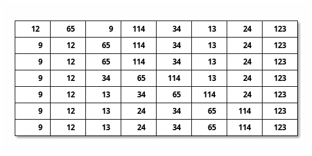

# Übungsblatt 2
Ich benutze hier `\\` für inline-Kommentare in Pseudocode. Dies ist meines Erachtens besser lesbar.

## 1. Laufzeitanalyse
> Betrachten Sie folgenden Algorithmus:
> ```
> BerechneZahl(int n):
>     a = 1
>     b = 1
>     c = 1
>     d = 1
>     for i = 1 to n do
>         a = a*i
>     for i = 1 to n do
>         for j = 1 to i do
>             b = b*j
>
>         for j = 1 to n - i do
>             c = c * (j + i)
>         d = d - a/(b * c)
>         b = 1
>         c = 1
>     return d
> ```

### a)
> Analysieren Sie die asymptotische Worst-Case-Laufzeit des Algorithmus. Das heißt:
> 1. Notieren Sie die Anzahl der Rechenschritte zeilenweise in Abhängigkeit der Eingabegröße $n$.
> 2. Summieren Sie die Gesamtanzahl der Rechenschritte.
> 3. Ordnen Sie die asymptotische Laufzeit in $\mathcal O$-Notation ein.

```
BerechneZahl(int n):
    a = 1  \\ 1
    b = 1  \\ 1
    c = 1  \\ 1
    d = 1  \\ 1
    for i = 1 to n do  \\ n+1
        a = a*i  \\ n
    for i = 1 to n do  \\ n+1
        for j = 1 to i do  \\ t_1
            b = b*j \\ t_2

        for j = 1 to n - i do \\ t_1
            c = c * (j + i)  \\ t_2
        d = d - a/(b * c) \\ n
        b = 1 \\ n
        c = 1 \\ n
    return d
```

$$
\begin{aligned}
    t_1 = &\sum_{i=1}^{n} (i + 1) \\
    t_2 = &\sum_{i=1}^{n} i \\
    t_3 = &\sum_{i=1}^{n} n-i+1 = t_2 \\
    t_4 = &\sum_{i=1}^{n} n-i
\end{aligned}
$$
$t_3$ ist quasi $t_2$ in umgekehrter Reihenfolge summiert.

Summe:
$$
    T(n) = 2n^2 + 8n + 7
$$
Die asymptotische Worst-Case-Laufzeit ist demnach $T(n) \in \mathcal O(n^2)$.

### b)
> Geben Sie an, was der Algorithmus bei Eingabe der natürlichen Zahl n berechnet. Erklären Sie die Funktionsweise des Algorithmus.

```
BerechneZahl(int n):
    \\ initialisiere Variablen
    a = 1
    b = 1
    c = 1
    d = 1

    \\ berechne a = n! (Fakultät)
    for i = 1 to n do
        a = a*i

    for i = 1 to n do
        \\ berechne b = i!, da am Anfang dieser Schleife b=1
        for j = 1 to i do
            b = b*j

        \\ berechne c = (n-i)!
        for j = 1 to n - i do
            \\ (j+i) läuft von i bis n
            c = c * (j + i)

        d = d - a/(b * c)

        \\ setze Variablen auf 1 zurück
        b = 1
        c = 1
    return d
```

1. berechne $\mathrm a = n!$
2. für $i\le n, i\in\mathbb N:$
    1. berechne $\mathrm b = i!$
    2. berechne $\mathrm c = (n-i+1)!=\frac{n!}{i!}$
    3. $\mathrm d = \mathrm d - \frac{\mathrm a}{\mathrm b \cdot \mathrm c} = \mathrm d - \frac{n!}{i! \cdot (n-i)!} = \mathrm d - 1$
4. $\mathrm d = 1 - n$

### c)
> Lässt sich das Ergebnis des Algorithmus auch effizienter berechnen? Erklären Sie warum nicht oder geben Sie einen schnelleren Algorithmus an und analysieren Sie dessen asymptotische Worst-Case-Laufzeit.

```
BerechneZahl(int n):
    return 1 - n
```

$$
    T(n) = \mathcal O(1)
$$

## 2. Landau Notation
> Welche der folgenden Aussagen sind korrekt?

$$
\begin{aligned}
    \mathcal O (g(n)) =\ &\{
        f(n) |
        \exists c\in\mathbb R_+:\exists n_0\in\mathbb N:
        \forall\mathbb N \ni n\ge n_0: 0 \le f(n) \le c\cdot g(n)
    \} \\
    \Omega (g(n)) =\ &\{
        f(n) |
        \exists c\in\mathbb R_+:\exists n_0\in\mathbb N:
        \forall n\ge n_0: 0 \le c\cdot g(n) \le f(n)
    \} \\
    & f(n) \in \mathcal O(g(n)) \Leftrightarrow \ g(n) \in \Omega(f(n))
\end{aligned}
$$

### 1.
> $6n^2 + n^3 \in \mathcal O(n^2)$

**Falsch**. Seien $c, n_0 > 0$.
$$
    6n^2 + n^3 > cn^3 \\
    \Leftrightarrow n^3 > n^2(c-6) \\
    \Leftrightarrow n > c-6
$$
Sei $n=\max[n_0, c-5]$. Damit gibt es immer ein $n$, dass obige Gleichung erfüllt. Dies widerspricht der Forderung von $\mathcal O(n^2)$.

### 2.
> $2\log_2 n \in \mathcal \Omega(n)$

**Falsch**.

$$
\begin{aligned}
    2\log_2 n \in\ &\mathcal \Omega(n) \\
    \Leftrightarrow n \in \ &\mathcal O(2\log_2(n)) \\
    \Rightarrow n \ge\ &4c\log_2(n) \overset{*}{>} 2c\log_2(n) \\
\end{aligned}
$$
$$
    n=\max[n_0, 2^{10c}] \Rightarrow n \ge 4c\log_2(n)
        \begin{cases}
            n=2^{10c} &\overset{**}{\Rightarrow} 2^{10c} \ge 40 c^2 \\
            n=n_0 &\Leftrightarrow \frac{\log_2(n)}{2} > c
                \overset{**}{\Rightarrow} n_0 \ge \frac{4(\log_2(n))^2}{10}
        \end{cases}
$$

Die Ungleichung $*$ gilt für $n\ge 2$. Die Ungleichungen $**$ stehen im Widerspruch zu der getätigten Aussage. Damit ist der Widerspruchsbeweis abgeschlossen.

### 3.
> $\mathcal O(n^2+2n) = \mathcal O(n^2)$

**Richtig**.

#### $\Leftarrow$
Wenn $f(n) \in \mathcal O(n^2+2n) \Leftarrow f(n) \in \mathcal O(n^2)$.
Beweis:
$$
    f(n) \in \mathcal O(n^2) \Rightarrow
        \exists c,n_0: \forall n\ge n_0: 0\le f(n) \le cn^2 \\
$$
$$
    \text{Sei } c^\prime=c, n_0^\prime=n_0
            \Rightarrow \forall n\ge n_0: 0\le f(n) \le c^\prime(n^2 + 2n) \\
$$
$$
    \Rightarrow \exists c^\prime, n_0^\prime:
            \forall n\ge n_0: 0\le f(n) \le c^\prime(n^2 + 2n) \\
        \Leftrightarrow f(n) \in \mathcal O(n^2+2n)
$$

#### $\Rightarrow$
Wenn $f(n) \in \mathcal O(n^2+2n) \Leftarrow f(n) \in \mathcal O(n^2)$.
Beweis:
$$
    f(n) \in \mathcal O(n^2+2n) \Rightarrow
        \exists c,n_0: \forall n\ge n_0: 0\le f(n) \le c(n^2+2n) \\
$$
$$
    \text{Seien\ } c^\prime=2c \land n_0 = 3 \Rightarrow \forall n\ge n_0:
        \frac{2c}{c^\prime-c} \overset{*}{\le} n \\
$$
$$
    \Rightarrow \exists c=2c, n_0: \forall n\ge n_0: f(n) \le c^\prime n^2\\
    \Leftrightarrow f(n) \in \mathcal(n^2)
$$

Nebenrechnung:
$$
    cn^2 + 2cn \le c^\prime n^2
        \Leftrightarrow cn + 2c \le c^\prime n
        \Leftrightarrow 2c \le (c^\prime-c)n \\
        \Leftrightarrow \frac{2c}{c^\prime-c} \overset{*}{\le} n
$$

### 4.
> $3n^4 + 2n - 3 \in \Omega(n^3)$

**Richtig**.
Seien $c=n_0=1$, so gilt für alle $n\ge n_0$ $0\le cn^3 \le 3n^4 + 2n-3 \Leftrightarrow 3n^4 + 2n - 3\in\Omega(n^3)$.

### 5.
> $\log_2 n + 12 + n \in \mathcal O(n\log_2n)$

**Richtig**.
Seien $c=15$ und $n_0=2$. Dann gilt für alle $n\ge n_0$ $\log_2(n)+12+n\le cn\log_2n$. Dies ist äquivalent zu der Aussage $\log_2 n + 12 + n \in \mathcal O(n\log_2n)$.

# Übungsblatt 3
## 1. Schleifeninvariante
> Betrachten Sie den folgenden Algorithmus, der als Eingabe ein Array $A = [a_1, a_2,\dots, a_n]$ der Länge $n$ mit $a_i \in\mathbb N$, $1 \le i \le n$ erhält.
> ```
> BerechneWert(A,n):
> 1.  p=0
> 2.  for i = 1 to n do
> 3.      p = p + A[i]
> 4. return p/n
> ```

### a)
> Stellen Sie eine Behauptung auf, welchen Wert der Algorithmus in Abhängigkeit des Eingabearrays berechnet.

Der Algorithmus berechnet den Mittelwert (Arithmetisches Mittel) der Werte in A.

### b)
> Formulieren Sie eine Schleifeninvariante, die zu Beginn jeder Iteration der for-Schleife (Zeilen 2 und 3) für die Variable $p$ gilt. Beweisen Sie diese mittels vollständiger Induktion.

#### Invariante
Beim $i$-ten Eintritt in den Schleifenrumpf hat $p$ den Wert der Summe der Elemente an der Position $j< i$, wobei $j\in\mathbb N_0$ auch $0$ sein kann: $S(i): p=\sum_{j=1}^{i-1} \mathrm A[j]$

#### Induktionsvoraussetzung
Für $i=1$ ist $p=0$. Die Summe aller Elemente an den Positionen vor $i$ ist $\sum_{j=1}^{0} \mathrm A[j]=0$, die $S(1)$ gilt daher.

#### Induktionsannahme
Gelte die Invariante für $i$. Es ist zu zeigen, dass die Invariante auch für $i+1$ gilt.

#### Induktionsschritt
* Gelte die Invariante für die Position $i$.
* Dies bedeutet, dass zwischen den Zeilen 2 und 3 $p=\sum_{j=1}^{i-1} \mathrm A[j]$ gilt.
* In Zeile 3 wird $\mathrm A[i]$ addiert, danach gilt $p=\sum_{j=1}^{i} \mathrm A[j]$.
* Dann gilt $S(i+1)$.
* $\mathrm{q.e.d.}$

### c)
> Verwenden Sie die Schleifeninvariante aus Aufgabenteil b), um zu zeigen, dass die Behauptung aus Aufgabenteil a) korrekt ist.

Wenn Zeile 4 erreicht wird, gilt nach $S(n+1): p=\sum_{j=0}^{n} \mathrm A[j]$, was die Summe aller Elemente von $\mathrm A$ ist. Der Mittelwert $\bar{A}$ wird durch die Formel $\bar{A}=\frac{1}{n}\sum_{j=0}^n \mathrm A[j]$ ermittelt. Daher gilt hier $\bar A=\frac{p}{n}$, was zurückgegeben wird. Damit ist die Korrektheit der Annahme in a) bewiesen. $\mathrm{q.e.d.}$

## 2. Korrektheit
> Gegeben sei der folgende Algorithmus zur Berechnung der Potenz $a^b$ für zwei Zahlen $a,b\in \mathrm N_{\ge 0}$.
> ```
> Potenz(a, b):
>     if b = 0 then
>         return 1
>     return a · Potenz(a, b - 1)
> ```
> Beweisen Sie mithilfe von vollständiger Induktion die Korrektheit des Algorithmus. Zeigen Sie dazu einen Induktionsanfang für eine geignete Induktionsvariable, formulieren Sie eine Induktionsannahme und zeigen Sie unter dieser einen Induktionsschritt.

### Induktionsvoraussetzung: $b=0$
Im Fall von $b=0$ wird $1$ zurückgegeben (Zeilen 1-2).  Für alle $a$ gilt $a^0=1$, daher ist der Code richtig.

### Induktionsannahme
$\mathrm{Potenz}(a, b-1)$ gebe die korrekte Potenz $a^{b-1}$ zurück.

### Induktionsschritt
Sei $b>0$. Dann wird in Zeile 3 $\mathrm{Potenz}(a, b-1)$ aufgerufen. Nach Induktionsannahme gibt dies $a^{b-1}$ zurück. Damit ist der Rückgabewert von $\mathrm{Potenz}(a, b)$ gleich $a\cdot a^{b-1}=a^b$, was die korrekte Potenz ist. $\mathrm{q.e.d.}$

## 3. Merge-Operation
> Betrachten Sie die Funktion $\mathrm{Merge}(A, p, q, r)$ aus der Vorlesung. Diese fügt die sortierten Teilarrays $\mathrm A[p..q]$ und $A[q + 1..r]$, $1 \le p \le q < r$, zum sortierten Teilarray $A[p..r]$ zusammen und soll dabei $\mathcal O(n)$ Zeitschritte benötigen, wobei $n = r - p + 1$ ist.

MergeSort:
```
MergeSort(A,p,r) \\ Sortiert A[p..r]
    if p<r then \\ Rekursionsabbruch, wenn p=r
        int q = (p+r)/2 \\ Berechne die Mitte (Gaußklammer)
        MergeSort(A,p,q) \\ Sortiere linke Teilhälfte
        MergeSort(A,q+1,r) \\ Sortiere rechte Teilhälfte
        Merge(A,p,q,r) \\ Füge die Teile zusammen
```

### meine Lösung (nicht funktional)
#### a)
> Spezifizieren Sie die Merge-Funktion in Pseudocode. Geben Sie außerdem eine intuitive Erklärung zu Ihrem Pseudocode an.

```
Merge(A, left, middle, right)
    l = left \\ 1
    r = middle + 1 \\ 1
    while l <= middle and r <= right \\ t_n+1
        x = A[left + i] \\ t_n
        y = A[middle + 1 + i] \\ t_n
        if x < y then l = l+1 \\ t_n
        else \\ t_n
            A[left + i] = y \\ t_n
            A[middle + 1 + i] = x \\ t_n
        r = r+1 \\ t_n
```

Es funktioniert allerdings nicht. Aus Zeitgründen aufgehört.

#### b)
> Analysieren Sie die asymptotische Worst-Case-Laufzeit Ihres Algorithmus.

```
Merge(A, left, middle, right)
    l = left \\ 1
    r = middle + 1 \\ 1
    while l <= middle and r <= right \\ t_n+1
        x = A[left + i] \\ t_n
        y = A[middle + 1 + i] \\ t_n
        if x < y then l = l+1 \\ t_n
        else \\ t_n
            A[left + i] = y \\ t_n
            A[middle + 1 + i] = x \\ t_n
        r = r+1 \\ t_n
```

$$
\begin{aligned}
    t_n =\ &\mathrm{middle}-\mathrm{left}+1 + \mathrm{right}-\mathrm{middle}+1 \\
    =\ &\mathrm{right} - \mathrm{left} + 2 \\
    =\ &n+2 \\
    t_n \in\ &\mathrm{O}(n)
\end{aligned}
$$

### Musterlösung
#### a)
```
Merge(A, p, q, r)
    B = new array[1..(r-p+1)] \\ Feld zum Einsortieren
    i = p \\ aktuelle Position linker Teilarray
    j = q+1 \\ aktuelle Position rechter Teilarray
    for k=1 to r-p+1 do
        \\ wenn rechter Rand überschritten wurde oder das linke Element kleiner ist
        if i <= q and (j>r or A[i] <= A[j])
        then
            \\ dann nehme das linke Element (falls vorhanden)
            B[k] = A[i] \\ in richtige Position in B einfügen
            i = i+1
        else
            \\ sonst nehme das rechte Element
            B[k] = A[j] \\ in richtige Position in B einfügen
            j = j+1
    A[p..r] = B[1..(r-p+1)] \\ kopiere Daten von B nach A
```

#### b)
```
Merge(A, p, q, r)
    B = new array[1..(r-p+1)] \\ O(n) mit n=r-p+1
    i = p \\ O(1)
    j = q+1 \\ O(1)
    for k=1 to r-p+1 do \\ O(n+1)
        \\ wenn rechter Rand überschritten wurde oder das linke Element kleiner ist
        \\ folgender Block: 3n, also O(n)
        if i <= q and (j>r or A[i] <= A[j]) \\ O(n) (je 1 Schritt)
        then
            \\ dann nehme das linke Element (falls vorhanden)
            B[k] = A[i] \\ in richtige Position in B einfügen \\ O(n)
            i = i+1 \\ O(n)
        else
            \\ sonst nehme das rechte Element
            B[k] = A[j] \\ O(n)
            j = j+1 \\ O(n)
    A[p..r] = B[1..(r-p+1)] \\ O(n)
```

Da die höchste Ordnung $\mathcal O(n)$ ist, gilt $T(n)\in\mathcal O(n)$.

## 4. Teile & Herrsche
> Gegeben sei ein Feld $A$ mit $n$ natürlichen Zahlen. Entwickeln Sie einen rekursiven Teile-und-Herrsche-Algorithmus, der für die Eingabe $A$ die Anzahl der gerade Zahlen in $A$ berechnet. Geben Sie ihren Algorithmus in Pseudocode an und kommentieren Sie diesen.

```
CountEven(A, first, last)  \\ erster Aufruf: CountEven(A, 1, n)
    if first = last \\ einzelnes Element
    then
        if A[first] is even
        then return 1 \\ gerade: zähle dieses Element
        else return 0 \\ ungerade: ignoriere dieses Element
    else \\ nicht notwendig
        \\ gaussklammer: finde das mittlere Element (eher das linke)
        q = gaussklammer((first+last)/2)
        l = CountEven(A, first, q) \\ zähle in linker Hälfte
        r = CountEven(A, q+1, last) \\ zähle in rechter Hälfte
        return l + r \\ beide Hälften zusammen ergeben vollständige Zählung
```

# Übungsblatt 4
## 1. Binäre Suche
> Betrachten Sie das folgende Feld von Zahlen:
> 
> $A = [6, 3, 36, 99, 2, 39, 12, 45, 23, 17, 24]$
> 
> Strukturieren Sie die Elemente in dem Feld um, sodass Binäre Suche anwendbar ist.
> 
> Führen Sie anschließend die aus der Vorlesung bekannte Methode $\mathrm{BinäreSuche}(A,12,1,11)$ aus, um in dem Feld $A[1, \dots , 11]$ nach dem Wert $12$ zu suchen und geben Sie die Ausgabe, sowie die besuchten Teilfelder des Algorithmus an.

Pseudocode der Suchfunktion:
```
BinäreSuche(A,x,p,r) \\ Finde Zahl x in sortiertem Feld A[p..r]
    if p=r then return p \\ sofern vorhanden
    else \\ Ausgabe: Index der gesuchten Zahl
    int q = (p+r)/2 \\ Berechne die Mitte (Gaußklammer)
    if x <= A[q] then return BinäreSuche(A,x,p,q)
    else return BinäreSuche(A,x,q+1,r)
```

### a) Strukturiere A
$A$ muss aufsteigend sortiert sein, sieht sortiert also folgendermaßen aus:
$$
A = [2, 3, 6, 12, 17, 23, 24, 36, 39, 45, 99]
$$

### b) Suche $12$
```
A = [6, 3, 36, 99, 2, 39, 12, 45, 23, 17, 24]$
sortiere(A)
BinäreSuche(A,12,1,11)
```

* Rückgabewert: $4$
* Besuchte Felder:
    1. Feld $6$, Wert $23$
    2. Feld $3$, Wert $6$
    3. Feld $5$, Wert $17$
    4. Feld $4$, Wert $12$

## 2. Teile und Herrsche
> Gegeben sei ein aufsteigend sortiertes Feld $A$ aus $n$ natürlichen Zahlen. Bei der Übertragung des Feldes ist ein Fehler unterlaufen. Die Diagnose des Fehlers besagt, dass es nach der Übertragung maximal einen Wert gibt, welcher verfälscht wurde. Dies bedeutet, dass die betroffene Stelle des Feldes einen größeren Wert als ursprünglich haben kann. Dadurch kann es sein, dass das Feld nach der Übertragung nicht mehr aufsteigend sortiert ist. Also kann binäre Suche auf dem Feld nicht mehr angewandt werden.
> 
> Trotz dieses Fehlers sollen aber alle unverfälschten Werte von Feld $A$ in Laufzeit $\mathcal O(\log n)$ gesucht werden können.

### a) Algorithmus
> Entwickeln Sie einen Teile-und-Herrsche-Algorithmus, welcher das Feld $A$, dessen Länge $n$ und eine natürliche Zahl $x$ bekommt, und in Laufzeit $\mathcal O(\log n)$ die Position von $x$ im Feld $A$ zurückgibt, sofern $x$ ein unverfälschter Wert ist. Sollte $x$ durch den Übertragungsfehler in $A$ entstanden sein, kann der Algorithmus in Laufzeit $\mathcal O(\log n)$ $\mathcal O(\log n)$ die Position von $x$ ausgeben, oder einen Fehler ausgeben.

Anpassungsidee:

* Betrachte immer die beiden mittleren Werte, statt eines einzelnen. Falls der vordere größer ist als der erste, liegt hier der Vertauschungsfehler vor.
* Falls der Übertragungsfehler $x$ erzeugt hat, kann sofort ein Fehler zurückgegeben werden.
* Ansonsten muss die zweite der mittleren Stellen verwendet werden, um weiterhin binär zu suchen. Auf diese Weise ist der Korrekte der beiden mittleren Werte für den Vergleich herangezogen worden.

```
01. Search(A,x,l,r)
02.     if l=r
03.     then
04.         if A[l]=x
05.         then return l
06.         else return NIL

07.     m = gauss((l+r)/2) \\ Berechne die Mitte (Gaußklammer)
08.     if A[m] > A[m+1] \\ Übertragungsfehler bei m
09.         if A[m] = x then return NIL \\ gefunden, sollte aber nicht da sein
            \\ x < A[m+1] sinnvoller, dann kann man A[l..m-1] betrachten
10.         if x <= A[m+1]
12.         then return Search(A,x,l,m+1)
13.         else return Search(A,x,m+2,r)

14.     if x <= A[m]
15.     then return Search(A,x,l,m)
16.     else return Search(A,x,m+1,r)
```

Offizielle Lösung. Betrachte, ob das Element verfälscht wurde, d.h. der Fehler kann einen Wert vergrößern oder verkleinern.
```
Search(A,x,l,r)
    n = r-l+1 \\ Anzahl der hier betrachteten Elemente
    if n<=3
    then \\ konstante Worst-Case-Laufzeit
        \\ prüfe, ob x enthalten ist
        for i=l to r do
            if A[i] = x then return i
        return NIL \\ Fehler
    \\ ab hier gilt n>=4

    m = gauss((r+l)/2) \\ gaussklammer
    if A[m-1] > A[m] then m = m+1 \\ Wert wurde verkleinert
    if A[m] > A[m+1] then m = m-1 \\ Wert wurde vergrößert

    if A[m] <= x
    then return Search(A,x,m+1,r)
    else return Search(A,x,l,m)
```

### b) Laufzeit
> Beginnen Sie die Laufzeitanalyse Ihres Algorithmus, indem Sie eine Rekursionsgleichung für die Laufzeit herleiten und angeben.

* $n=1$: Zeilen 2-6 werden ausgeführt, daher $T(1) = 3$
* $n>1$:
    * Zeile 2: $1$
    * Zeile 7: $1$
    * Zeile $8$: 1
    * Zeile 9: worst case ist _nicht gefunden_, daher $1$ (ansonsten bricht die Rekursion ab)
    * Zeile 10 oder Zeile 14: $1$
    * Zeilen 12, 13, 15, 16: Genau ein Funktionsaufruf wird ausgeführt, jeder hat $T(\frac{n}{2})$

$$
\begin{aligned}
    T(n) &=
        \begin{cases}
            n=1: & 3 \\
            n>1: & T(\frac{n}{2}) + 6
        \end{cases} \\
    \Rightarrow T(n) &\in \mathcal O(\log_2(n))
\end{aligned}
$$

### c) Korrektheit
> Beweisen Sie die Korrektheit Ihres Algorithmus.

Bessere Idee: Definiere $n=r-l+1$ und beweise für $n$.

### Induktionsanfang
Sei $l=r$. Dann wird die Position $l$ zurückgegeben, falls an der Stelle der Wert $x$ im Feld steht; in diesem Fall wurde $x$ gefunden. Ansonsten wird $\mathrm{NIL}$ zurückgegeben, da $x$ nicht gefunden wurde. Damit stimmt das Ergebnis der Methode $\mathrm{Search}(A, x, l, r)$ für $l=r$.

### Induktionsannahme
Gebe $\mathrm{Search}(A, x, l, r)$ den richtigen Wert für das linken oder rechten Teilfeld $A$ zurück. Dies heißt insbesonde, dass entweder $l$ oder $r$ die Mitte $\frac{l+r}{2}\pm 1$ beschreiben müssen.

### Induktionsschritt
* Sei $l<r$. Dann beschreibt $m=\lbrack\frac{l+r}{2}\rbrack$ die mittlere Stelle und $m+1$ die darauf folgende Stelle des noch zu durchsuchenden Feldes.
* Das Feld ist i.A. sortiert, es gibt nur einen möglichen Fehler. Wenn nun $A[m]>A[m+1]$, so haben wir an der Stelle $m$ den Fehler. Damit gibt es im Rest des Feldes keine Fehler.
    * Falls $x=A[m]$, so wurde ein $x$ gefunden, dass nicht existieren sollte. Dies ist ein Fehlerzustand, daher ist der Rückgabewert $\mathrm{NIL}$ korrekt.
    * Falls $x<A[m+1]$, so ist $x$ aufgrund der Sortierung von $A$ im Bereich $A[l..m+1]$. Dann liefert $\mathrm{Search}(A, x, l, m+1)$ nach Induktionsannahme den richtigen Wert zurück.
    * Falls $x\ge A[m+1]$, so ist $x$ aufgrund der Sortierung von $A$ im Bereich $A[m+2..r]$. Dann liefert $\mathrm{Search}(A, x, l, m+2)$ nach Induktionsannahme den richtigen Wert zurück.
* Falls es an der Stelle $m$ keinen nachweisbaren Fehler gibt, ist das Feld an dieser Stelle korrekt sortiert.
    * Falls $x<A[m]$, so ist $x$ aufgrund der Sortierung von $A$ im Bereich $A[l..m]$. Dann liefert $\mathrm{Search}(A, x, l, m)$ nach Induktionsannahme den richtigen Wert zurück.
    * Falls $x\ge A[m+1]$, so ist $x$ aufgrund der Sortierung von $A$ im Bereich $A[m+1..r]$. Dann liefert $\mathrm{Search}(A, x, l, m+1)$ nach Induktionsannahme den richtigen Wert zurück.

## 3. Rekursionsgleichungen
> Geben Sie für die folgenden Rekursionsgleichungen eine möglichst einfache und langsam wachsene Funktion $g(n)$ an, sodass $T(n)\in\mathcal O(g(n))$ ist.
> 
> Gehen Sie dabei wie folgt vor:
> 
> Lösen Sie die Rekursionsgleichungen auf, um eine nicht rekursive Funktion zu erhalten, welche die Laufzeit in Abhängikeit von $n$ beschreibt und beweisen Sie deren Korrektheit mittels Induktion. Drücken Sie nun Ihre bewiesene Funktion durch $\mathcal O$-Notation aus.

### a)
> $T(n) = \begin{cases}1 & n=1 \\1\cdot T(\frac{n}{4}) + 4& \text{sonst}\end{cases}$

Laufzeit:
$$
\begin{aligned}
    T(n)
        &= T\left(\frac{n}{2}\right) + 4 \\
        &= T\left(\frac{n}{4}\right) + 8 \\
        &= T\left(\frac{n}{8}\right) + 13 \\
        &= \dots \\
      \text{Rekursionstiefe } t \Rightarrow
          T(n) &= T\left(\frac{n}{2^t}\right) + 4t \\
      t = \log_4(n) \Rightarrow
          T(n) &= T\left(\frac{n}{2^{\log_4(n)}}\right) + 4\log_4(n) \\
      \Rightarrow T(n) &= 1 + 4\log_4(n) \\
\end{aligned}
$$

#### Induktionsannahme
Für $n=1$ gilt $T(n=1) = 1 + 4\log_4(1) = 1 = T(1)$.

#### Induktionsvoraussetzung
Sei $n$ eine Viererpotenz und gelte $T(n) = 1+4\log_4(n)$.

#### Induktionsschritt
Zeige, dass $T(4n)$ gilt.
$$
\begin{aligned}
    T(4n)
        &= \left[1+4\log_4\left(\frac{4n}{4}\right)\right] + 4 \\
        &= 5 + 4(\log_4(n) - \log_4(4)) \\
        &= 5 + 4\log_4(n) - 4 \\
        &= 1 + 4\log_4(n) \\
        & \mathrm{q.e.d.}
\end{aligned}
$$

Damit gilt $T(n) \in\mathcal O(log_4(n))$.

### b)
> $T(n) = \begin{cases}1 & n=1 \\2\cdot T(\frac{n}{2}) + n^2& \text{sonst}\end{cases}$

Laufzeit:
$$
\begin{aligned}
    T(n)
        &= \sum_{i=0}^{t-1} 2^i T\left(\frac{n}{2^i}\right) + tn^2 \\
        &= 2^t\cdot T\left(\frac{n}{2^t}\right)
            + \sum_{i=0}^{t-1} 2^i \left(\frac{n}{2^i}\right)^2 \\
        &= 2^t\cdot T\left(\frac{n}{2^t}\right)
            + n^2\sum_{i=0}^{t-1} \frac{1}{2^i} \\
     t = \log_2(n) \Rightarrow T(n)
         &= 2^{\log_2(n)} T(1) + n^2\sum_{i=0}^{\log_2(n)-1} \frac{1}{2^i} \\
         &= 1 + n^2(2-\frac{2}{n}) \\
         &= n + 2n^2-2n \\
     T(n) &= 2n^2 - n
\end{aligned}
$$

Behauptung: $T(n)\in\mathcal O(n^2)$

#### Induktionsvoraussetzung
Sei $c>2$ konstant. Wir beweisen für Zweierpotenzen $n$.

$$
    T(1) = 1 \le c\cdot 1^2 \Rightarrow T(1) \in \mathcal O(n^2)
$$

#### Induktionsannahme
Gelte $T(n) = c\cdot n^2$.

#### Induktionsschritt
Zu zeigen ist $T(2n) \le c\cdot (2n)^2 = 4cn^2$.
$$
\begin{aligned}
    T(2n) &= T(n) + (2n)^2 \\
        &= cn^2 + 4n^2 \\
        &= (c+4)n^2 \le 4cn^2 \\
    \Leftrightarrow c+4 &\le 4c \\
    \Leftrightarrow 4 &\le 3c \\
    \Leftrightarrow \frac{4}{3} &\le c \\
\end{aligned}
$$

Für $c=2$ ist dies gelöst.

### c)
> $T(n) = \begin{cases}1 & n=1 \\3\cdot T(\frac{n}{2}) + n& \text{sonst}\end{cases}$

$$
    T(n) = 3^3 T\left(\frac{n}{3^3}\right) + 3n \\
    = 3^{\log_3(n)} \cdot T\left(\frac{n}{3^{\log_3(n)}}\right) + n\log_3(n) \\
    = n + n\log_3(n)
$$

Behauptung: $T(n)\in\mathcal O(n\log_3(n))$.
Beweis mittels vollständiger Induktion, analog zu a) und b).

### Appendix: Rekursionstiefe
Sei $T(n) = aT(\frac{n}{b}) + f(n)$. Dann gilt: Die Rekursionstiefe ist $\log_b(n)$. Beweis:

Auf der tiefsten Rekursionsebene ist das Array in Blöcke der Größe $1$ unterteilt. Je Ebene wird in $b$ Teile unterteilt, daher gibt es in der $x$-ten Rekursionsebene $b^x$ Teilarrays. Damit diese die Länge 1 haben, muss gelten $\frac{n}{b^x}= 1$. Falls $n$ eine Potenz von $b$ ist, gilt Gleichheit, ansonsten muss es weniger Teilarrays geben. Dies ist äquivalent zu $n=b^x$ und dies zu $\log_b(n)=x$. Daher muss es $x$ Rekursionsebenen geben, damit alle Teilarrays die Länge $1$ haben. Dies bedeutet, die Rekursionstiefe ist $\log_b(n)$.

# Übungsblatt 5
## 1. Mastertheorem
> Verwenden Sie das Master-Theorem, um für die folgenden Rekursionsgleichungen asymptotische Schranken anzugeben.

### a)
> $T(n) = \begin{cases}12 & n=1 \\2\cdot T(\frac{n}{2}) + 12& \text{sonst}\end{cases}$

$$
\begin{aligned}
    f(n) &= 12 \\
    f\left(\frac{n}{b}\right) &= 12 \\
    \exists 1>\gamma=\frac{1}{2}: \gamma a\cdot f\left(\frac{n}{b}\right) = \gamma\cdot 12\cdot2 &\leq 12 = f(n)
\end{aligned}
$$

Daher ist Teil $3$ vom Mastertheorem erfüllt. Daraus folgt:
$$
    T(n) \in\mathcal O(2^{\log_{2}(n)}) = \mathcal O(n)
$$

### b)
> $T(n) = \begin{cases}1 & n=1 \\1\cdot T(\frac{n}{3}) + n^3& \text{sonst}\end{cases}$

$$
\begin{aligned}
    f(n) &= n^3 \\
    f\left(\frac{n}{b}\right) &= \frac{n^3}{3^3} \\
    \exists 1<\gamma= 3^3: \gamma a\cdot f\left(\frac{n}{b}\right) = \gamma \frac{n^3}{3^3} &\leq n^3 = f(n)
\end{aligned}
$$

Daher ist Teil $2$ vom Mastertheorem erfüllt. Daraus folgt:
$$
    T(n) \in\mathcal O(n^3)
$$


### c)
> $T(n) = \begin{cases}1 & n=1 \\1\cdot T(\frac{n}{2}) + n& \text{sonst}\end{cases}$

$$
\begin{aligned}
    f(n) &= n \\
    f\left(\frac{n}{b}\right) &= \frac{n}{2} \\
    \exists 1<\gamma=2: \gamma a\cdot f\left(\frac{n}{b}\right) = \gamma \frac{n}{2} &\geq n = f(n)
\end{aligned}
$$

Daher ist Teil $2$ vom Mastertheorem erfüllt. Daraus folgt:
$$
    T(n) \in\mathcal O(n)
$$

### d)
> $T(n) = \begin{cases}1 & n=1 \\2\cdot T(\frac{n}{4}) + \sqrt{n}& \text{sonst}\end{cases}$

$$
\begin{aligned}
    f(n) &= \sqrt{n} \\
    f\left(\frac{n}{b}\right) &= \frac{\sqrt{n}}{2} \\
    \exists \gamma=1: \gamma a\cdot f\left(\frac{n}{b}\right) = \gamma \frac{n}{2} &\leq n = f(n)
\end{aligned}
$$

Daher ist Teil $1$ vom Mastertheorem erfüllt. Daraus folgt:
$$
    T(n) \in\mathcal O(\sqrt{n}\log_2n)
$$


## 2. Teile und Herrsche
> Wir betrachten den Aktienkurs der Firma Informatik AG. Der Wert einer Aktie über $n$ Zeiteinheiten wird dabei in dem Array $A$ gespeichert. Wir möchten wissen zu welchen Zeiten wir die Aktie kaufen und verkaufen sollten, um den maximalen Gewinn zu erziehlen.
> 
> Kauf und Verkauf dürfen dabei aber nur einmal passieren.
> 
> Formal ist also ein Array $A[1..n]$ von positiven ganzen Zahlen gegeben und wir wollen die größte Wertdifferenz $A[i] - A[j]$ für $j \le i$ bestimmen.

### a)
> Betrachten Sie zwei benachbarte Teilarrays $A[i..j]$ und $A[j + 1..l]$ mit $1 \le i \le j < l \le n$. Welche Informationen über die Teilarrays werden benötigt, um die maximale Differenz zweier Elemente in $A[i..l]$ in konstanter Zeit zu berechnen? Erklären Sie auch wie diese Berechnung funktioniert.

Es wird von beiden Teilarrays die Position von den jeweiligen globalen Minima und Maxima benötigt. Dann können die jeweiligen Differenzen verglichen werden. Hier gibt es mehrere Fälle: Die Differenz in einem der Teilarrays die größte Differenz sein, oder das die Differenz von dem linken Minimum (an einer Position $i_-\le j$) und dem rechten Maximum (an einer Position nach $i_+\ge j+1$) kann am größten sein.

In jedem dieser Fälle muss jedoch sichergestellt werden, dass das Minimum vor dem Maximum kommt, ansonsten ist es für unseren Gewinn irrelevant. Dies ist für die Differenz aus dem linken Minimum und dem rechten Maximum immer gegeben.

### b)
> Entwickeln Sie einen Teile-und-Herrsche-Algorithmus, der Ihre Überlegungen aus Aufgabenteil a) verwendet, um die größte Wertdifferenz zu berechnen. Geben Sie eine Implementierung Ihres Algorithmus in Pseudocode an und kommentieren Sie diesen. Für die volle Punktzahl wird ein Algorithmus erwartet, dessen Worst-Case-Laufzeit durch $\mathcal O(n)$ beschränkt ist.

Erster Aufruf für ein Feld $A$ der Länge $n$: $\mathrm{maxProfit(A,1,n)}$. Die Rückgabe bzw. Zuordnung von mehreren Variablen erfolgt über einen geeigneten Verbunddatentyp. Dies könnte in Python ein _Tupel_ sein, die Laufzeit wird dadurch nur durch einen konstanten Faktor verändert.

```
\\ finde die Positionen maximalen Differenz im Intervall A[left..right]
maxProfit(A, left, right)
    if left >= right then return NIL, NIL \\ Fehlerzustand
    if left = right-1 \\ Trivialfall bricht Rekursion ab
    then
        if A[left] < A[right] \\ wenn die Differenz positiv ist
        then return left, right \\ ok
        else return NIL, NIL \\ keine positive Differenz vorhanden

    middle = gauss((right-left)/2) \\ gaussklammer: finde Mitte
    \\ finde Positionen der Differenz im linken Teil
    left_min, left_max = maxProfit(A, left, middle)
    \\ finde Positionen der Differenz im rechten Teil
    right_min, right_max = maxProfit(A, middle+1, right)

    \\ berechne Differenzen
    \\ Differenz im linken Teil
    if left_min = NIL \\ links keine positive Differenz
    then diff_left = -1 \\ ungueltige Differenz
    else diff_left = A[left_max] - A[left_min]

    \\ Differenz im rechten Teil
    if right_min = NIL \\ rechts keine positive Differenz
    then diff_right = -1 \\ ungueltige Differenz
    else diff_right = A[right_max] - A[right_min]

    if left_min = NIL and right_max = NIL
    then
        \\ keine positiven Differenzen gefunden
        \\ keine positive Differenz moeglich
        return NIL, NIL
    else
        if left_min = NIL or right_max = NIL
        then
            \\ es gibt keine übergreifende gültige Differenz
            \\ es kann aber links ODER rechts eine gültige Differenz geben
            diff_middle = -1
        else
            \\ maximal moegliche Differenz in beiden Teilen zusammen
            diff_middle = A[right_max] - A[left_min]

    \\ finde min(links, rechts)
    \\ falls beide gleich sind, nehme die groessere Spanne
    if diff_left <= diff_right
    then \\ Positionen aus linkem Teil
        min_pos = left_min
        max_pos = left_max
        current_max_diff = diff_left
    else \\ rechter Teil
        min_pos = right_min
        max_pos = right_max
        current_max_diff = diff_right

    if current_max_diff<0 and diff_middle<0
    then return NIL, NIL \\ keine gültige Differenz gefunden

    if current_max_diff < diff_middle
    then return left_min, right_max
    else return min_pos, max_pos
```

### c)
> Analysieren Sie die Laufzeit Ihres Algorithmus. Stellen Sie hierzu eine Rekursionsgleichung für die Laufzeit Ihres Algorithmus auf und lösen Sie diese. Sie dürfen das Mastertheorem verwenden.

```
maxProfit(A, left, right) \\ T(n)
    if left >= right then return NIL, NIL \\ 1 oder 2
    if left = right-1 \\ 1
    then
        if A[left] < A[right] \\ 1
        then return left, right \\ 1
        else return NIL, NIL \\ 1

    middle = gauss((right-left)/2) \\ 1
    left_min, left_max = maxProfit(A, left, middle) \\ T(n/2)
    right_min, right_max = maxProfit(A, middle+1, right) \\ T(n/2)

    \\ block: 2
    if left_min = NIL
    then diff_left = -1
    else diff_left = A[left_max] - A[left_min]

    \\ block: 2
    if right_min = NIL
    then diff_right = -1
    else diff_right = A[right_max] - A[right_min]

    \\ block: 2-3
    if left_min = NIL or right_max = NIL
    then return NIL, NIL
    else
        if left_min = NIL or right_max = NIL
        then
            diff_middle = -1
        else
            diff_middle = A[right_max] - A[left_min]

    \\ block: 4
    if diff_left <= diff_right
    then
        min_pos = left_min
        max_pos = left_max
        current_max_diff = diff_left
    else \\ rechter Teil
        min_pos = right_min
        max_pos = right_max
        current_max_diff = diff_right

    if current_max_diff<0 and diff_middle<0 \\ 1
    then return NIL, NIL \\ 0-1

    \\ block: 2
    if current_max_diff < diff_middle
    then return left_min, right_max
    else return min_pos, max_pos
```

$$
T(n) =
    \begin{cases}
        \text{Fehlerzustand} & 2 \\
        n=1 & 4\\
        n>1 & 4 + 1 + 2T(\frac{n}{2}) + 2 + 2 + 3 + 4 + 1 + 2
    \end{cases}
$$

Fuer die Worst-Case-Laufzeit vernachlässigen wir den Fehlerzustand, da dies nur einmal beim ersten Aufruf der Funktion auftreten kann.

$$
\Rightarrow T(n) =
    \begin{cases}
        n=1 & 4\\
        n>1 & 2T(\frac{n}{2}) + 19
    \end{cases}
$$

$$
\begin{aligned}
    f(n) &= 19 \\
    f\left(\frac{n}{b}\right) &= 19 \\
    \Rightarrow a\cdot f\left(\frac{n}{b}\right) = 2\cdot 19 &\neq 19 = f(n) \\
    \exists \gamma\leq \frac{1}{2}: \gamma a\cdot f\left(\frac{n}{b}\right) = \gamma\cdot 2 \cdot 19 &\leq 19 = f(n)
\end{aligned}
$$

Daher ist Teil $3$ vom Mastertheorem erfüllt. Daraus folgt:
$$
    T(n) \in \mathcal O(2^{\log_{2}n})=\mathcal O(n)
$$

### d)
> Zeigen Sie die Korrektheit Ihres Algorithmus.

```
maxProfit(A, left, right)
 1    if left >= right then return NIL, NIL
 2    if left = right-1
 3    then
 4        if A[left] < A[right]
 5        then return left, right
 6        else return NIL, NIL
 7
 8    middle = gauss((right-left)/2)
 9    left_min, left_max = maxProfit(A, left, middle)
10    right_min, right_max = maxProfit(A, middle+1, right)
11
12    if left_min = NIL
13    then diff_left = -1
14    else diff_left = A[left_max] - A[left_min]
15
16    if right_min = NIL
17    then diff_right = -1
18    else diff_right = A[right_max] - A[right_min]
19
20    if left_min = NIL and right_max = NIL then return NIL, NIL
21    if left_min = NIL or right_max = NIL then diff_middle = -1
22    else diff_middle = A[right_max] - A[left_min]
23
24    if diff_left <= diff_right
25    then
26        min_pos = left_min
27        max_pos = left_max
28        current_max_diff = diff_left
29    else
30        min_pos = right_min
31        max_pos = right_max
32        current_max_diff = diff_right
33
34    if current_max_diff<0 and diff_middle<0 then return NIL, NIL
35    if current_max_diff < diff_middle
36    then return left_min, right_max
37    else return min_pos, max_pos
```

### Induktionsvoraussetzung
Der Algorithmus liefert das korrekte Ergebnis für ein Feld der Länge $2$.

In diesem Fall werden die Zeilen $4-6$ ausgeführt. Falls der erste Wert kleiner ist, werden die Positionen von Minimum und Maximum zurückgegeben, ansonsten wird $\mathrm{NIL}$ als Fehler-Index zurückgegeben.

Damit funktioniert der Algorithmus für $n=2$.

### Induktionsannahme
Liefere der Algorithmus das korrekte Ergebnis für jedes Teilfeld der Länge $n$. Sei das gesamte Feld der Länge $2n$. Dann ist zu zeigen, dass der Algorithmus das Problem löst.

### Induktionsschritt
1. Habe das Feld $A$ die Länge $2n$, dann werden die Zeilen $4-6$ übersprungen.
2. In den Zeilen $8-10$ werden jeweils die Positionen der größten Differenzen der Teilarrays $A[1..\frac{n}{2}]$ und $A[\frac{n}{2}..n]$ ermittelt. Beide Teilarrays haben die Länge $n$, nach Induktionsannahme erhalten wir die korrekten Indizes bzw. $\mathrm{NIL}$ als Fehlermeldung.
3. In den Zeilen $12-18$ werden die Differenzen der Teilbereiche ermittelt, falls sie gültig sind. Ansonsten werden sie auf einen negativen Wert gesetzt, um den Fehler zu kennzeichnen.
4. In Zeile $20$ wird $\mathrm{NIL}$ als Fehlerwert zurückgegeben, falls kein Teilfeld eine gültige Differenz hat. Dann kann es auch keine gültige Differenz im Gesamtfeld geben
5. In Zeile $21$ wird die übergreifende Differenz als fehlerhaft markiert, falls ein Teilfeld keine gültige Differenz hat. Es kann keine die Mitte übergreifende Differenz geben, aber es kann gültige Differenz in einem der beiden Teilarrays geben.
6. In Zeile $22$ wird die übergreifende Differenz ermittelt, falls sie berechnet werden kann.
7. In den Zeilen $24-37$ werden die Positionen mit der größten Differenz ermittelt und zurückgegeben. Falls es in einem Teilbereich keine gültige Differenz gibt, ist der dort angegebene Wert kleiner als _jede_ gültige Differenz. Falls es _nirgendwo_ eine gültige Differenz gibt, wird $\mathrm{NIL}$ als Fehler zurückgegeben.
8. Die in 7. ermittlten Positionen beschreiben geben die größtmögliche Differenz des linken und rechten Teils sowie von dem kleinsten Wert der linken Seite und dem größten Wert der rechten Seite. Dies ist die größtmögliche Differenz im gesamten Feld.

Damit ist bewiesen, dass der Algorithmus korrekt ist.

# Übungsblatt 6
## 1.
> Wir betrachten den Algorithmus $\mathrm{SubsetSum}(A, U, n)$ der Vorlesung. Gegeben sei die folgende Menge:

> $A = \{19, 5, 7, 4, 12, 9, 2, 6, 4\}$ und der Wert $u = 15$.

> Wenden Sie den Algorithmus der Vorlesung an, um zu entscheiden, ob es eine Teilmenge $L \subseteq A$ gibt, sodass $\sum_{x\in L} x = u$ gilt. Geben Sie dabei das vollständige Array $I$, sowie das Ergebnis des Algorithmus an.

```
SubsetSum(A, U, n)
    \\ initalisiere Indikator
    Ind = new array [0..U][1..n]
    for j=1 to U do
        Ind[j,1] = false
    Ind[0,1] = true \\ leere Menge
    if A[1] <= U \\ Menge {A[1]}
    then Ind[A[1],1] = true

    \\ suche nach Teilmenge
    for i=2 to n do
        for u=0 to U do
            Ind[u,i] = false
            if Ind[u,i-1] = true then Ind[u,i] = true
            if u>=A[i] und Ind[u-A[i], i-1] = true then Ind[u,i] = true
    return Ind[U,n]
```

$0\equiv \mathrm{false}$ und $1\equiv \mathrm{true}$

|   | 0 | 1 | 2 | 3 | 4 | 5 | 6 | 7 | 8 | 9 | 10 | 11 | 12 | 13 | 14 | 15 |
|---|---|---|---|---|---|---|---|---|---|---|----|----|----|----|----|----|
| 1 | 1 | 0 | 0 | 0 | 0 | 0 | 0 | 0 | 0 | 0 | 0  | 0  | 0  | 0  | 0  | 0  |
| 2 | 1 | 0 | 0 | 0 | 0 | 1 | 0 | 0 | 0 | 0 | 0  | 0  | 0  | 0  | 0  | 0  |
| 3 | 1 | 0 | 0 | 0 | 0 | 1 | 0 | 1 | 0 | 0 | 0  | 0  | 1  | 0  | 0  | 0  |
| 4 | 1 | 0 | 0 | 0 | 1 | 1 | 0 | 1 | 0 | 1 | 0  | 1  | 1  | 0  | 0  | 0  |
| 5 | 1 | 0 | 0 | 0 | 1 | 1 | 0 | 1 | 0 | 1 | 0  | 1  | 1  | 0  | 0  | 0  |
| 6 | 1 | 0 | 0 | 1 | 1 | 1 | 1 | 1 | 0 | 1 | 0  | 1  | 1  | 1  | 1  | 0  |
| 7 | 1 | 0 | 1 | 0 | 1 | 1 | 1 | 1 | 0 | 1 | 0  | 1  | 1  | 1  | 1  | 1  |
| 8 | 1 | 0 | 1 | 0 | 1 | 1 | 1 | 1 | 1 | 1 | 1  | 1  | 1  | 1  | 1  | 1  |
| 9 | 1 | 0 | 1 | 0 | 1 | 1 | 1 | 1 | 1 | 1 | 1  | 1  | 1  | 1  | 1  |    |


## 2.
> Gegeben sei ein Array $A[1..n]$ mit $1 \le A[i] \le 3$ für alle $1 \le i \le n$. Eine Spielfigur startet auf der ersten Stelle des Arrays und muss die $n$-te Stelle erreichen. Befindet sich die Figur auf der Stelle $i$ für $1 \le i \le n$, so darf sie mit einem Sprung bis zu $A[i]$ Stellen nach vorne ziehen. Im unten gezeigten Beispiel darf die Figur also von der zweiten Stelle aus bis zu $A[2] = 3$ Stellen weiterspringen, also jede der Stellen $3$, $4$ und $5$ mit einem Sprung erreichen. Gesucht ist die minimale Anzahl von Sprüngen, um beginnend auf der ersten Stelle des Arrays die $n$-te Stelle zu erreichen.

> Für das folgende Beispiel mit $n = 8$ beträgt die minimale Anzahl an Sprüngen $3$ und ergibt sich durch die Sprungfolge $1 \curvearrowright 2 \curvearrowright 5 \curvearrowright 8$.

> $A= (2\ \ 3\ \ 1\ \ 2\ \ 3\ \ 1\ \ 2\ \ 1)$

> Sei $M [i]$ die minimal benötigte Anzahl von Sprüngen, um ausgehend von der $i$-ten Stelle die $n$-te Stelle zu erreichen. Geben Sie eine rekursive Formulierung für $M [i]$ an. Erklären Sie die Funktionsweise dieser. Gehen Sie dabei auf jede Fallunterschiedung ein.

Hier wird $\infty$ als Fehlerwert gewählt, damit $\min\{\dots\}$ diesen Pfad nicht auswählen wird.

$$
M(i) =
    \begin{cases}
        0 &: i = n \\
        \infty &: i>n \\
        1+M(i+1) &: A[i] = 1 \\
        1+ \min\{M(i+1), M(i+2)\} &: A[i] = 2 \\
        1+ \min\{M(i+1), M(i+2), M(i+3)\} &: A[i] = 3 \\
    \end{cases}
$$

```
fastestWay(A, n):
    \\ Kann das Ziel in einem Sprung erreicht werden?
    \\ Dies ist auch der Fall, wenn n=1, da A[i] >= 1
    if n<=A[1] then return 1 \\ springe direkt zum Ziel

    fastest = n \\ längstmöglicher Weg: alle A[i]=1

    \\ Da A[i] <= 3 müssen nur 3 Felder auf den kürzesten Weg überprüft werden
    for i=1 to 3 do
        way = fastestWay(A, n-i) \\ finde den schnellsten Weg zur gewählten Position
        if way < fastest \\ falls der Weg der kürzeste ist:
        then fastest = way \\ speichere diese Weglänge

    return fastest
```

## 3.
> Gegeben sei eine Menge $A$ mit $n$ Zahlen. Die Anzahl der Partitionen von $A$ kann mit der sogenannten Stirling Zahl zweiter Art berechnet werden.

> Diese Zahl $S(n, k)$ ist rekursiv definiert als:

> $S(n,k) = \begin{cases}0 & \text{, falls } k=0,n>0 \\1 & \text{, falls } k=n \\S(n-1,k-1)+k\cdot S(n-1,k) & \text{\ \ sonst}\end{cases}$


> und beschreibt wie viele Partitionen einer $n$-elementigen Menge es in $k$ disjunkte Teilmengen gibt.

### a)
> Geben Sie einen rekursiven Algorithmus in Pseudocode an, welcher bei Eingabe einer Zahl $n$ unter Verwendung von $S(n, k)$ die Anzahl aller Partitionen einer Menge mit $n$ Elementen berechnet.

```
S(n, k)
    if k=n then return 1
    if k>=0 and n>0 then return 0 \\ fange negative Eingaben ab
    return S(n-1, k-1) + k * S(n-1, k)
```

Gesucht ist die Anzahl aller Partitionen:
```
NumberOfAllPartitions(n):
    sum = 0
    for k = 0 to n
        sum = sum + S(n, k)
    return sum
```

### b)
> Analysieren Sie die asymptotische Worst-Case-Laufzeit Ihres Algorithmus aus Teilaufgabe a).

```
S(n, k) \\ T(n, k)
    if k=n then return 1 \\ O(1)
    if k>=0 and n>0 then return 0 \\ O(1)
    return S(n-1, k-1) + k * S(n-1, k) \\ T(n-1, k-1) + T(n-1, k)
```

Überlegungen zur Laufzeit:

* Der Rekursionsbaum ist nicht vollständig.
* Seine maximale Höhe ist $n$.
* Der vollständige Baum hat $2^n$ Blätter, tatsächlich hat der Baum weniger Blätter
* Die Laufzeit in jedem Knoten ist konstant.
* Es gibt mehr Blätter als innere Knoten.

Daraus folgt eine Laufzeit von $T_1(n)\in\mathcal O(n)$.

$T(0)\in\mathcal O(1)$ sei die Laufzeit der letzten Rekursionsstufe. Es gilt $T(n)= 2T(n-1) + \mathcal O(1)$. Daher gilt $T(n) = 2^{n-1}T(0)$, also $T(n)\in\mathcal O(2^{n-1}) \subseteq \mathcal O(2^n)$.

```
NumberOfAllPartitions(n): \\ T_2(n)
    sum = 0 \\ O(1)
    for k = 0 to n \\ O(1)
        sum = sum + S(n, k) \\ n*O(2^n)
    return sum
```

$$
\begin{aligned}
    T_1(n, k) &\in \mathcal O(2^n) \\
    T_2(n) &\in \mathcal O(n2^n)
\end{aligned}
$$

### c)
> Geben Sie einen Algorithmus in Pseudocode an, der auf dem Prinzip der dynamischen Programmierung beruht, und bei Eingabe einer Zahl $n$ unter Verwendung von $S(n, k)$ die Anzahl aller Partitionen einer Menge mit $n$ Elementen berechnet.

```
NumberPartitions(n)
    k = n

    S = new array[0..n][0..k]
    for i=0 to n do \\ hier kann n=k gelten
        S[i, i] = 1 \\ k=n
        S[i, 0] = 0 \\ k=0, n>0

    for i=2 to n do
        for j=2 to i-1 do
            S[i, j] = S[i-1,j-1] + j * S[i-1,j]

    sum = 0
    for j=0 to n do
        sum = sum + S[n, j]

    return sum
```

### d)
> Analysieren Sie die asymptotische Worst-Case-Laufzeit Ihres Algorithmus aus Teillaufgabe c).

```
NumberPartitions(n)
    k = n \\ O(1)

    S = new array[0..n][0..n] \\ O(n^2)
    for i=0 to n do \\ O(n+1)
        S[i, i] = 1 \\ O(n)
        S[i, 0] = 0 \\ O(n)

    for i=2 to n do \\ O(n)
        for j=2 to i-1 do \\ O(n(n+1))
            S[i, j] = S[i-1,j-1] + j * S[i-1,j] \\ O(n(n+1))

    sum = 0 \\ O(1)
    for j=0 to n do \\ O(n+2)
        sum = sum + S[n, j] \\ O(n+1)

    return sum \\ O(1)
```

Das Erstellen des Feldes braucht $\mathcal O(n^2)$, daher braucht der gesamte Algorithmus $\mathcal O(n^2)$.

# Übungsblatt 7
## 1. Dynamische Programmierung
> Bob hat Angst vor dem Klimawandel und betrachtet die Höchsttemperaturen der letzten Jahre. Er möchte die steigende Tendenz der Temperaturen beobachten. Einige kalte Zeiten dazwischen interessieren nicht, da die Tendenz für Bob interessant ist.

> Dafür notiert er die Temperaturen in zeitlicher Reihenfolge in einem Array $A = [a_1 ,\dots, a_l]$. Darin sucht er nach einer längsten aufsteigenden Teilsequenz. Dies ist eine Teilsequenz mit maximaler Länge, deren Elemente  aufsteigend sortiert sind. Dabei muss die Sequenz nicht zusammenhängend sein.

Die Aufgabenstellung wird insofern interpretiert, dass die Sequenz nicht monoton steigen muss.

### a)
> Es bezeichne $T (i)$ die Länge der längsten aufsteigenden Teilfolge im Teilarray $A = [a_1 ,\dots, a_l]$, $1 \le i \le l$. Geben Sie eine Rekursionsgleichung für $T (i)$ an und erklären Sie diese.

$$
T(i) =
    \begin{cases}
        1 &: i=1 \\
        T(i-1) &: i>1 \forall j<i: A[i] \le A[j] \\
        T(j) + i-j &: i>1\land \exists j<i: A[i] > A[j]
    \end{cases}
$$

1. Falls nur ein Feld betrachtet wird ist die Lösung trivial.
2. Falls das letzte Element kleiner oder gleich aller vorherigen Elemente ist, ist die längste Teilsequenz identisch mit dem der längsten Teilsequenz für $(i-1)$.
3. Falls das $i$-te Element das bislang größte Element ist, muss die längste aufsteigene Teilsequenz auf bis zur Stelle $i$ erweitert werden. Sei $j$ die Position des bisherigen Maximums, dann wird die Teilsequenz von $T(j)$ um $i-j$ Elemente erweitert.

### b)
> Entwerfen Sie basierend auf der Rekursionsgleichung aus a) einen Algorithmus in Pseudocode, der mit dynamischer Programmierung bei Eingabe eines Arrays $A = [a_1 ,\dots, a_l]$ die Länge einer längsten aufsteigenden Teilsequenz ausgibt. Kommentieren Sie Ihren Algorithmus mit Bezug zu Ihrer Rekursionsgleichung aus a).


```
PartialSequence(A, n)
01.    S = new array[1..n]
02.    S[1] = 1 \\ Fall 1.
03.    cur_max_pos = 1 \\ Position des bisherigen Maximums
04.    for i=2 to n do
05.        if A[i] > A[cur_max_pos]
06.        then \\ neues Maximum gefunden
07.            S[i] = S[cur_max_pos] + i-cur_max_pos \\ Fall 3.
08.            cur_max_pos = i
09.         else \\ kein neues Maximum
10.            S[i] = S[j] \\ Fall 2.
11.    return S[n]
```

### c)
> Analysieren Sie die asymptotische Worst-Case-Laufzeit Ihres Algorithmus.

```
PartialSequence(A, n)
    S = new array[1..n] \\ O(n)
    S[1] = 1 \\ 1
    cur_max_pos = 1 \\ 1
    for i=2 to n do \\ O(n)
        if A[i] > A[cur_max_pos] \\ O(n)
        then \\ neues Maximum gefunden
            S[i] = S[cur_max_pos] + i-cur_max_pos \\ O(n)
            cur_max_pos = i \\ O(n)
        else S[i] = S[j] \\ Fall 2.
    return S[n] \\ O(1)
```

$$
    T(n) = \mathcal O(n)
$$

### d)
> Beweisen Sie die Korrektheit Ihres Algorithmus mithilfe einer Schleifeninvariante.

Im letzten Schleifendurchlauf gilt $i=n$. Danach wird $i$ um eins erhöht, bevor die Schleife abgebrochen wird. Demnach gilt in Zeile $11$ $i+1=n-1$. Wenn die Schleifeninvariante $S[i-1] = T(i)$ gilt, gilt in Zeile $11$ $S[i-1]=S[n]=T(n)$. Dann ist der Algorithmus korrekt.

#### 1. $j<i$
In Zeile $3$ wird $j=1$ initialisiert, beim ersten Eintritt in die Schleife gilt $i=2>j$.
Nur in Zeile $8$ kann im $i$-ten Durchlauf $j=i$ gesetzt werden. Daher gilt beim $(i+1)$-ten Durchlauf der Schleife $i+1>i=j$.

#### 2. $A[j] = \max\{A[1..i-1\}$
##### Induktionsanfang
In den Zeilen $2$ und $3$ werden $j$ und $S[1]$ gesetzt. Für ein einelementiges Feld enthält das erste Feld die Länge des längsten wachsenden Teilfeldes, das die Länge $1$ hat. Da beim ersten Eintritt in die Schleife $i=2$ und $j=1$ gelten, gilt die Invariante.

##### Induktionsannahme
Für $i-1$ gilt die Invariante. Es ist zu zeigen, dass die Invariante auch nach dem $i$-ten Schleifendurchlauf gilt.

##### Induktionsschritt
Nach Induktionsannahme enthält $A[j]$ beim $i$-ten Eintritt in die Schleife die Länge des längsten wachsenden Teilfeldes bis zur Position $i-1$. Falls der Wert an der Stelle $i$ größer ist (Zeile $5$), wird $j=i$ gesetzt (Zeile $8$). Damit enthält $A[j]$ nun die Länge des längsten wachsenden Teilfeldes bis zur Position $i$. Beim nächsten Eintritt in die Schleife ist der Index $i+1$, nun beschreibt $A[j]$ die Länge des längsten wachsenden Teilfeldes bis zur Position $i$. Damit ist die Invariante erfüllt.

#### 3. $S[i-1] = T(i)$
##### Induktionsanfang
Beim ersten Eintritt in die Schleife gelten $i=2$ und $j=1$. Falls $A[2]>A[1]$ (Zeile $5$) wird der Wert $1+2-1=2$ in $S[2]$ gespeichert. Dies entspricht der Länge des längsten wachsenden Teilfeldes in diesem Fall. Ansonsten wird der Wert $1$ in $S[2]$ gespeichert, was ein einelementiges wachsendes Teilfeld beschreibt. Beim zweiten Eintritt in den Schleifenrumpf gilt $i=3$ und $S[2]$ enthält die Länge des längsten wachsenden Teilfeldes. Damit gilt an der Stelle $S[i-1] = T(i)$.

##### Induktionsannahme
Gelte $S[i-1]=T(i)$. Es ist zu zeigen, dass die Invariante auch nach dem $i$-ten Schleifendurchlauf gilt.

##### Induktionsschritt
Beim $i$-ten Eintritt in die Schleife gilt nach Induktionsannahme $S[i-1]=T(i)$. Zudem enthält $A[j]$ die Länge des längsten wachsenden Teilfeldes.

Wenn $A[i]>A[j]$ gilt, muss das längste aufsteigene Teilfeld bis zur Stelle $i$ erweitert werden. Die bisherige Länge $S[j]$ wird um $i-j$ Felder ergänzt, was durch die Summe $S[j]+i-j$ dargestellt wird (Zeile $7$). Dann wird die neue Position des Maximums abgespeichert (Zeile $8$).

Wenn $A[i]\le A[j]$ darf das längste aufsteigene Teilfeld nicht erweitert werden. In diesem Fall gilt $T(i)=T(i-1)$, was an der Stelle $S[i]$ gespeichert wird (Zeile $10$).

Beim nächsten Eintritt ist der Index auf $i+1$ erhöht worden. Es gilt also $S[i-1]=T(i)$.

### e)
> Geben Sie nun einen Algorithmus in Pseudocode an, der die in b) berechnete Lösung rekonstruiert und eine längste aufsteigende Teilsequenz ausgibt. Wandeln Sie dafür Ihren Algorithmus aus b) ab, indem Sie statt der Länge die Teilsequenz zurück geben. Erklären oder kommentieren Sie Ihren Algorithmus.

Gebe die Funktion $\mathrm{PartialSequence}(A, n)$ in Zeile $11$ das berechnete Feld $S$ anstelle dessen letzten Elementes zurück. Im Folgenden stellt $P=\{\dots\}$ eine Menge dar und $P+\{\dots\}$ die Vereinigungsmenge $P\cup \{\dots\}$.

```
PartialSequencePath(S, n)
    path = {}
    current_length = 1 \\ Initalisierung
    for i=2 to n do
        \\ Falls die Länge an dieser Stelle erhöht wurde
        \\ dann wurde dieses Element zur Teilsequenz hinzugefügt
        if S[i] > current_length
        then
            path = path + {i}
            current_length = S[current_length]
    return path
```

## Dynamische Programmierung
> Seien $x = (x_1, \dots, x_m) \in \{0, 1\}^m$ und $y = (y_1, \dots, y_n) \in \{0, 1\}^n$ zwei Bitstrings. Die Editierdistanz zwischen $x$ und $y$ sei definiert als die minimale Anzahl der Operationen, um $x$ in $y$ umzuwandeln: ein Bit einfügen, ein Bit löschen, eine 0 in eine 1 umwandeln oder umgekehrt eine 1 in eine 0 umwandeln.

### a)
> Geben Sie eine Rekursionsgleichung $E(i, j)$ zur Berechnung der Editierdistanz zwischen $(x_1 , \dots, x_i)$ und $(y_1, \dots, y_j)$, $1 \le i \le m, 1 \le j \le n$, an und erklären Sie diese.
> _Hinweis_: _Betrachten Sie die aktuellen Bits_ $x_i$ _und_ $y_j$ .

$$
E(i,j) =
    \begin{cases}
        0 &: i=j=0 \\
        i+j &: i=0 \dot{\lor} j=0 \\
        E(i-1, j-1) + |x_i - y_j| &: i>0 \land j>0 \\
    \end{cases}
$$

1. Falls wenigstens beide Bitstrings die Länge $0$ haben, muss keine Änderung vorgenommen werden.
2. Falls genau einer der beiden Bitstrings die Länge $0$ hat, muss für jedes fehlende Element eingefügt / gelöscht werden. Die Anzahl der Operationen ist $i+j$, da einer der beiden Werte die Differenzlänge angibt und der andere $0$ ist.
3. Die Editierdistanz für zwei nicht-leere Bitstrings ist die Editierdistanz für um ein Element kürzere Bitstrings. Genau dann wenn die letzten Elemente gleich sind, kommt eine weitere Änderung dazu. Dies kann durch die Formel $x_i-y_j$ beschrieben werden.

### b)
> Zeigen Sie die Korrektheit der Rekursionsgleichung aus a).

#### Induktionsvoraussetzung
##### 1. $i=j=0$
Sei $i=j=0$. Dann sind beide Bitstrings identisch. Es gilt $E(0,0)=0$, was die Editierdistanz für identische Bitstrings beschreibt.

##### 2. $i=0 \dot{\lor} j=0$
Ohne Beschränkung der Allgemeinheit sei $i=0$ und $j>0$. Dann ist der Bitstring $x$ um $j$ Elemente kürzer als der Bitstring $y$. Es müssen demnach $j$ Elemente in $x$ eingefügt werden oder $j$ Elemente aus $y$ entfernt werden, um identische Bitstrings zu erhalten. Es gilt $E(0, j) = 0+j = j$, was diese Editierdistanz beschreibt.

#### Induktionsannahme
Berechne $E(i-1,j-1)$ die korrekte Editierdistanz für zwei Bitstrings der Längen $i-1$ und $j-1$.
Es ist zu zeigen, dass $E(i, j)$ die korrekte Editierdistanz für zwei Bitstrings der Längen $i$ und $j$ berechnet

#### Induktionsschritt
Falls $x_i = y_j$ gibt es keine Änderung für die letzten Elemente, also müssen $x_i-y_j=0$ Änderungen an dem letzten Element des manipulierten Bitstrings vorgenommen werden. Falls $x_i\neq y_j$ muss stattdessen eine Änderung vorgenommen werden. Da $x_i,y_j\in\{0,1\}$ gilt $x_i-y_j=\pm 1$, daher gilt $|x_i-y_j|=1$.

Daher müssen für das nur letzte Element $|x_i-y_j|$ Änderungen vorgenommen werden. Für alle bisherigen Elemente müssen nach Induktionsannahme $E(i-1,j-1)$ Änderungen vorgenommen werden. Die Gesamtzahl der Änderungen liegt demnach bei $E(i,j)=E(i-1,j-1)+|x_i-y_j|$, was zu beweisen war.

### c)
> Entwerfen Sie mithilfe der Rekursionsgleichung aus a) einen Algorithmus in Pseudocode, der mit dynamischer Programmierung bei Eingabe zweier Arrays $X = [x_1, \dots, x_m]$ und $Y = [y_1, \dots, y_n]$ mit Einträgen in ${0, 1}$ die Editierdistanz zwischen den Bitstrings $x$ und $y$ ausgibt. Kommentieren Sie Ihren Algorithmus mit Bezug zu Ihrer Rekursionsgleichung aus a).

```
EditDistance(x, y, n, m)
    S = new array[0..n][0..m]

    S[0][0] = 0 \\ i = j = 0

    for i=1 to n do \\ i>0 & j=0
        S[i][0] = i

    for j=1 to n do \\ i=0 & j>0
        S[0][j] = j

    for i=1 to n do
        for j=1 to m do
            effort_this_element = |x[i] - y[j]| \\ Betrag der Differenz
            S[i][j] = S[i-1][j-1] + effort_this_element
```

### d)
> Analysieren Sie die asymptotische Worst-Case-Laufzeit Ihres Algorithmus.

```
EditDistance(x, y, n, m)
    S = new array[0..n][0..m] \\ O((n+1)*(m+1))

    S[0][0] = 0 \\ i = j = 0 \\ O(1)

    for i=1 to n do \\ O(n+1)
        S[i][0] = i \\ O(n)

    for j=1 to m do \\ O(m+1)
        S[0][j] = j \\ O(m)

    for i=1 to n do \\ O(n+1)
        for j=1 to m do \\ O((n)*(m+1))
            effort_this_element = |x[i] - y[j]| \\ O(n*m)
            S[i][j] = S[i-1][j-1] + effort_this_element \\ O(n*m)
```

Der am stärksten wachsende Term ist $\mathcal O((n+1)(m+1))$ in Zeile $1$. Es gelten $(n+1)(m+1)=mn + m + n + 1$ sowie $\mathcal O(mn + m + n + 1) \subseteq \mathcal O(mn)$. Dies entspricht der Laufzeit in den letzten beiden Zeilen.

$$
    T(n) \in O(mn)
$$

# Übungsblatt 8
## 1. Scheduling
> Betrachten Sie die folgenden dargestellten Aufgaben, die am rechten Rand auch als Tupel (Anfangszeitpunkt, Endzeitpunkt) angegeben sind. Geben Sie an, in welcher Reihenfolge die Aufgaben betrachtet werden müssen, damit der Algorithmus $\mathrm{IntervalScheduling}$ aus der Vorlesung anwendbar ist. Führen Sie dann den Algorithmus aus, wobei die Daten in der von Ihnen angegebenen Reihenfolge bearbeitet werden. Geben Sie die Ausgabe des Algorithmus und alle Aufgaben, die nicht erfüllt werden, an.

> $(12,30)$
> $(3,11)$
> $(5,7)$
> $(1,4)$
> $(12,17)$
> $(1,2)$
> $(8,15)$
> $(16,27)$
> $(3,7)$
> $(19,29)$

### Reihenfolge der Eingabewerte
Die Aufgaben müssen aufsteigend nach Endzeitpunkt sortiert sein, damit der in der Vorlesung definerte Algorithmus $\mathrm{IntervalScheduling}$ funktioniert. Damit sind die Eingabewerte in folgender Reihenfolge zu übergeben. Die Positionen $3$ und $4$ dürfen auch vertauscht sein, da die Endzeitpunkte nicht verwendet werden

1. $(1,2)$
2. $(1,4)$
3. $(3,7)$
4. $(5,7)$
5. $(3,11)$
6. $(8,15)$
7. $(12,17)$
8. $(16,27)$
9. $(19,29)$
10. $(12,30)$

### (un)erfüllte Aufgaben
* Rückgabewert: $\{1, 4, 6, 8\}$
* erfüllte Aufgaben:
    1. $(1,2)$
    4. $(5,7)$
    6. $(8,15)$
    8. $(16,27)$
* unerfüllte Aufgaben:
    2. $(1,4)$
    3. $(3,7)$
    5. $(3,11)$
    7. $(12,17)$
    9. $(19,29)$
    10. $(12,30)$

## 2. Gierige Algorithmen
> Wir betrachten ein Problem aus dem Bereich Scheduling:
> Auf einer einzelnen Maschine sind $n$ Jobs mit Bearbeitungszeiten $p_1 ,\dots, p_n \in\mathbb R^+$ auszuführen. Die Maschine kann zu jedem Zeitpunkt höchstens einen der Jobs bearbeiten und es ist nicht erlaubt, die Bearbeitung eines Jobs zugunsten eines anderen Jobs zu unterbrechen und zu einem späteren Zeitpunkt wiederaufzunehmen. Ein _Schedule_ beschreibt nun einen Plan, in welchen Zeiträumen die Jobs auf der Maschine bearbeitet werden. Der Zeitpunkt, zu dem in einem Schedule der Job $i$ beendet ist, wird mit $c_i$ bezeichnet. Wir suchen einen Schedule, der die summierten Beendigungszeitpunkte von allen Jobs, d.h. $\sum_{i=1}^n c_i$ minimiert.
> Beispiel: Gegeben seien drei Jobs mit den Bearbeitungszeiten $p_1 = 1$, $p_2 = 2$ und $p_3 = 3$. Wenn die Jobs in der Reihenfolge $2$, $3$, $1$ ohne Leerlauf bearbeitet werden, ergibt sich $c_2 + c_3 + c_1 = 2 + 5 + 6 = 13$ für die summierten Beendigungszeitpunkte.

### a)
> Entwickeln Sie einen gierigen Algorithmus, der ein Schedule findet, das die summierten Beendigungszeitpunkte von allen Jobs minimiert, und erklären oder kommentieren Sie diesen.

Sei $S=\sum_{i=1}^n c_i$ die zu minimierende Summe. Es gilt $c_i=c_{i-1} + p_i=\sum_{j=1}^i p_j$. Daher gilt $S=\sum_{i=1}^n c_i=\sum_{i=1}^n \sum_{j=1}^i p_j=p_1\cdot n + p_2 \cdot (n-1) + \dots$,  woraus $S=\sum_{i=1}^n p_i\cdot (n+1-i)$ folgt. Da beispielsweise $p_1$ $n$-mal in $S$ einfließt, müssen die Jobs nach Bearbeitungszeit $p_i$ aufsteigent sortiert ausgeführt werden, um $S$ zu minimieren. Für ein Feld $P$ mit den Bearbeitungszeiten in Ausführungsreihenfolge muss also gelten $\forall i<j: P[i]\le P[j]$

```
Schedule(P, n)
    S = new array[1..n] \\ schedule
    \\ Initalisierung: Reihenfolge der übergebenen Jobs
    for i=1 to n do
        S[i] = i

    \\ InsertionSort
    \\ nehme dieselben Änderungen an P und S vor
    for i=2 to n do
        x = P[i] \\ Bearbeitungszeit an Stelle i
        j = i - 1
        \\ verschiebe die Elemente links von i um eins nach rechts,
        \\ bis entweder das erste Element erreicht wurde
        \\ oder das i-te Element richtig einsortiert wurde
        while j>0 and A[j]>x do
            A[j+1] = A[j]
            S[j+1] = S[j]
            j = j-1

        \\ Das i-te Element
        A[j+1] = x
        S[j+1] = i

    return S
```

### b)
> Analysieren Sie die asymptotische Worst-Case-Laufzeit Ihres Algorithmus.

```
Schedule(P, n)
    S = new array[1..n] \\ O(n)
    for i=1 to n do \\ O(n)
        S[i] = i \\ O(n)

    for i=2 to n do \\ O(n)
        x = P[i] \\ O(n)
        j = i - 1 \\ O(n)
        while j>0 and A[j]>x do \\ n*n-1 = O(n^2)
            A[j+1] = A[j] \\ O(n^2)
            S[j+1] = S[j] \\ O(n^2)
            j = j - 1 \\ O(n^2)

        \\ Das i-te Element
        A[j+1] = x \\ O(n)
        S[j+1] = i \\ O(n)

    return S \\ O(1)
```

Die Worst-Case-Laufzeit beträngt $\mathcal (n^2)$. Dies ist zu erwarten, da die Worst-Case-Laufzeit von InsertionSort ist $\Theta(n^2)$ beträgt.

## 3. Gierige Algorithmen
> Bob hat einen kleinen Unverpacktladen, in dem er verschiedene Lebensmittel wie Gemüse oder Getreide unverpackt verkauft. Er ist beim Großmarkt, um Waren für seinen Laden einzukaufen. Beim Großmarkt hat Bob die Möglichkeit jede der $n$ möglichen Waren in $100\mathrm g$ Einheiten zu kaufen. Die unterschiedlichen Waren sind mit verschiedenen Kennzahlen in $\{1, \dots, n\}$ bezeichnet. Leider hat der Großmarkt aber nur eine begrenzte Menge der einzelnen Waren, da es ein paar Lieferschwierigkeiten gab.
> Nun muss Bob entscheiden, welche Waren er für seinen Laden kauft. Allerdings hat Bob nur einen sehr alten Lastwagen und kann so nur ein Maximalgewicht $G$ an Waren transportieren. Das Gewicht der Verpackungen kann dabei vernachlässigt werden, da Bob selber genug Behälter dabei hat, die bereits im Maximalgewicht G berücksichtigt werden. Zuerst schreibt Bob sich die vorhandenen Mengen in einem Feld $g[1 . . . n]$ mit $g[i] \in\mathbb N$ auf.
> Bob muss sich keine Gedanken über sein Budget für den Einkauf oder darüber machen, welche Produkte seine Kunden kaufen, da das Geschäft gut läuft und alle möglichen Waren sehr begehrt bei seinen Kunden sind. Allerdings möchte er natürlich möglichst viel Gewinn mit den ausgewählten Waren machen. Deswegen notiert sich Bob auch den Gewinn, den er für $100\mathrm g$ der einzelnen Waren erbringen kann, in einem Feld $p[1 . . . n]$ mit $p[i] \in\mathbb N$.
> Also möchte Bob nun die Mengen an Waren auswählen, die ihm möglichst viel Gewinn bringen, aber noch von seinem Lastwagen transportiert werden können.

### a)
> Entwickeln Sie einen gierigen Algorithmus mit einer Laufzeit in $\mathcal O(n \log_2 n)$, der Bob die Entscheidung abnimmt, und erklären oder kommentieren Sie diesen. Dabei können sie davon ausgehen, dass die Gewichtskapazität $G$ des Lastwagens ein Vielfaches von $100\mathrm g$ ist (also $G\%100 = 0$) und die Einträge in $g$ in Gramm sind.

#### Abstrakt
```
Einkauf(G, g, p, n)
1.    Sortiere g und p aufsteigend nach den Werten in p,
      ohne die Zuordnung der Elemente zu verändern.
2.    Iteriere von 1 bis n über i:
3.        Kaufe so viel von Ware i, wie noch in den Wagen passt.
```

Im Folgenden wird die Sortierung der Felder nicht explizit implementiert. Diese Sortierung kann in der Laufzeit $\mathcal O(n\log_2 n)$ erfolgen.

#### Pseudocode
Der folgende Code setzt voraus, dass $g$ und $p$ gemeinsam nach den Werten in $p$ sortiert wurden, ohne die Zuordnung der Elemente zu stören. Dann wird nur noch $g$ im Algorithmus verwendet, da der erzielte Gewinn nicht berechnet werden muss.

Bei der Sortierung sollte zudem darauf geachtet werden, dass bei Gleichheit der Gewinne $p[i]$ nach den Gewichten $g[i]$ sortiert wird, mit dem leichtesten Gewicht zuerst. Nimmt man an, dass keine zwei Waren den exakt gleichen Gewinn bringen, kann man dies vernachlässigen.

Es wird angenommen, dass $G\%100=0$ ist oder dass alle Waren nur in $100\mathrm g$-Einheiten zu kaufen sind.

```
Einkauf(G, g, n)
    S = new array[1..n] \\ Einkaufsliste
    \\ Initialisierung: keine Einkäufe getätigt
    for i=0 to n do
        S[i] = 0

    free = G/100
    \\ für jede Ware, beginnend mit der Ertragreichsten
    for i=1 to n do
        \\ kaufe so viele Waren wie möglich
        \\ aber nicht mehr, als in den Wagen passen
        to_buy = min(g[i], free)

        \\ kaufe entsprechende Waren
        S[i] = to_buy
        \\ lade Einkauf in den Wagen
        free = free - to_buy

    return S
```

### b)
> Analysieren Sie die asymptotische Worst-Case-Laufzeit Ihres Algorithmus.

```
Einkauf(G, g, n)
1.    S = new array[1..n] \\ O(n)
2.    for i=0 to n do \\ O(n)
3.        S[i] = 0 \\ O(n)

4.    free = G/100 \\ O(1)
5.    for i=1 to n do \\ O(n)
6.        to_buy = min(g[i], free) \\ O(n)
7.        S[i] = to_buy \\ O(n)
8.        free = free - to_buy \\ O(n)

9.    return S \\ O(1)
```

Die gemeinsame Sortierung von $g$ und $p$ kann z.B. mit einer Variante von $\mathrm{MergeSort}$ erfolgen. Da es bei der Sortierung nur auf die Werte in $p$ ankommt (solange die Zuordnung nicht gestört wird), braucht die Sortierung eine Laufzeit von $\mathcal O(n\log_2n)$.

Der restliche Algorithmus hat eine Worst-Case-Laufzeit von $\mathcal O(n)$. Da $\mathcal O(n)\subseteq \mathcal O(n\log_2n)$ ist, ist die Gesamtlaufzeit $T(n) \in \mathcal O(n\log_2n)$.

### c)
> Zeigen Sie die Korrektheit Ihres Algorithmus mit einem Widerspruchsbeweis.
> 
> 1. welche strukturelle Eigenschaft hat die von Ihrem Algorithmus berechnete Lösung?
> 2. Was würde folgen, wenn es eine optimale Lösung gibt, die diese strukturelle Eigenschaft nicht besitzt?

Am Ende des $i$-ten Schleifendurchlaufs wurden so viele der gewinnträchtigsten Ware gekauft wie möglich. Eine Ware $m$ ist genau dann gewinnträchtiger als eine andere Ware $i$, wenn $p[m]>p[i]$. Beim Einkaufen wird nur dann auf eine andere Ware zugegriffen, wenn von der alten Ware keine weiteren Objekte mehr verfügbar sind.

Angenommen, es wird eine Ware $i$ mit geringerem Gewinn $p[i]$ gekauft, bevor die gewinnträchtigste Ware $m$ mit dem Gewinn $p[m]$ gekauft wird. Es gilt also $p[i]<p[m]$. Dann muss die Ware $i$ im sortierten Feld vor der Ware $m$ stehen. $g$ und $p$ sind so sortiert, dass der größte Gewinn in $p[1]$ gespeichert ist, der nächstgrößte Gewinn in $p[2]$ usw, sowie dass $g[j]$ das Gewicht zu der Ware mit dem Gewinn $p[j]$ enthält. Wenn Ware $i$ in diesem Feld vor Ware $m$ steht, ist $p[i]\ge p[m]$. Dies widerspricht der Annahme, dass $m$ die gewinnträchtigste Ware ist.

### d)
> Diskutieren Sie, ob es ebenfalls möglich ist eine optimale Lösung mit Hilfe eines gierigen Algorithmus zu finden, wenn Sie nur die gesamten Mengen eines Produktes abnehmen können. Geben Sie entweder einen kommentierten Algorithmus an oder ein Gegenbeispiel, für das Ihr gieriger Algorithmus keine optimale Lösung findet.

#### Annahme
Ein analog entwickelter Algorithmus würde möglicherweise keine optimale Lösung finden. Wenn es einen solchen Algorithmus gibt, muss er eine andere Strategie verfolgen.

#### Beweis
Sei $G=400$ und gebe es Waren mit den Eigenschaften $(g_1,p_1)=(100, 5)$ und $(g_2,p_2)=(400, 2)$. Dann kauft der Algorithmus nur die Ware $1$ ein, was einen Gewinn von $5$ liefert. Allerdings wäre der optimale Einkauf, Ware $2$ komplett zu kaufen, was einem Gewinn von $4\cdot 2=8>5$ entspricht. Damit die Annahme bewiesen.

# Übungsblatt 9
## 1. Binärbäume
### a)
> Fügen Sie die Schlüssel $31, 1, 5, 87, 65, 19$ in dieser Reihenfolge in einen anfangs leeren binären Suchbaum ein.

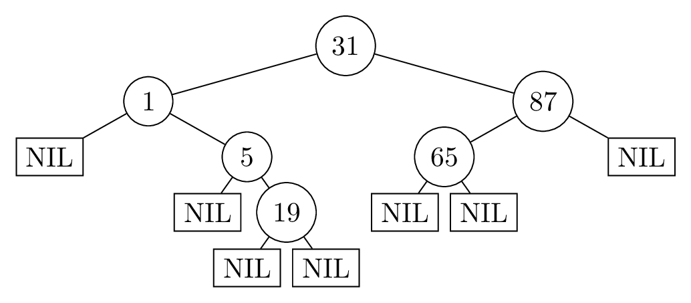

### b)
> Übersetzen Sie Ihren Suchbaum aus Aufgabenteil a) in die Darstellung im Speicher eines Rechners. Nehmen Sie dazu folgendes an:
> 1. Die Knoten des Baums liegen, beginnent bei Speicheradresse $1$, in der gleichen Reihenfolge aus a) im Speicher.
> 2. Der Baum liegt in einer ununterbrochenen Sequenz im Speicher (Zwischen den Speicherzellen für die Knoten sind keine anderen Speicherzellen).

Der Verbund $\mathrm{Knoten}$ wie folgt definiert, zudem wird $\mathrm{NIL}$ als $0$ eingetragen.

```
Verbund Knoten
    key
    parent
    left
    right
```

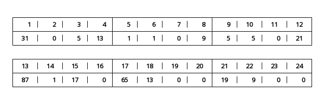

### c)
> Übersetzen Sie die gegebene Sequenz [an Speicherzellen] in einen Binärbaum und zeichnen Sie diesen.

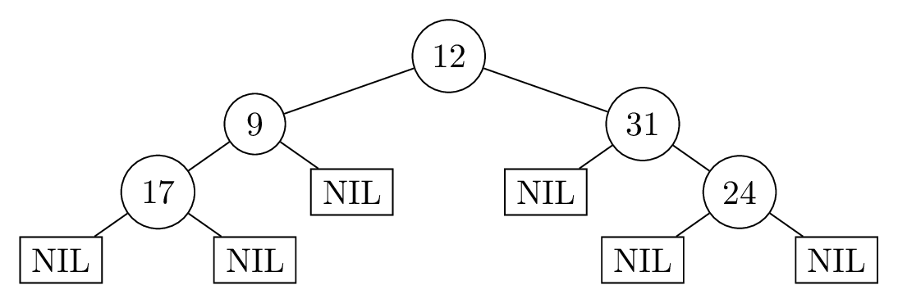

### d)
> Löschen Sie die Schlüssel $33$, $42$, $29$ in dieser Reihenfolge aus dem [Such-]Baum.


### e)
> Betrachten Sie den folgenden Algorithmus:
>
> ```
> Traversierung(x):
>     if x !+ NIL then
>         Traversierung(right[x])
>         Traversierung(left[x])
>         Ausgabe key[x]
> ```
>
> Wenden Sie, auf Ihrem Binärbaum aus Teilaufgabe c), den Algorithmus $\mathrm{Traversierung}$ an, und verwenden Sie den Wurzelknoten Ihres Binärbaums als initialen Eingabeparameter. Geben Sie die Ausgaben und deren Reihenfolge an.

1. $24$
2. $31$
3. $17$
4. $9$
5. $12$

## 2. Datenstruktur entwickeln
> Sei $k \in\mathbb N$ eine Konstante und $U = \{1,\dots, k\}$ ein Universum. Gesucht ist eine Datenstruktur zur Repräsentation von Multimengen aus dem Universum $U$. Eine Multimenge $M$ aus dem Universum $U$ kann jedes Element $x \in U$ gar nicht, einmal oder auch mehrmals enthalten. Die gesuchte Datenstruktur soll folgende Operationen in den jeweils angegebenen Laufzeiten unterstützen.
> 
> * $\mathrm{Add}(M, x)$ fügt der Multimenge $M$ das Element $x$ einmal hinzu. Laufzeit $\mathcal O(1)$.
> * $\mathrm{Remove}(M, x)$ entfernt das Element $x$ aus $M$, sodass $x$ anschließend gar nicht mehr in $M$ vorkommt. Laufzeit $\mathcal O(1)$.
> * $\mathrm{Count}(M, x)$ liefert, wie häufig $x$ in $M$ vorkommt. Laufzeit $\mathcal O(1)$.
> * $\mathrm{Merge}(M, N)$ liefert eine neue Multimenge $R$, sodass für jedes $x \in U$ die Anzahl von $x$ in $R$ der Summe der Anzahlen von $x$ in $M$ und in $N$ gleicht. Laufzeit $\mathcal O(k)$, also auch $\mathcal O(1)$, da $k$ eine Konstante ist.
> 
> Beschreiben Sie in wenigen kurzen Sätzen wie Ihre Datenstruktur aufgebaut ist. Schreiben Sie für jede der geforderten Operationen kommentierten Pseudocode und analysieren Sie dessen asymptotische Worst-Case-Laufzeit. Begründen Sie kurz, dass die Datenstruktur korrekt arbeitet.

Im Folgenden wird davon ausgegangen, dass $U$ die Größe $k$ hat und $M,N,R$ Multimengen von $U$ sind sowie $x\in U$. Dies ist nach Aufgabenstellung gegeben. Sollten diese Bedingungen nicht erfüllt sein, z.B. $x>k$, wird der folgende Pseudocode nicht funktionieren.

### $M$
$M$ kann als Feld implementiert werden. Sei $M=\mathrm{new\ array}[1..k]$, dann wird an der Stelle $M[x]$ die Anzahl der Elemente $x\in M$ gespeichert. Dadurch kann in konstanter Laufzeit die Anzahl eines Elementes verändert oder gezählt werden.

Mit der Funktion $\mathrm{initialize}(k)$ kann man in der Laufzeit $\mathcal O(k)$ eine leere Multimenge für ein Universum der Größe $k$ erstellen.

```
initialize(k)
    M = new array[1..k]
    for x=1 to k do
        M[x] = 0
    return M
```

Man könnte auch ein weiteres Element an der Stelle $M[0]$ speichern, in der man die Anzahl aller Elemente von $M$ speichert. Dann kann man z.B. in konstanter Laufzeit prüfen, ob $M=\{\}$ die leere Menge ist.

### $\mathrm{Add}(M, x)$
```
Add(M, x)
    M[x] = M[x] + 1
```

Die Laufzeit des Algorithmus ist $1\in\mathcal O(1)$, da nur eine Pseudocode-Operation ausgeführt wird. Hierbei wird die Anzahl des Elementes $x$ um $1$ erhöht, es wird also ein Element $x$ zur Menge $M$ hinzugefügt.

### $\mathrm{Remove}(M, x)$
```
Remove(M, x)
    M[x] = 0
```

Die Laufzeit des Algorithmus ist $1\in\mathcal O(1)$, da nur eine Pseudocode-Operation ausgeführt wird. Hierbei wird die Anzahl des Elementes $x$ auf $0$ gesetzt, es werden daher alle Elemente mit dem Wert $x$ aus der Menge $M$ gelöscht.

### $\mathrm{Count}(M, x)$
```
Count(M, x)
    return M[x]
```

Die Laufzeit des Algorithmus ist $1\in\mathcal O(1)$, da nur eine Pseudocode-Operation ausgeführt wird. Da $M[x]$ die Anzahl der Elemente mit dem Wert $x$ speichert, wird die korrekte Anzahl zurückgegeben.

### $\mathrm{Merge}(M, N, k)$
```
Merge(M, N, k)
    R = new array[1..k]
    for x=1 to k do
        R[x] = M[x] + N[x]
    return R
```

In Zeile $1$ wird eine neue Multimenge $R$ erstellt. Dies verhindert, dass eine der Multimengen $M,N$ verändert wird. Dann wird in Zeile $3$ die Gesamtzahl der Elemente $x$ in der Vereinigungsmenge $M\cup N$ ermittelt, was durch die Summe dargestellt wird. Dies erfolgt für alle Werte von $x$ (Zeile $2$), daher wird in Zeile $4$ die korrekt gebildete Multimenge $R$ zurückgegeben.

Die Laufzeit von $\mathrm{Merge}(M, N, k)$ ist $T(n)\in\mathcal O(k)$, also konstant in $n$:

* Zeile $1$ benötigt eine Laufzeit von $k$.
* Zeile $2$ wird $k+1$-mal ausgeführt und benötigt jeweils eine Laufzeit von $1$.
* Zeile $3$ wird $k$-mal ausgeführt und benötigt jeweils eine Laufzeit von $1$.
* Zeile $4$ benötigt eine Laufzeit von $1$.

# Übungsblatt 10
## Rot-Schwarz-Bäume
### a)
> Vervollständigen Sie die Methode RS-Einfügen-Fix aus der Vorlesung [...], indem Sie den else-Fall ergänzen.

```
RSEinfügenFix(T,z)
    while color[parent[z]] = rot do
        if parent[z] = left[parent[parent[z]]] then
            y = right[parent[parent[z]]] \\ Onkel von z

            if color[y] = rot then \\ Onkel ist rot
                \\ schiebe rote "Ebene" eine Stufe höher
                color[parent[z]] = schwarz
                color[y] = schwarz
                color[parent[parent[z]]] = rot
                \\ prüfe beim Großvater weiter
                z = parent[parent[z]]
            else \\ Onkel schwarz
                if z = right[parent[z]] then
                    \\ parent[z] rechter Knoten
                    Linksrotation(T, parent[z])
                    \\ prüfe beim Vater weiter
                    z = parent[z]
                else \\ z und parent[z] linke Knoten
                    color[parent[z]] = schwarz
                    color[parent[parent[z]]] = rot
                    Rechtsrotation(T, parent[parent[z]])
        else
            \\ ab hier kommt der selbstgeschriebene Teil
            y = left[parent[parent[z]]] \\ Onkel von z

            if color[y] = rot then \\ Onkel ist rot
                \\ schiebe rote "Ebene" eine Stufe höher
                color[parent[z]] = schwarz
                color[y] = schwarz
                color[parent[parent[z]]] = rot
                \\ prüfe beim Großvater weiter
                z = parent[parent[z]]
            else \\ Onkel schwarz
                if z = left[parent[z]] then
                    \\ und parent[z] linker Knoten
                    Rechtsrotation(T, parent[z])
                    \\ prüfe beim Vater weiter
                    z = parent[z]
                else \\ z und parent[z] rechte Knoten
                    color[parent[z]] = schwarz
                    color[parent[parent[z]]] = rot
                    Linksrotation(T, parent[parent[z]])
            \\ bis hier geht der selbstgeschriebene Teil
    color[root[T]] = schwarz
```

### b)
> Fügen Sie die Schlüssel $30, 42, 41, 50, 55, 1, 3$ in dieser Reihenfolge in einen anfangs leeren Rot-Schwarz-Baum ein und notieren Sie dabei nach jeder Operation den resultierenden Baum.

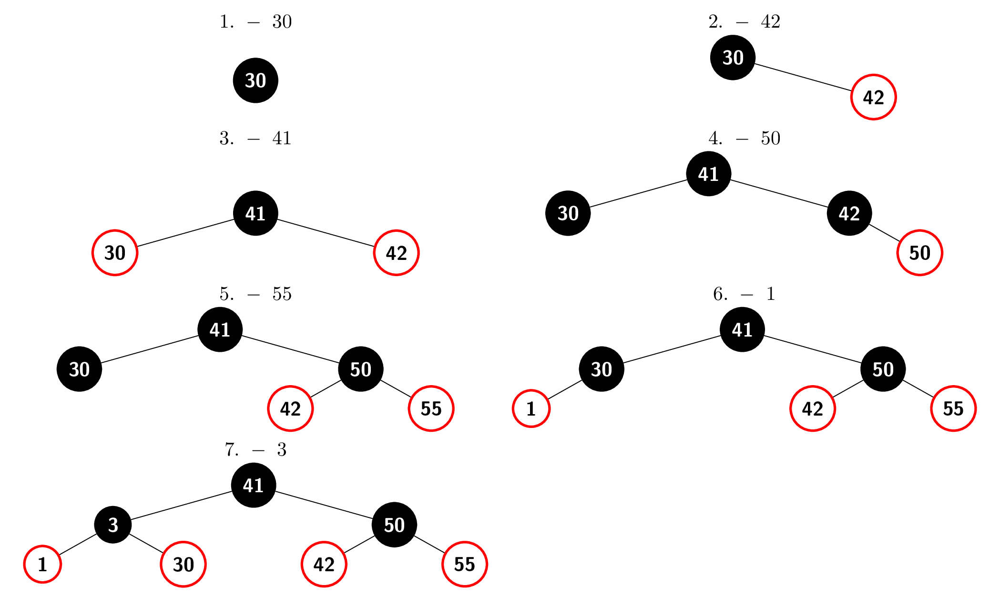

### c)
> Löschen Sie die Werte $5, 10, 47, 20$ und $18$ in der genannten Reihenfolge [aus dem folgenden Rot-Schwarz-Baum]. Zeichnen Sie den Rot-Schwarz-Baum nach jedem Löschen und geben Sie an, welche Fälle durchgeführt wurden.

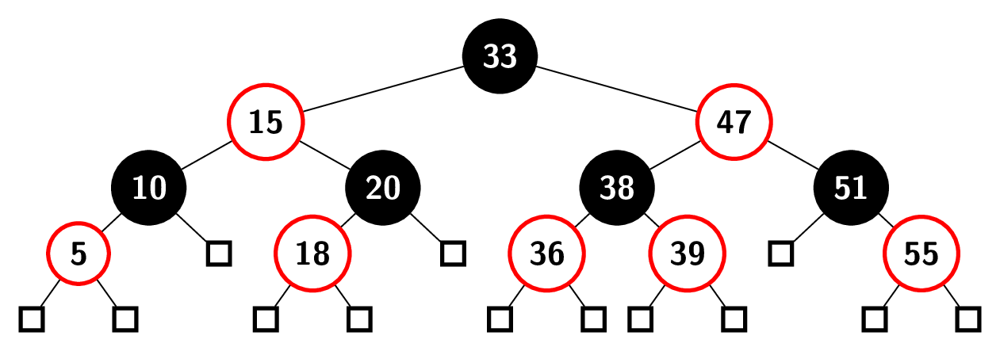

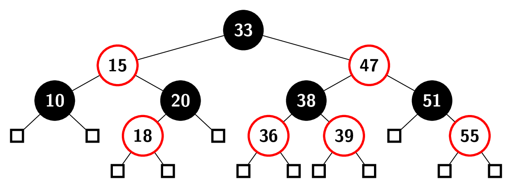

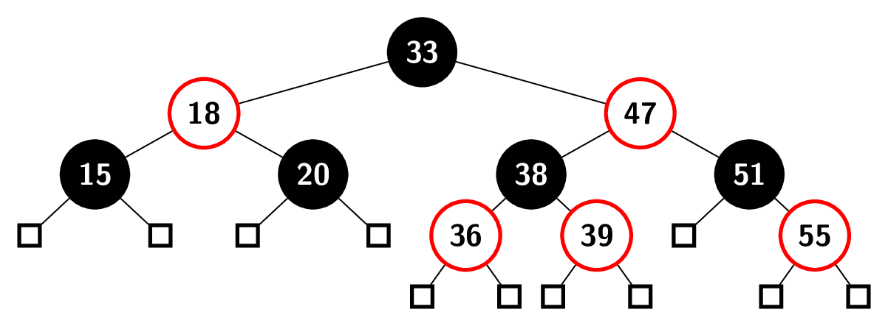

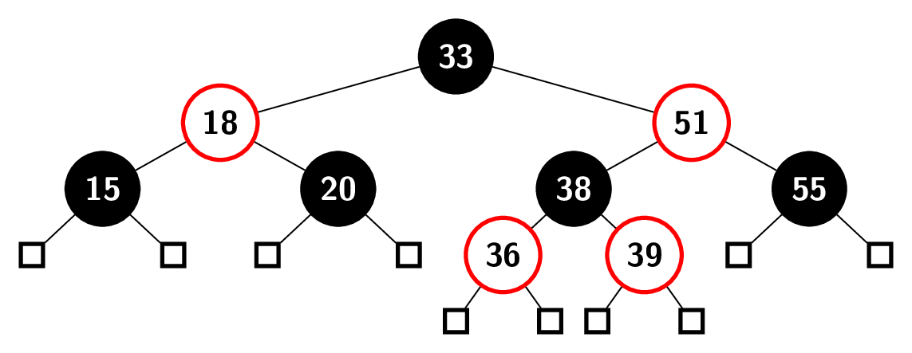

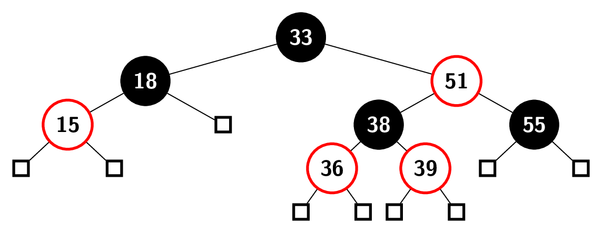

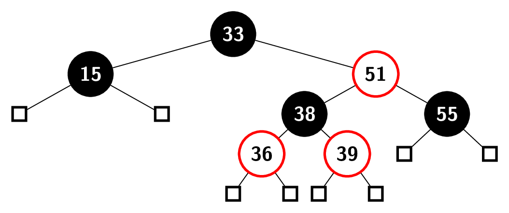

## Suchbäume
> Sei $T$ ein binärer Baum, der nicht zwingend die Suchbaumeigenschaft erfüllt. Es soll nun geprüft werden, ob $T$ ein Suchbaum ist. Für den binären Baum $T$ liefert $\mathrm{root}(T)$ den Wurzelknoten von $T$ . Für jeden Knoten $v \in V$ im binären Baum T stehen folgende Operationen mit Laufzeit $\mathcal O(1)$ zur Verfügung.
> 
> * $\mathrm{key}(v)$ liefert den im Knoten $v$ enthaltenen Schlüssel.
> * $\mathrm{lc}(v)$ liefert einen Zeiger auf das linke Kind von $v$ in $T$. Hat $v$ kein linkes Kind, liefert $\mathrm{lc}(v)$ den Wert $\mathrm{NIL}$.
> * $\mathrm{rc}(v)$ liefert einen Zeiger auf das rechte Kind von $v$ in $T$. Hat $v$ kein rechtes Kind, liefert $\mathrm{rc}(v)$ den Wert $\mathrm{NIL}$.
> * $\mathrm{leaf}(v)$ liefert $\mathrm{true}$, falls der Knoten $v$ in $T$ ein Blatt ist. Sonst liefert $\mathrm{leaf}(v)$ den Wert $\mathrm{false}$.
> 
> Für diese Aufgabe soll $T$ ein vollständiger binärer Baum sein. Das heißt, dass jeder innere Knoten in $T$ genau zwei Kinder hat und alle Blätter von $T$ auf der selben Höhe sind.

### a)
> Entwerfen Sie einen Teile-und-Herrsche-Algorithmus, der bei Eingabe eines binären Baumes $T$ mit Knotenmenge $V$ den Wert $\mathrm{true}$ zurückgibt, falls $T$ die Suchbaumeigenschaft erfüllt. Erfüllt $T$ die Suchbaumeigenschaft nicht, soll der Algorithmus $\mathrm{false}$ zurückgeben. Beschreiben Sie Ihren Algorithmus in eigenen Worten und geben Sie den Algorithmus auch in Pseudocode an. Für die volle Punktzahl wird ein Algorithmus erwartet, dessen Laufzeit durch $\mathcal O(|V|)$ beschränkt ist.

Der Algorithmus beginnt an der Wurzel $\mathrm{root}[T]$ und iteriert über alle Knoten. Falls eine Stelle falsch sortiert ist, so kann die Rekursion an dieser Stelle abgebrochen werden. Falls ein Blatt erreicht wurde, ist dieses ein gültiger binärer Suchbaum und eine Rekursionskette hat ihr Ende erfolgreich erreicht.

Ansonsten muss für jeden Knoten $v$ überprüft werden, dass $\mathrm{key}(\mathrm{lc}(v))  \le \mathrm{key}(v) \le \mathrm{key}(\mathrm{rc}(v))$. Wenn dies nicht stimmt, kann $T$ kein binärer Suchbaum sein. Ansonsten ist der Baum genau dann ein binärer Suchbaum, wenn beide Kinder die Wurzel eines binären Suchbaums bilden.

```
isSearchTree(v) \\ erster Aufruf: isSearchTree(root[T])
    if leaf(v) then return true \\ Ende erreicht

    left = lc(v)
    right = rc(v)

    \\ sind Kinder sind falsch sortiert?
    \\ falls ja: Abbruch
    if key(left) > key(v) then return false
    if key(right) < key(v) then return false

    if isSearchTree(left)
    then return isSearchTree(right)
    else return false
```

### b)
> Analysieren Sie die Laufzeit Ihres Algorithmus.

```
isSearchTree(v) \\ T(n)
    if leaf(v) then return true \\ O(1)

    left = lc(v) \\ O(1)
    right = rc(v) \\ O(1)

    if key(left) > key(v) then return false \\ O(1)
    if key(right) < key(v) then return false \\ O(1)

    if isSearchTree(left) \\ T(n/2)
    then return isSearchTree(right) \\ T(n/2)
    else return false \\ O(1)
```

Sei $f(n)\in\mathcal O(1)$, dann beschreibt die folgende rekursive Funktion die Laufzeit $T(n)$.

$$
    T(n) =
        \begin{cases}
            f(n) &: n=1 \\
            2T\left(\frac{n}{2}\right) + f(n) &: n>1
        \end{cases}
$$

Es gilt $\forall n>1: T(n) = aT\frac{n}{b} + f(n)$ mit $a=b=2$. Sei $f(n)=c$ mit konstantem $c$, so gilt $f(n) = a\cdot f(\frac{n}{2})=c$. Nach Teil $1$ des Mastertheorems fließt in jeder Rekursionsebene der Aufwand $f(n)$ ein und die Laufzeit ist $T(n)\in\mathcal O(f(n)\cdot\log_2n)$. Da $f(n)\in\mathcal O(1)$ eine konstante Laufzeit beschreibt, ist es ein konstanter Faktor $c$. Es gilt weiterhin $\mathcal O(c\log_2n)\subseteq \mathcal O(\log_2n)$.

$$
    T(n) = \mathcal O(\log_2n)
$$
Die Funktion benötigt daher logarithmische Laufzeit.

### c)
> Beweisen Sie die Korrektheit Ihres Algorithmus.

```
isSearchTree(v) \\ T(n)
1.    if leaf(v) then return true \\ O(1)

2.    left = lc(v) \\ O(1)
3.    right = rc(v) \\ O(1)

4.    if key(left) > key(v) then return false \\ O(1)
5.    if key(right) < key(v) then return false \\ O(1)

6.    if isSearchTree(left) \\ T(n/2)
7.    then return isSearchTree(right) \\ T(n/2)
8.    else return false \\ O(1)
```

#### Induktionsvoraussetzung
Sei $T$ ein Baum der Höhe $0$ mit genau einem Knoten, dann ist $v=\mathrm{root}[T]$ ein Blatt. In diesem Fall wird in Zeile $1$ $\mathrm{true}$ zurückgegeben. Dies ist korrekt, da ein Baum mit einem Blatt immer sortiert und damit ein binärer Suchbaum ist.

#### Induktionsannahme
Seien $T$ ein vollständiger binärer Baum der Höhe $h$ und $T^\prime$ ein vollständiger binärer Baum der Höhe $h-1$. Seien weiterhin $v=\mathrm{root}[T]$, $u=\mathrm{root}[T^\prime]$ und $u=\mathrm{root}[T^\prime]$. Sei $u$ ein Kind von $v$.

Gebe $\mathrm{isSearchTree}(u)$ an, ob $T^\prime$ ein binärer Suchbaum ist. Dann ist zu zeigen, dass $\mathrm{isSearchTree}(v)$ korrekt bestimmt, ob $T$ ein binärer Suchbaum ist.

#### Induktionsschritt
Da $v$ kein Blatt ist, passiert in Zeile $1$ nichts. In den Zeilen $2$ werden die Kinder von $v$ ermittelt.

Falls die Gleichung $\mathrm{key}(\mathrm{lc}(v))  \le \mathrm{key}(v) \le \mathrm{key}(\mathrm{rc}(v))$ _nicht_ erfüllt ist, so ist $T$ kein binärer Suchbaum. In diesem Fall wird entweder in Zeile $4$ oder in Zeile $5$ $\mathrm{false}$ zurückgegeben, was den korrekten Zustand abbildet.

Ansonsten wird in Zeile $6$ geprüft, ob das linke Kind von $v$ ein korrekter Suchbaum ist. Mit $u=\mathrm{lc}(v)$ gibt die Prozedur $\mathrm{isSearchTree}(u)$ nach Induktionsannahme den korrekten Zustand zurück. Falls unter $\mathrm{lc(v)}$ kein binärer Suchbaum ist, ist auch $T$ kein binärer Suchbaum und es wird in Zeile $8$ $\mathrm{false}$ zurückgegeben.

Ansonsten ist $T$ genau dann ein binärer Suchbaum, wenn auch $u=\mathrm{rc}(v)$ die Wurzel eines binären Suchbaums ist. Dieser Wert wird genau dann in Zeile $7$ zurückgegeben, wenn $\mathrm{isSearchTree}(u)$ den richtigen Zustand zurückgibt. Dies ist nach Induktionsannahme der Fall.

Damit ist $\mathrm{isSearchTree}(v)$ korrekt.

# Übungsblatt 11
## 1. Hashtabelle
> Gegeben seien eine Hashtabelle der Größe $m = 11$ und die Hashfunktion $h(x) = x \mod m$.
> 
> Fügen Sie die Schlüssel $112, 121, 17, 356, 202, 876, 394, 26, 742, 652$ in der angegebenen Reihenfolge nach dem Schema offener Addressierung mit linearem Ausprobieren in die Hashtabelle ein. (Es genügt, das Endergebnis aller Einfügeoperationen anzugeben.)

| 0   | 1 | 2   | 3   | 4   | 5   | 6  | 7   | 8  | 9   | 10  |
|:---:|:-:|:---:|:---:|:---:|:---:|:--:|:---:|:--:|:---:|:---:|
| 121 |   | 112 | 652 | 356 | 202 | 17 | 876 | 26 | 394 | 742 |

## 2. Breitensuche
> Führen Sie auf dem gegebenen Graphen den Breitensuche-Algorithmus aus. Gehen Sie dabei so vor, dass der Knoten $a$ als Startknoten genutzt wird und bei mehreren benachbarten Knoten der mit dem lexikographisch kleineren Buchstaben zuerst der Warteschlange hinzugefügt wird.
> 
> Skizzieren Sie für jeden Schritt der Traversierung den Zustand der Breitensuche. Geben Sie dazu jeweils die Färbung der Knoten und den Inhalt der Warteschlangen-Datenstruktur an.

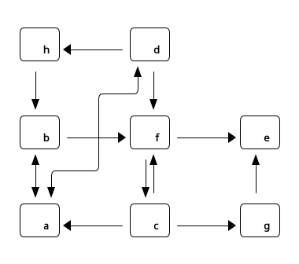

#### 1. $a$
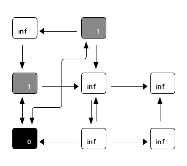

#### 2. $b$
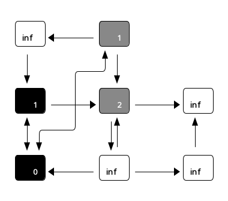

#### 3. $d$
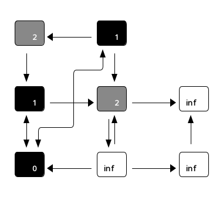

#### 4. $f$
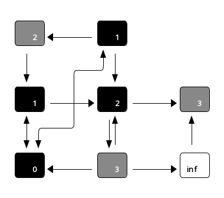

#### 5. $h$
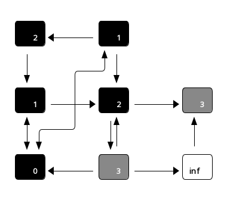

#### 6. $c$
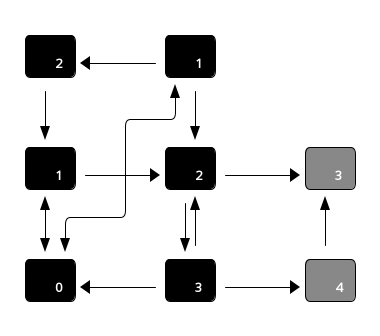

#### 7. $e$
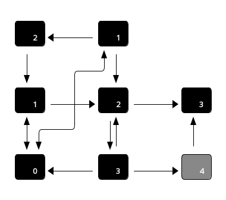

#### 8. $g$
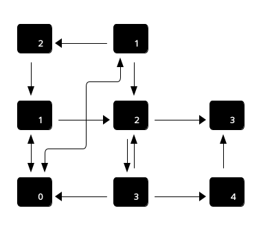

## 3. Kreisfreiheit
> Ein ungerichteter Graph heißt _kreisfrei_, wenn es für jedes Knotenpaar $u, v \in V \times V$ nur einen Pfad von $v$ nach $u$ gibt.

### a)
> Gegeben sei ein ungerichteter zusammenhängender Graph $G = (V, E)$ in Adjazenzlistendarstellung. Geben Sie einen Algorithmus in Pseudocode an, der in Zeit $\mathcal O(|V | + |E|)$ entscheidet ob der Graph $G$ kreisfrei ist. Erklären oder kommentieren Sie Ihren Pseudocode.

Der Algorithmus führt eine Breitensuche aus. Falls dabei ein gefundener Knoten erneut gefunden wird, wurde ein Kreis gefunden. Die einzige Ausnahme ist der Vater im Breitensuchbaum, der der einzige bekannte Nachbar sein muss.

```
IstKreisfrei(G,s)
1.   initialisiere BFS
2.   while Q != {} do
3.       u = head[Q]
4.       for each v in Adj[u] do
5.           \\ breche ab, falls Knoten bekannt
6.           \\ es sei denn, v ist der Vater im BFS
7.           if color[v] != weiß and pi[u] != v
8.               then return false

9.           if color[v] = weiß
10.          then
11.             \\ Knoten ist neu
12.              color[v] = grau
13.              d[v] = d[u] + 1
14.              pi[v] = u
15.              enqueue(Q,v)
16.      dequeue(Q)
17.      color[u] = schwarz
18.  return true
```

### b)
> Analysieren Sie die asymptotische Worst-Case-Laufzeit Ihres Algorithmus.

Der Algorithmus wurde nicht strukturell verändert, daher ist die Worst-Case-Laufzeit wie die der Breitensuche $\mathcal O(|V|+|E|)$. Die Laufzeit kann nur um einen konstanten Term verändert. Dagegen kann die Laufzeit deutlich schneller sein, falls ein Kreis gefunden wird.

### c)
> Beweisen Sie die Korrektheit Ihres Algorithmus.

Für den Startknoten $s$ werden alle Nachbarn erreichbaren Knoten entdeckt und markiert. Wird nach Zeile $4$ ein bereits entdeckter Knoten $v$ als Nachbarknoten von $u$ erkannt, so gibt es zu diesem Nachbarknoten zwei Wege: Der Weg, auf dem $v$ ursprünglich entdeckt wurde, und der Weg über $u$. Weil beide Wege an $s$ starten, gibt es mehrere verschiedene Wege zu $v$. Dies entspricht der Definition eines Kreises, deswegen muss in Zeile $8$ $\mathrm{false}$ zurückgegeben werden, dabei wird die Breitensuche abgebrochen. Falls die Breitensuche vollständig beendet ist, ist der Graph kreisfrei, weshalb in Zeile $18$ $\mathrm{true}$ zurückgegeben wird.

# Übungsblatt 12
## 1. Bellman-Ford
> Führen Sie die verbesserte Version des Algorithmus von Bellman-Ford für den gegebenen Graphen mit Startknoten $1$ aus. Tragen Sie dazu die Werte des Arrays $d$ nach jedem Durchlauf der äußeren Schleife des Algorithmus in die Tabelle unten ein. Gehen Sie dabei die Knoten in aufsteigender Reihenfolge durch.
> 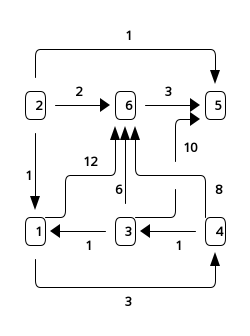

```
Bellman-Ford(G,s)
    d = new array [1..|V|]
    for each v in V do
        d[v] = inf
    d[s]=0

    for i=1 to |V|-1 do
        for each v in V do
            for each (u,v) in In[v] do
                if d[u]+w(u,v) < d[v]
                then d[v] = d[u] + w(u,v)
    return d
```

| i | d[1] | d[2] | d[3] | d[4] | d[5] | d[6] |
|:-:|:----:|:----:|:----:|:----:|:----:|:----:|
| 0 | 0    | inf  | inf  | inf  | inf  | inf  |
| 1 | 0    | inf  | inf  | 3    | inf  | 11   |
| 2 | 0    | inf  | 4    | 3    | 14   | 10   |
| 3 | 0    | inf  | 4    | 3    | 13   | 10   |
| 4 | 0    | inf  | 4    | 3    | 13   | 10   |
| 5 | 0    | inf  | 4    | 3    | 13   | 10   |

## 2. Graphalgorithmen
> Sei $G = (V, E)$ ein ungerichteter Graph. Eine unabhängige Menge ist eine Teilmenge $U \subseteq V$ der Knotenmenge, für die gilt, dass kein Knotenpaar $u, v \in U$ durch eine Kante verbunden ist. Wir betrachten nun den Spezialfall, dass $G$ ein ungerichteter Graph mit maximalem Knotengrad $d$ ist, d.h. jeder Knoten $v \in V$ hat maximal $d$ Nachbarn.

### a)
> Beschreiben Sie einen gierigen Algorithmus für diesen Spezialfall (nicht notwendigerweise Pseudocode), der für einen gradbeschränkten Graphen $G$ mit maximalem Knotengrad $d$ eine unabhängige Menge berechnet, die mindestens die Größe $\lceil \frac{n}{d+1}\rceil$ hat. Für die volle Punktzahl wird ein Algorithmus erwartet, dessen Worst-Case-Laufzeit durch $\mathcal O(d |V|)$ beschränkt ist.

Der Algorithmus soll nach aufsteigendem Grad Knoten auswählen und ihn, falls er unabhängig von der bisherigen Menge ist, der Menge hinzufügen. Diese Methode wurde gewählt, weil die Wahrscheinlichkeit für eine Kante in die bisher gewählte Menge proportional zu dem Grad des betrachteten Knotens ist. Um dies zu realisieren, wird eine Prioritätenschlange $Q$ verwendet.

```
IndependentSet(G)
1.  Initialisiere Prioritätenschlange Q \\ O(|V|)
2.  M = {} \\ O(1)

3.  while Q != {} do \\ O(|V|)
4.      v = ExtractMin(Q) \\ O(|V| * 1)

5.      for u in Adj[v] do \\ O(|V| * (d+1))
6.          Löschen(Q, u) \\ O(|V| * d)

7.      M = M + {v} \\ O(|V| * 1)

8.  return M \\ O(1)
```

### b)
> Begründen Sie, warum Ihr Algorithmus die vorgegebene Laufzeitschranke einhält oder geben Sie, falls ihr Algorithmus diese Schranke nicht einhält, eine möglichst gute Schranke für die Worst-Case-Laufzeit Ihres Algorithmus an und begründen Sie diese.

Die Worst-Case-Laufzeit für Zeile $1$ ist am schwierigsten abzuschätzen. Da die Werte der Prioritäten bekannt sind, nämlich $p\in\{0, \dots, d\}$, kann man ein Array von Listen nutzen, um die Prioritätenschlange $Q$ zu implementieren. In diesem Fall kann das Einfügen in $Q$ in konstanter Laufzeit erfolgen. Da dies für jeden Knoten notwendig ist, erhält man eine Laufzeit von $\mathcal O(|V|)$. Die Schleife in den Zeilen $3-7$ kann maximal $|V|$ oft erfolgen, da in jedem Durchlauf mindestens ein Knoten gelöscht wird. Die Schleife in den Zeilen $5-6$ wird für jeden Knoten $v$ nach der Anzahl des Grades durchlaufen, also maximal $\mathcal O(d|V|)$. Dadurch ist die gesamte Worst-Case-Laufzeit durch $\mathcal O(d|V|)$ beschränkt.

### c)
> Beweisen Sie die Korrektheit Ihres Algorithmus, d.h. dass ihr Algorithmus für jeden ungerichteten Graphen $G$ mit maximalem Knotengrad $d$ eine unabhängige Menge berechnet, die mindestens $\lceil \frac{|V|}{d+1}\rceil$ Knoten enthält.

#### Invariante
Bei $n$-ten Eintritt in die äußere Schleife enthält $M$ eine unabhängige Menge mit $n-1$ Elementen. Zu dem selben Zeitpunkt enthält $Q$ nur Knoten, die unabhängig von den Knoten in $M$ sind.

#### Induktionsvoraussetzung
Beim $1.$ Eintritt in die Schleife ist $M$ als leere Menge initialisiert worden (vgl. Zeile $2$). Die Invariante ist demnach erfüllt

#### Induktionsannahme
Bei $n$-ten Eintritt gilt die Invariante.

Es ist zu zeigen, dass $M$ beim $n+1$-ten Schleifeneintritt eine unabhängige Menge mit $n$ Elementen ist. Weiter ist zu zeigen, dass $Q$ beim $n+1$-ten Schleifeneintritt nur Knoten enthält, die unabhängig von den Knoten in $M$ sind.

#### Induktionsschritt
In Zeile $4$ wird ein Knoten $v$ aus $Q$ extrahiert, der nach Induktionsannahme unabhängig von den Knoten in $M$ ist. Daher ist $M$ auch dann noch eine unabhängige Menge, wenn $v$ zu $M$ hinzugefügt wurde (Zeile $7$), wodurch die Länge von $M$ um eins erhöht wird. Da nach Induktionsannahme zuvor $n$ Elemente in $M$ waren und nur in Zeile $7$ ein einzelnes Element hinzugefügt wird, sind beim nächsten Schleifeneintritt $n+1$ Elemente in $M$.

Nach Induktionsannahme sind bei Schleifeneintritt alle Knoten in $Q$ unabhängig von $M$. Da nur $v$ in Zeile $7$ zu $M$ hinzugefügt wird, können zu dem Zeitpunkt nur Abhängigkeiten zwischen $v\in M$ und $u\in Q$ bestehen. Dazu muss es eine Kante $(v, u)\in E$ geben. Diese Kante muss in $\mathrm{Adj}[v]$ gespeichert sein, da der Graph ungerichtet ist. Da alle Knoten, auf die das zutrifft, aus $Q$ entfernt werden (Zeilen $5-6$), enthält $Q$ auch beim Schleifenaustritt nur Knoten, die unabhängig von den Knoten in $M$ sind.

Damit wurde die Invariante bewiesen. Dies beweist, dass eine unabhängige Menge berechnet wird.

#### Größe von $M$
Die Größe von $M$ kann durch $d$ abgeschätzt werden. Sei $|M|$ die Anzahl der Elemente in $M$, dann wird $|M|$ in jedem Schleifendurchlauf um eins erhöht. $|M|$ ist also genau dann minimal, wenn in jedem Schleifendurchlauf die maximale Menge an Knoten aus $Q$ entfernt wird. In Zeile $4$ wird immer ein Knoten entfernt, in Zeile $6$ wird jeder Nachbar entfernt. Die Anzahl der Nachbarn ist durch $d$ beschränkt, dadurch können je Durchlauf maximal $d+1$ Knoten entfernt werden.

Angenommen, es werden in jedem Durchlauf $d+1$ Knoten entfernt, so muss es $\frac{|V|}{d+1}$ Durchläufe geben. Falls dieser Quotient keine ganze Zahl ist, sind nach dem $\lfloor\frac{|V|}{d+1}\rfloor$-ten Durchlauf noch mindestens ein Knoten, aber maximal $d+1$ Knoten, in $Q$. Dann ist nach dem $\lceil\frac{|V|}{d+1}\rceil$-ten Durchlauf kein Knoten mehr in $Q$ und die Schleife wurde beendet. Da $|M|$ durch die Anzahl der Schleifendurchläufe bestimmt ist, gilt $|M|\ge \lceil\frac{|V|}{d+1}\rceil$, was zu beweisen war.

## 3. Graphalgorithmen
> Marie fand einen Zettel, auf dem ein ungerichteter zusammenhängender Graph $G = (V, E)$ gezeichnet ist. Marie hat vier Farbstifte: rot, blau, schwarz und grün. Sie hat zuerst alle Kanten entweder in rot ($X$) oder blau ($Y$) gefärbt, wobei $E = X \cup Y$ ist.
> 
> Jetzt möchte Marie die Knoten in schwarz oder grün färben, und zwar so, dass die Knoten der roten Kanten beide schwarz oder beide grün sind, und dass die Knoten der blauen Kanten unterschiedlich gefärbt werden.

### a)
> Entwerfen Sie einen Algorithmus $\mathrm{Farben}(V, X, Y)$, der entscheidet, ob solche Knotenfärbung möglich ist und dementsprechend $\mathrm{true}$ bzw. $\mathrm{false}$ zurückgibt. Beschreiben Sie den Algorithmus zunächst mit eigenen Worten. Setzen Sie den Algorithmus dann in Pseudocode um. Für die volle Punktzahl wird ein Algorithmus erwartet, dessen Laufzeit durch $\mathcal O(|V | + |E|)$ beschränkt ist.

Starte an einem beliebigen Knoten und färbe diesen in einer beliebigen Farbe. Färbe wie bei der Breitensuche alle Knoten, bis entweder alle Knoten gefärbt sind oder die Bedingung verletzt ist.

```
Farben(V, X, Y, s)
1.     initialisiere Breitensuche
2.     color[s] = schwarz

3.     while Q != {} do
4.         u = dequeue(Q)
5.         for each v in Adj[u] do
6.             \\ ermittle Farbe, die v haben soll
7.             if (u,v) in X \\ rote Kante
8.             then color_v = color[u]
9.             else \\ blaue Kante
10.                if color[u] = schwarz
11.                then color_v = grün
12.                else color_v = schwarz

13.            if color[v] = weiß
14.            then color[v] = color_v \\ färbe
15.            else \\ prüfe andere Farbe
16.                if color[v] != color_v
17.                then return false

18.    return true
```

### b)
> Analysieren Sie die Laufzeit Ihres Algorithmus.

Dieser Algorithmus ist eine Variation der Breitensuche, die eine Laufzeit von $\mathcal O(|V|\cdot |E|)$ benötigt. Alle Veränderungen haben konstante Laufzeit und werden nur im Rahmen der Breitensuche aufgerufen, daher ist die Gesamtlaufzeit im Worst-Case-Szenario identisch mit der der Breitensuche.

### c)
> Beweisen Sie die Korrektheit Ihres Algorithmus.

Jede gültige Färbung impliziert eine zweite gültige Färbung mit invertierten Farben. Daher ist es egal, welche Farbe der Startknoten in Zeile $2$ erhält.

Da die Breitensuche jeden Knoten besucht, werden alle Kanten einmal auf Färbung geprüft. In den Zeilen $6-12$ wird die Farbe ermittelt, die der Nachbarknoten $v$ haben soll. Falls $v$ noch $\mathrm{weiß}$ ist, wird er korrekt gefärbt (Z. $14$), ansonsten wird die Korrektheit der Kante geprüft (Z. $16$) und bei Widerspruch $\mathrm{false}$ zurückgegeben (Z. $17$).

Falls die komplette Breitensuche keinen Widerspruch findet, ist die gewünschte Färbung möglich. Dann ist die Rückgabe $\mathrm{true}$ korrekt. Daher arbeitet der Algorithmus korrekt.
